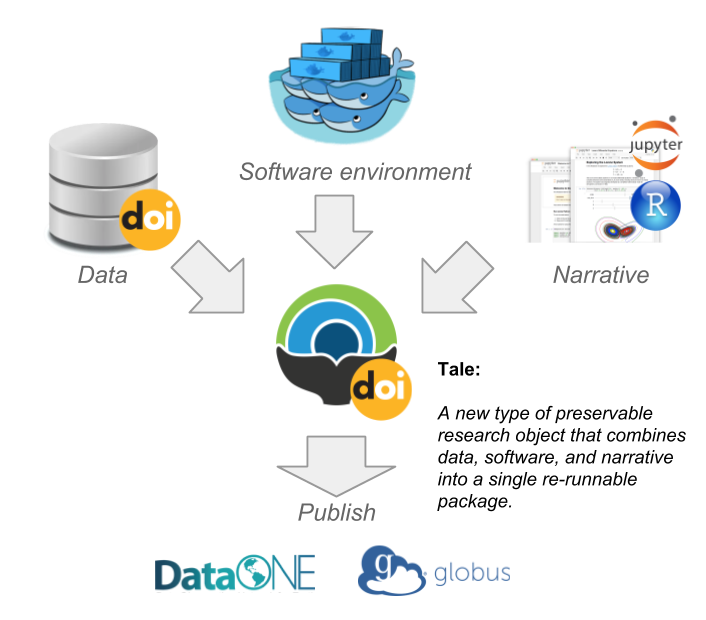

.. image:: http://readthedocs.org/projects/wholetale/badge/?version=latest
   :target: http://wholetale.readthedocs.io/en/latest/?badge=latest

Overview
========

Whole Tale is a scalable, web-based, multi-user platform for the creation, publication, and execution of "tales" -- shareable, reproducible, and preservable research objects that capture data, code, and the complete execution environment required for reproducibility. Whole Tale is intended to enable researchers to publish interactive environments along with research data used in published research.  A beta version of the Whole Tale reference implementation is available at https://dashboard.wholetale.org.

- If you are interested in exploring the Whole Tale service, please see the :ref:`users-guide` or :ref:`tutorials`.
- If you are interested participating in user experience testing, please
  `contact us <https://wholetale.org>`_. 
- If you are a developer intested in contributing to the Whole Tale project, please see the :ref:`contributing`.
- If you are interested in installing an instance of the Whole Tale platform, please see the :ref:`admin-guide`.
- Otherwise, please feel free to peruse our :ref:`development documentation <development>`.

**What is a tale?** A tale is a new type of preservable research object that combines data, software, and narrative into a single re-runnable package:

Whole Tale is an ongoing NSF-funded Data Infrastructure Building Blocks (DIBBS) project initiated in 2016 with expected completion February, 2021.
