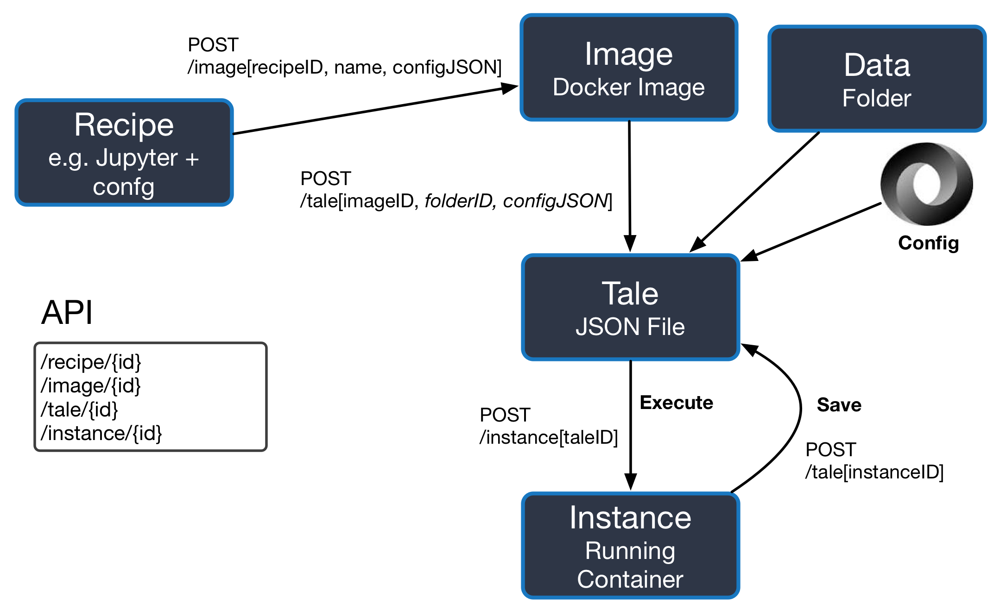

Frontend API and usage flow
===========================

Basic Architecture Diagram
--------------------------



Notes
-----

Following design plan conforms to [OpenAPI ver 2.0](http://swagger.io/specification/)
specification.

In order to launch interactive viewer of an API please do the following:

```bash

pip install -r mockup_frontend/requirements.txt --user
cd mockup_frontend
gunicorn -b 0.0.0.0:8001 main:api --reload -w 1 --threads 1

```

Then navigate your web browser to [http://localhost:8001/v1/u1/](http://localhost:8001/v1/u1/).

Implementation Notes
--------------------

API
---

Restructure the frontend creation API to use the following methods:

* /recipe - create a recipe for making an image
* /image - describes a docker image
* /tale - combination of image, config info and data
* /instance - an instance of the resulting tale.

TODO
----

* What happens to a recipe when the parent is removed?
