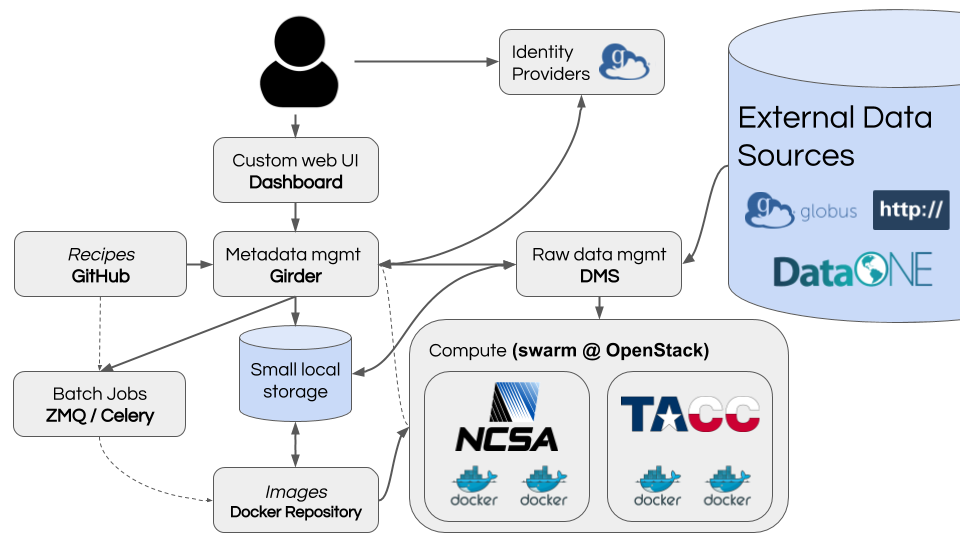

.. _architecture-overview:

Overview
========

The Whole Tale system combines and extends several standard components and
services described in detail below. Widely-recognized "industry standard"
components include Docker Swarm for container orchestration, Celery/Redis for
distributed tasks, MongoDB data management, and the Traefik reverse proxy. These
are use without modification or customization. 

Dashboard
---------
The Whole Tale dashboard interface is a standalone, "single page" application
developed  using the open-source javascript frameworks Ember.js and SemanticUI. 

Girder
------ 

Girder is an open source web-based data management platform intended for
developing new web services with a focus on data organization, user management, 
authentication and authorization. It has been adopted by several related 
projects including `yt.Hub <https://girder.hub.yt/>`_ and the NSF-funded 
Renaissance Simulations Laboratory. 

Whole Tale leverages Girder for the following features:

- Lighweight and high-performance interface to MongoDB
- Advanced access control models 
- Oauth flow for suer authentication, specifically Globus Auth

"Whole Tale" Plugin
------------------------

Whole Tale extends Girder adding functionality including:

- Ability to create and build images via integration with Celery
- Ability to create tales and launch tale instances
- Ability to search for and ingest data from external sources including 
  DataONE, Globus and HTTP resources.

Data Management Plugin
----------------------

The Whole Tale **Data Management** system is responsible for managing the data
used in Tales. The main components include:

- Transfer subsystem that managed movement of data from external data providers
  to local storage in Whole Tale. This is achieved through provider-specific
  transfer adapters.
- Storage management system that acts as a local data cache that selectively
  caches or clears local copies of externally hosted data based on frequency of
  use.
- Filesystem interface that allows tales to access cached data through a
  standard POSIX interface.

FUSE Filesystem
---------------

An intermediate later representing data in Girder as a POSIX filesystem that
interfaces with the Data Management system. This is based on fusepy, a thin
python wrapper for FUSE development.

Container and Volume Manager
----------------------------

A Celery worker that performs two tasks related to starting and stoppingi tale
instances:

- Mounting (and unmounting) FUSE filesystem to a local diretory
- Spawning (and destroying) tale instances 

Whole Tale Home Directories
---------------------------

A Girder plugin that adds a distributed home directory across tale instances for
each user build using WgsiDAV.

Smart Image Lookup Service
--------------------------

A simple service that generates eye-catching illustrations for tales based on
content words used in the title and description.

