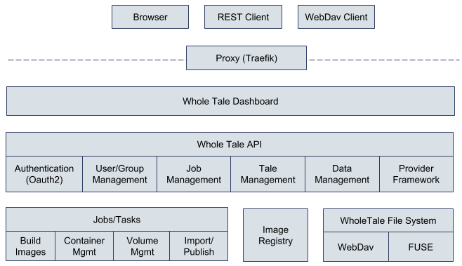
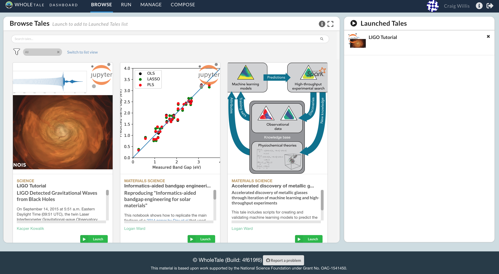
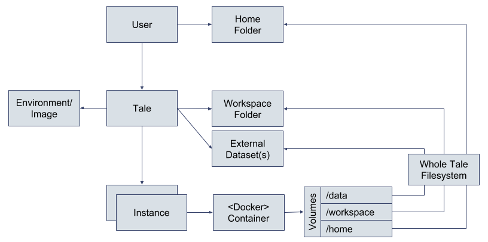
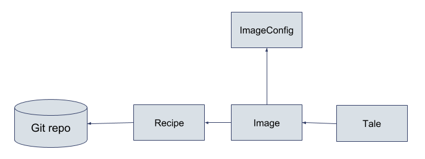
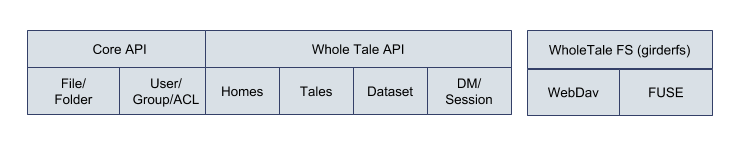
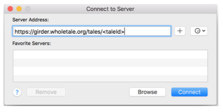
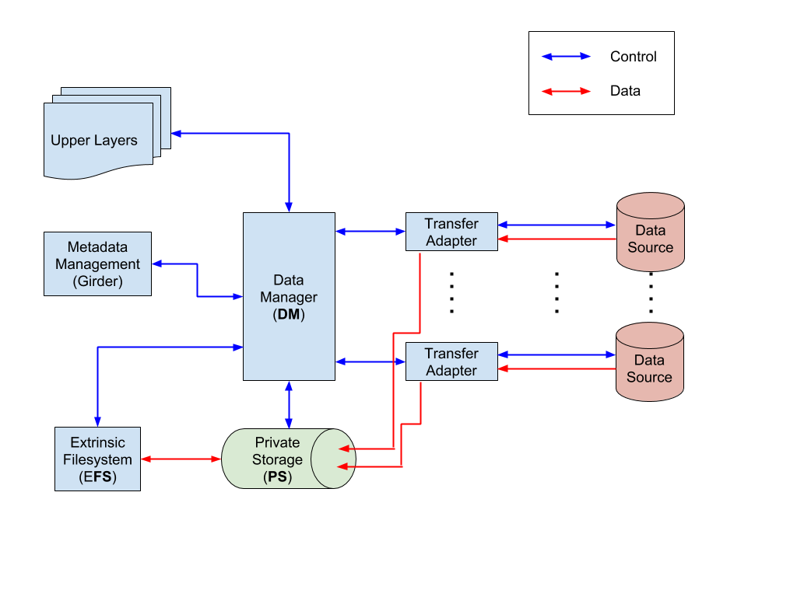
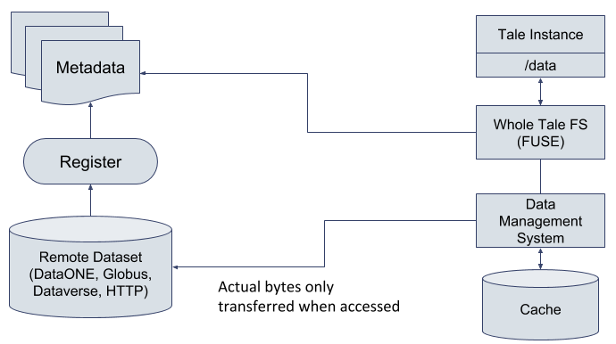

.. _architecture-overview:

Overview
========

The Whole Tale provides a scalable, web-based, multi-user
platform for the creation, publication, and execution of "tales" -- executable
research objects that capture data, code, and the complete software environment
required for reproducibility. It is designed to enable researchers to publish
their code and data along with required software dependencies to long-term
research archives, simplifying the process of creating and verifying
computational artifacts.

The Whole Tale platform includes the following primary components:

- Identity and access management
- Dashboard
- Whole Tale API 
- Whole Tale Filesystem  
- Image registry
- Provider API
- User environments 

The following diagram illustrates the logical relationship between key system
components:

The Whole Tale platform leverages and extends a variety of standard components and
services including the OpenStack cloud platform (via Jetstream and Chameleon),
Docker Swarm container orchestration platform, Celery/Redis for distributed task
management, MongoDB for data management, Traefik reverse proxy, Open Monitoring
Distribution for monitoring, as well as interactive analysis environments such
as RStudio and Jupyter.  Whole Tale leverages and extends the Girder REST API
framework.

Identity and Access Management
==============================

Identity and access management are implemented via OAuth 2.0/OpenID Connect. Via
the Girder OAuth plugin, the platform can be configured to use common OAuth
providers including Google, Github, Bitbucket, and Globus. The production WT service
leverages Globus Auth for federated login because if provides support for:

- InCommon IdPs via CILogon
- XSEDE/Argonne, ORCID and other research-centric systems
- Tokens that can be used to initiate Globus transfers

The publishing framework uses ORCID for authentication into the DataONE network.

Dashboard
=========

The dashboard is the primary interface into the Whole Tale system for users to
interactively launch, create, and share Tales. It is the reference interface for
the Whole Tale API, built using the Ember JS open-source web framework. 

Whole Tale API
==============

The Whole Tale API extends the Girder framework adding Whole Tale capabilities
including:

- Images, Tales and Instances
- Distributed home and Tale workspace folders
- Importing data from remote repositories
- Publishing Tales to remote repositories
- Remote data access and caching

Via Celery/Redis, the Whole Tale API provides a scalable framework for:
* Building and manaaging Tale images
* Launching Tale instances (e.g., RStudio, Jupyter environments)
* Ingesting data from external sources 
  
The following diagram provides an overview of key compoments of the Whole Tale
API:

Each user has a home folder that is accessible via the Whole Tale filesystem to
every running Tale instance (and also exposed via WebDav to be optionally
mounted on their local system). Every Tale is defined by its environment (e.g.,
RStudio/Jupyter); a workspace folder containing code, data, and narrative; and
an optional set of externally-referenced datasets. When a user runs/launches a
Tale, they get a Tale instance -- a running Docker container based on the
defined environment with the Tale workspace, external data, and home directory
mounted and accessible.

Girder
------ 

Girder is an open source web-based data management platform intended for
developing new web services with a focus on data organization, user management, 
authentication and authorization. It has been adopted by several related 
projects including `yt.Hub <https://girder.hub.yt/>`_, the NSF-funded 
Renaissance Simulations Laboratory, Crops *in silico*, and the Einstein Toolkit
DataVault.

Whole Tale leverages Girder for the following features:

- OAuth flow for user authentication
- User and group management including advanced access control models
- Metadata management including file, folder, and collection abstractions 
- Job management framework including notifications
- API key and token management
- Lighweight and high-performance interface to MongoDB

Environment Customization
-------------------------

As of release v0.6, environment customization is implemented via the Recipe
model

A Tale image is defined by a "recipe", which refers to a Github repository and
commit ID that conforms to the Whole Tale image definition requirements.  Future
releases will include integration with Project Jupyter's repo2docker framework.

Scalable task distribution (gwvolman)
-------------------------------------

The Whole Tale API implements a generic and scalable task distribution framework
via the popular Celery system. The `gwvolman` implements tasks including:

- Building and pushing images
- Managing services (Swarm) including start/stop/update
- Managing container volumes (mount/unmount)
- Ingesting data from external providers
- Publishing Tales to external providers (v0.7)

Whole Tale Filesystem
=====================

The Whole Tale filesystem provides distributed access to system data via a POSIX
interface.  This includes enabling access to home and Tale workspace data and
managing access to and caching of externally registered data.

Distributed folder access (wt_home_dir)
---------------------------------------

The Whole Tale platform includes an integrated WebDAV server (via WsgiDav) to
enable distributed access to home and Tale workspace folders. The WebDAV server
is integrated with Girder for authentication and to synchronize fileystem
metadata. This means that changes made via WebDAV or Girder (e.g., the WT
Dashboard) are always reflected in the exposed filesystem.

Data Management Service (girder_wt_data_manager)
------------------------------------------------

The Whole Tale **Data Management** system is responsible for managing the data
used in Tales. The main components include:

- Transfer subsystem that managed movement of data from external data providers
  to local storage in Whole Tale. This is achieved through provider-specific
  transfer adapters.
- Storage management system that acts as a local data cache that selectively
  caches or clears local copies of externally hosted data based on frequency of
  use.
- Filesystem interface that allows tales to access cached data through a
  standard POSIX interface.

Python client (girderfs)
------------------------

Whole Tale provides girerfs, a Python client/library to mount the Whole Tale
filesystem volumes. This is an intermediate layer representing data in Whole
Tale as a POSIX filesystem that interfaces with the Data Management system. 
This is based on fusepy, a thin python wrapper for FUSE development.

This component supports the following mount types:
* remote: mount Girder folders via REST API
* direct: mount local Girder assetstore
* wt_dms: mount via Whole Tale DMS
* wt_work: mount Tale workspace via davfs
* wt_home: mount user home directory via davfs

Provider Framework
==================

The Whole Tale provider framework is designed to enable easy extension to
support new providers for data registration, "Analyze in WT" capabilities, and
publishing.

The framework consists of the following interfaces:

- ImportProvider: Search, register, and access data from external repositories
- Integration: Translate requests for :ref:`Analyze in Whole Tale <analyze-in-wholetale>`
- PublishProvider: Publish Tales to external repositories
- TransferHandler: Protocol handlers for transferring data (e.g., HTTP, Globus)

Remote data registration and access
-----------------------------------

Combined with the Whole Tale filesystem and data management system, the provider
model provides an abstraction over heterogenous data sources (APIs), exposing a
consistent interface to both the Whole Tale dashboard and running tale
instances. Datasets from DataONE, Dataverse, and Globus are exposed to running
Jupyter and RStudio containers as elements of a POSIX filesystem.  The
registration process captures only the metadata of the remote dataset and the
data management service retrieves the actual bits only when used. This means
that only those portions of the remote dataset that are actually used are
transferred and cached in Whole Tale.

User Environments
=================

A fundamental design of the Whole Tale system is that users must be able to
conduct and publish their analysis using their software environment of choice.
Common environments such as RStudio and Jupyter should be provided by the
system. Users must be able to customize these environments by selecting specific
software versions. They must also be able to define and share new environments
that may not be part of the base system.

In v0.6, the base environments are defined by the Recipe and Image models.
Recipes refer to specific Github repositories and commit hashes.  Images are
the build Docker images stored in the Whole Tale image registry.

As of v0.7, we have adopted the Binder repo2docker model where users can
easily customize software in the environment.

