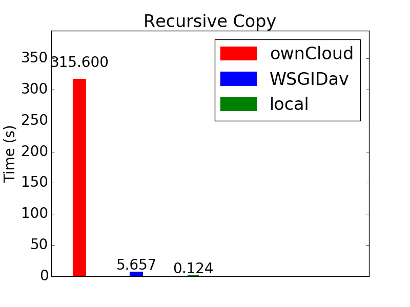
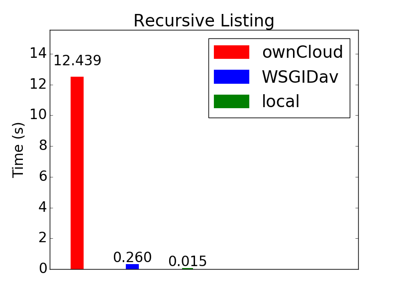
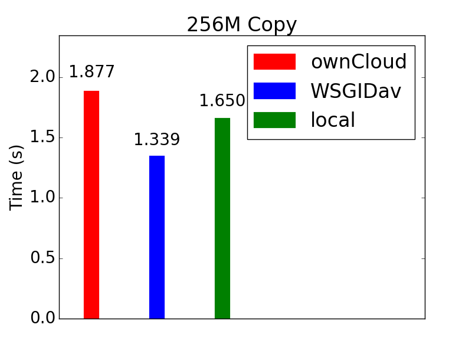

Comparison between ownCloud and WsgiDAV
=======================================

This is a quick and dirty performance comparison between the ownCloud WebDav server and WsgiDAV.

A few tests are run:

* a recursive copy of a directory that mostly includes source files
* large file copies (256M, 1G)
* deletion of the directory in the first step
* recursive listing
* evaluation of a jupyter notebook

Both ownCloud and WsgiDAV are run on plain HTTP and locally. Data is stored on an SSD. ownCloud is configured with Redis
caching, with Redis running locally and the connection being through a UNIX socket. Redis is also used for
'memcache.locking'. These are recommended performance settings for ownCloud (see `here
<https://doc.owncloud.org/server/10.0/admin_manual/configuration/server/caching_configuration.html>`_). WsgiDAV is run
with its own HTTP server.

The "many files" used in the tests consist of a structure with 50 sub-directories. There are a total of 680 files adding
up to 5.1MB.

Results
-------

Recursive copy
^^^^^^^^^^^^^^

::

    cp -r ...

Recursive Listing
^^^^^^^^^^^^^^^^^

::

    ls -lR

Recursive delete
^^^^^^^^^^^^^^^^

::

    rm -rf ...

.. image:: ../../images/webdav-performance-plots/Recursive_Delete.png

File copy (256M)
^^^^^^^^^^^^^^^^

This is from local to webdav mount

File copy (1G)
^^^^^^^^^^^^^^

.. image:: ../../images/webdav-performance-plots/1G_Copy.png

Notebook Eval
^^^^^^^^^^^^^

::

    jupyter nbconvert --to notebook --execute ...

The notebook has some code that loads a bunch of data files that are stored in the same directory as the notebook (so
webdav). Jupyter's configuration directory is set to the webdav mount.

.. image:: ../../images/webdav-performance-plots/Notebook_Eval.png
