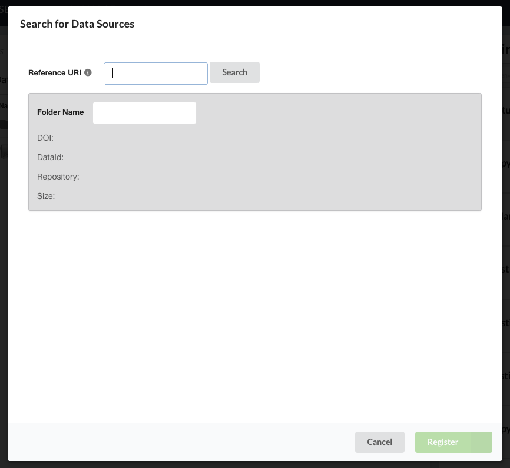

.. _data_registration:

Data Registration
=================
Users can register data from DataONE, Globus, and generic HTTP resources. The publishing
modal dialog is used to interface all three. User facing documentation on the process
can be found on the manage_ page.

Data Searching
--------------
Searching for a dataset by pid or URI is the fist step in registering data from
an external resource. In order to let the user enter a variety of inputs to locate a data package, we
parse the users' query and direct program flow depending on whether the package is
in DataONE, Globus, or an HTTP resource.

An endpoint, *repository/lookupData*, is responsible for taking an argument which should be a pid or
URI and returns a dictionary that contains information about the size, name, 
repository, and doi of the object.

     
     The data registration dialog.

DataONE
~~~~~~~
To locate data in DataONE, DataONE's SOLR endpoint is used. To get the user input 
in a form that can be used with SOLR, the input is parsed in *find_initial_pid*.
One field that we report to the user is package size. To do this, each object in the
package must be located and its size recorded.
Using the cleaned from *find_initial_pid*,the metadata document describing the package is located
in *find_resource_pid*. The resulting documents that are in the main metadata record are then
located in SOLR and their sizes recorded. Once complete, the dictionary is created and returned.

  
Globus
~~~~~~

HTTP Resources
~~~~~~~~~~~~~~
If the object is an HTTP resource, *repository._http_lookup* is called. The method
uses the *urllib* and *requests* python packages to retrieve information about the file
from the response header. The dictionary is then constructed with this information
and returned.

Data Ingestion
--------------

DataONE
~~~~~~~

Globus
~~~~~~

HTTP Resources
~~~~~~~~~~~~~~

.. _manage: http://wholetale.readthedocs.io/users_guide/manage.html
