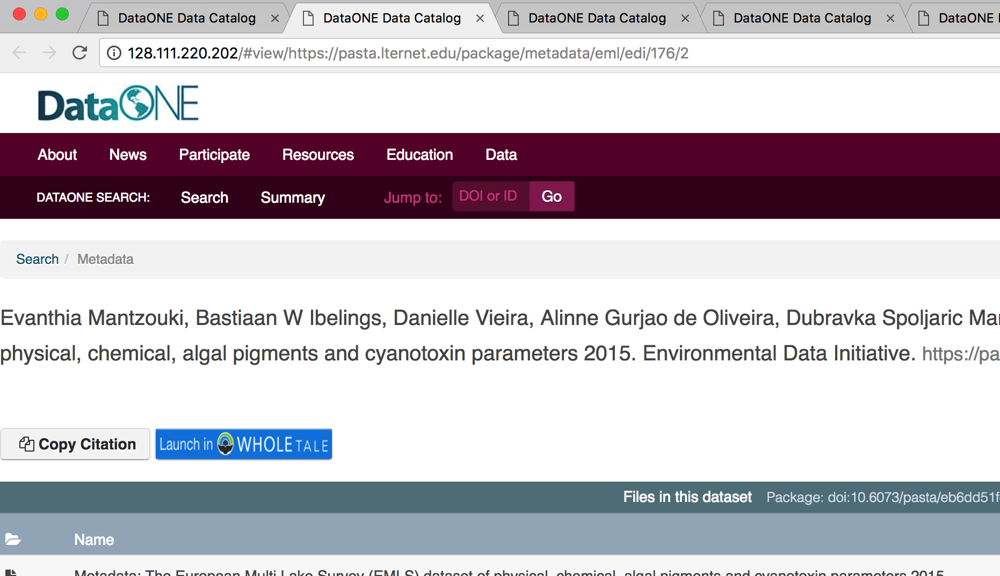
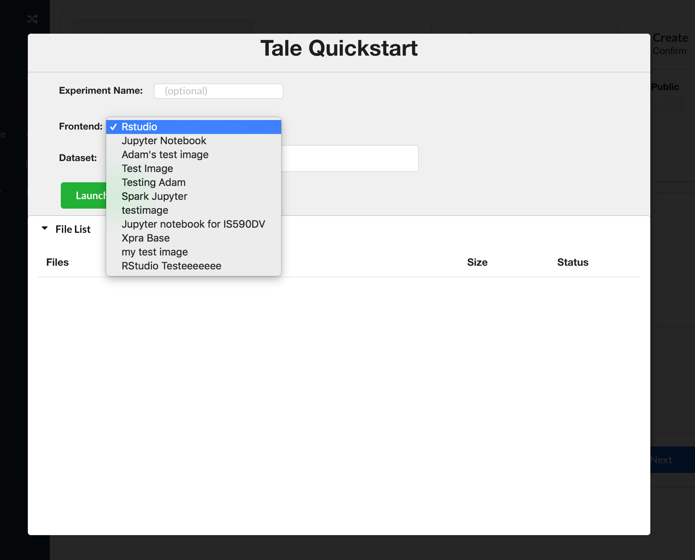

This folder has information relevant to what the user will experience when coming
from a DataONE package into WholeTale. The images used to generate the original mockups are in the ``design_media`` folder. Images in this directory are how the current system looks.

DataONE to WholeTale Workflow
=================================

When a user wants to take a data package from DataONE, they can do so in two ways:

1. By using the existing data registration modal dialog and then using the tale creation workflow.

2. By clicking a ``Launch`` button while viewing a DataONE package (in DataONE). This button combines the functionality of registering data *and* creating the tale. 

On the DataONE side, each data package has a button that the user can click
which will bring them to WholeTale. This can be seen in the image below. The position 
of the button may change as the `Making Data Count 
<http://mdc.lagotto.io/>`_ project progresses, which proposes UI changes in DataONE. Regardless
of button position, the workflow will remain the same.

    
Once the button is clicked, the user is brought over to WholeTale in a new tab. If the user has not logged into WholeTale,
they are prompted to do so at the WholeTale login page. There is discussion of integrating the DataONE and WholeTale authentication systems, which may obsolete this step. Once logged in, they are re-directed to WholeTale where a modal dialog overlays the site (see image below). 

.. image:: modal_final.png
    :alt: WholeTale's Landing Page

If the user has already logged into WholeTale and has an active session, the login step is bypassed and she/he is presented with the modal.

Although the tale names are optional, when the modal pops open the user's cursor is
initially placed in the ``Experiment Name`` box. Below, they can select which image they would like to use to run their tale.
This content is dynamic, and lists all of the images that the user has access to.

The dataset input box is automatically filled out with the package url from DataONE. Once
the user is content with the name and image, they can click the 'Register' button.
Once clicked, the file list is populated with the contents of the data package. One
key component of this is the indicator circle in the last column. As the package is
registered, the circles turn green. Registration currently takes place on a package-by-package
basis, which results in the UI updating on every complete package. 

When registration completes, the tale is created and the user is redirected to the 
tale view page, completing the data ingestion/creation process.

Extensions:

1. Let the user pick which files they would like in the package. This would require 
implementing registration file-by-file, which would allow for a more fine grained update
system.

2. Automatically populate the file list when the modal opens. There probably isn't a need to wait for the user to click the ``Register`` button since it should be implied that they intend to register that particular package.
