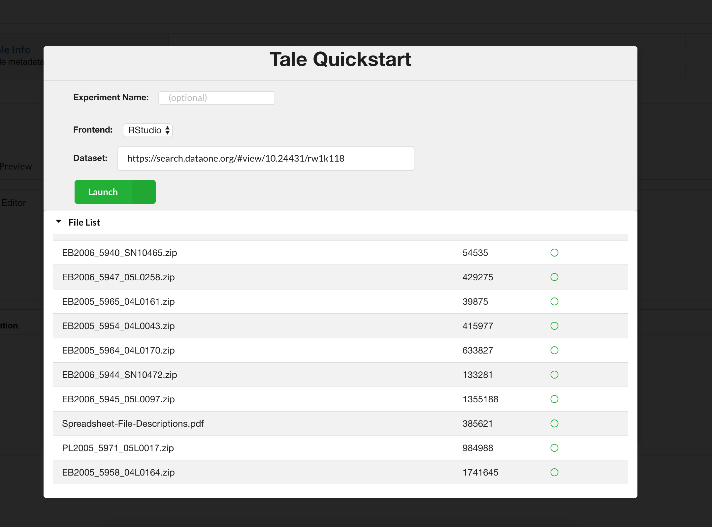

DataONE to WholeTale Landing Page
=================================

This folder has information relevant to what the user will experience when coming
from a DataONE package into WholeTale. 

Behavior:

#. When the dialog opens, the filename text area is left to the user to fill in.
#. The url that the user came from in DataONE is automatically transferred into the 
   Dataset box. This will eventually be changed to the DOI to support the case
   that the user comes from a member node.
#. When the user clicks Launch, the files are first listed out, and then registration begins.
#. Once complete, a tale is created from the new dataset and the image that the user
   selected in the dropdown (this is currently being tested).
   
Extensions:

#. Instead of immediately beginning registration, let the user pick the files
   that she/he wants.
