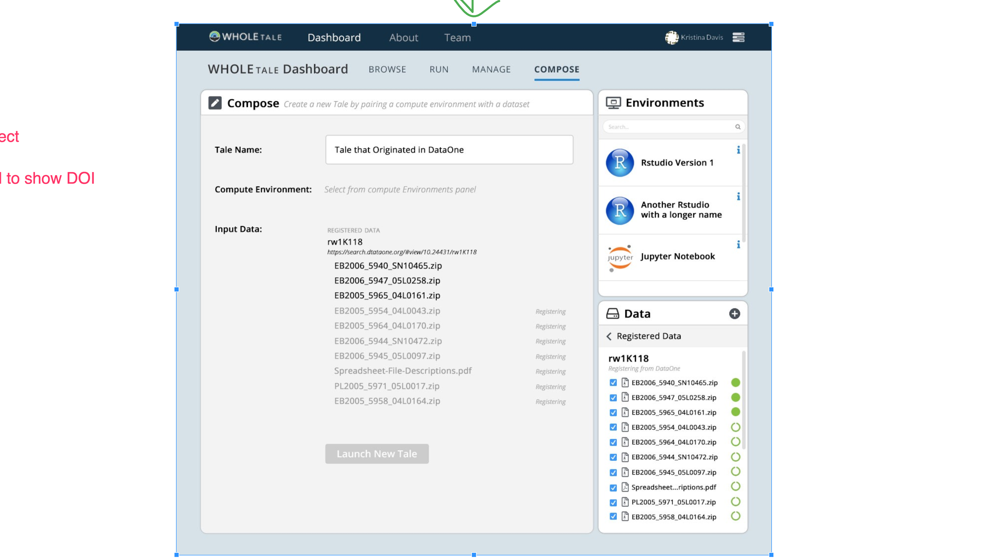
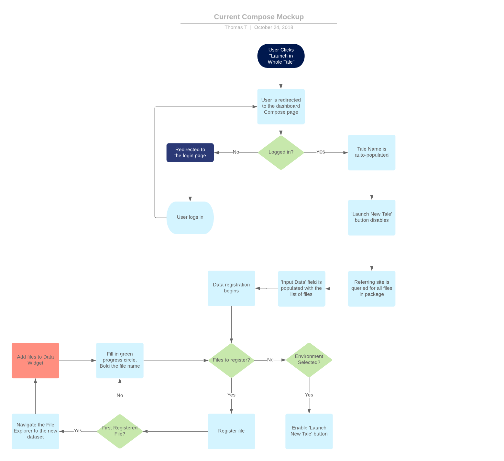
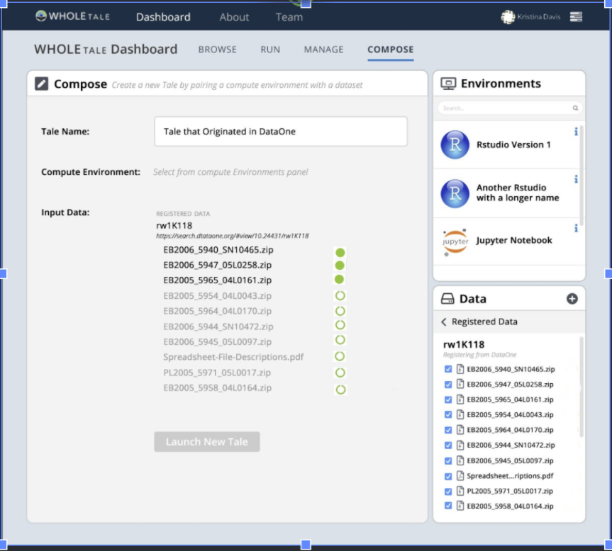
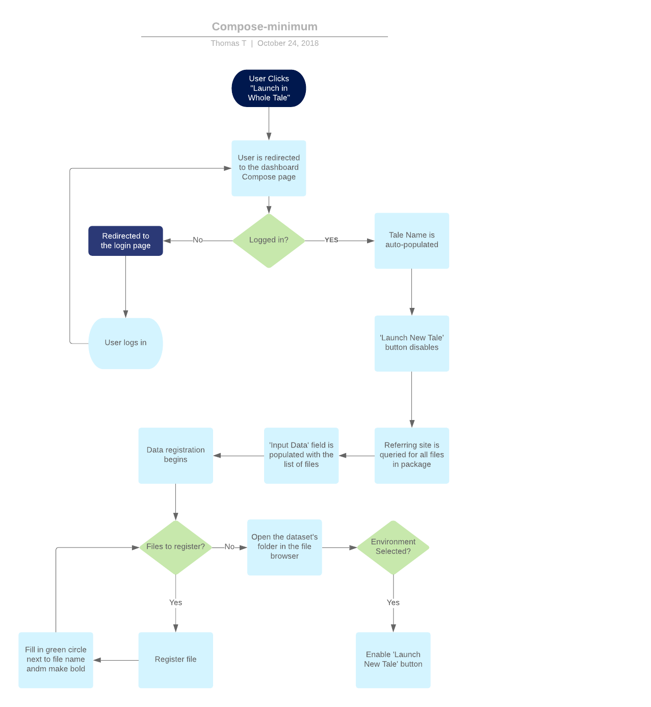
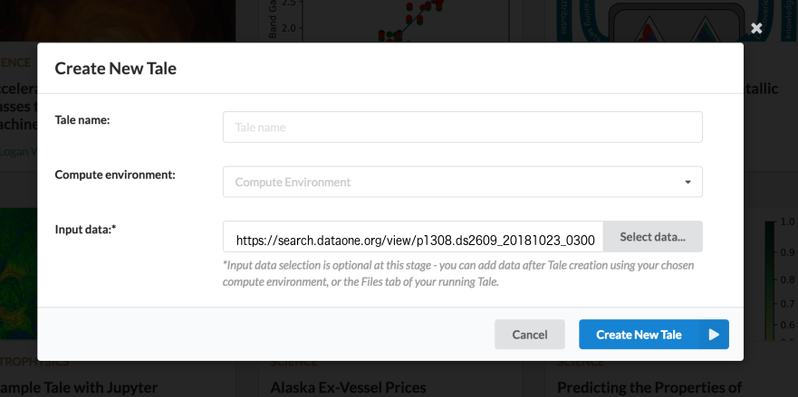
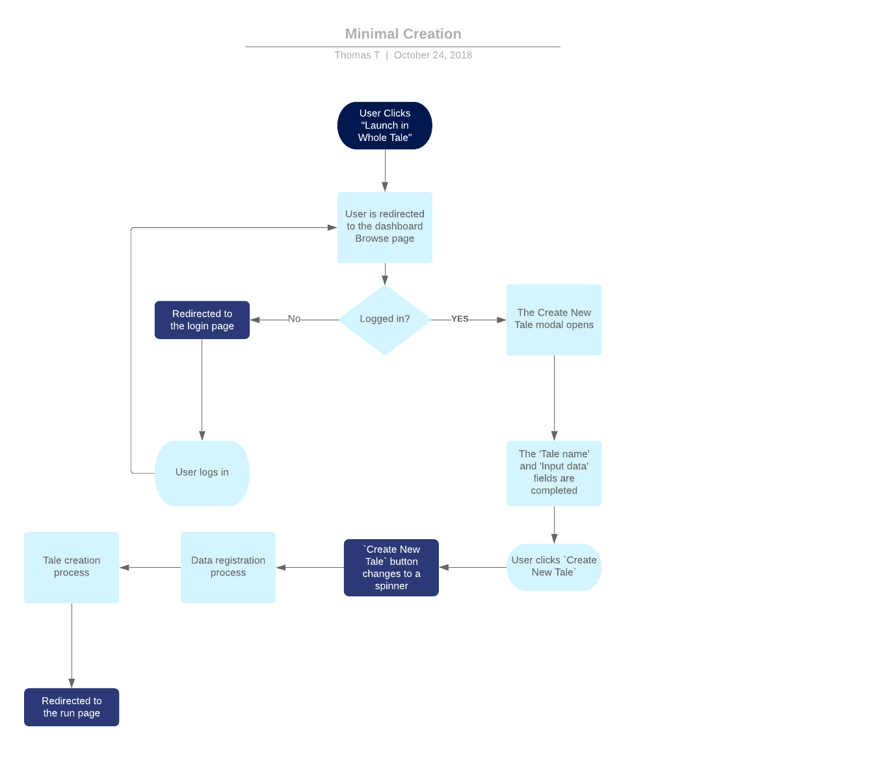

.. _importing_tales:

Tale Importing
==============

Background
----------

Importing Tales is an important feature for not only our users but also for the NSF.
Implementing this feature opens our system up for new uses and is the second half to
round tripping a tale. This task can be broken in to two phases:
   
   1. Importing & Launching Data from External Packages
   
         This phase handles datasets which are not Tales. When a user launches a
         dataset in Whole Tale, we automatically register the data and create 
         the Tale after an environment is selected.
         
   2. Importing & Launching Tales from External Packages 
   
         This phase extends the previous by adding support for parsing the 
         tale.yaml file and creating the corresponding Tale.

Phase 1: Importing & Launching from External Datasets
-----------------------------------------------------

Requirements:

   1. The user's data needs to register in Whole Tale
   2. The user needs to have a way to select an environment
   3. The user needs to be able to set a Tale Name
   

These requirements can be satisfied in a couple of different ways. The first is 
by re-purposing the Compose page. The Compose page may be going away at some point, 
but its replacement could also serve as a good landing spot. These options are 
explored below.

Proposed Mockup 1: Use the Compose Page
^^^^^^^^^^^^^^^^^^^^^^^^^^^^^^^^^^^^^^^

The Compose page is a natural place for the user to land. Upon visiting the page,
data registration automatically begins. The files are listed under the Tale's data
and entries with loading icons are placed in the File Explorer. Once registration 
completes, the `Launch New Tale` button enables.

Adding files to the widget is red because the File Explorer was never meant to 
support this kind of functionality. It is a graphical reflection of the filesystem, 
and files are added one-by-one during file registration. The proposed method would 
work if we created a record for each file (thus adding it to the filesystem, which
would appear in the UI) and fill in the bytes on a second pass-which is not realistic.
A second solution involves hacking the the file browser, which isn't recommended.

Pros:
   1. The requirements can be satisfied in this page
   2. The user is familiar with this dialog

Cons:
   1. Adding the file state in the File Explorer is a technical hurdle
   2. This page may go away at some point

Proposed Mockup 2: Use the Compose Page
^^^^^^^^^^^^^^^^^^^^^^^^^^^^^^^^^^^^^^^

This mockup uses the Compose page like the first, but moves the loading icons to 
the files listed under the Tale's data section. This gets around the technical hurdle 
of modifying the file browser.

Pros:
   1. [See Mockup 1]
   2. Reduces complexity of tweaking the File Explorer
   3. Can re-use the code that was written for the `Input data` field

Cons: 
   1. [See Mockup 1]

Proposed Mockup 3: Create the New Tale Dialog
^^^^^^^^^^^^^^^^^^^^^^^^^^^^^^^^^^^^^^^^^^^^^

The New Tale Dialog can be modified to support data registration if the user
pastes a link in the `Input data` field. The dialog would open when the user 
lands on Whole Tale. The referring URL would be placed in the `Input data field`, 
and the user can then click `Create New Tale` which registers the data and launches 
the Tale.

Pros:
   1. Get a head start on the UI refactor
   2. It's lightweight-keeping state shouldn't be a major issue
   
   
Cons:
   1. Need to define the behavior of the dialog
   2. Need to create the dialog
   
   
Summary
^^^^^^^

In summary, we have two choices:

    1. Use the existing Compose page
    2. Create the first version of the New Tale Modal

The Compose page and New Tale Modal are almost the same. The New Tale Modal 
doesn't have the File Explorer that the Compose page has (bottom right) and has a 
data selection button. The `Input data` section is closely related, and any 
development work done on that component should be transferable to the New 
Tale Modal when the time comes.

