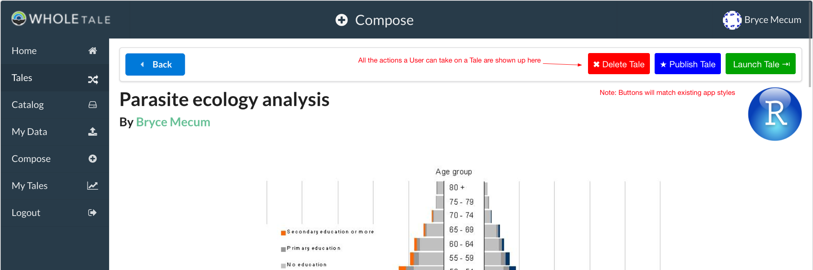
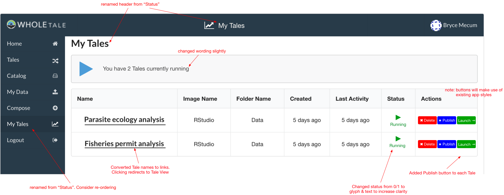
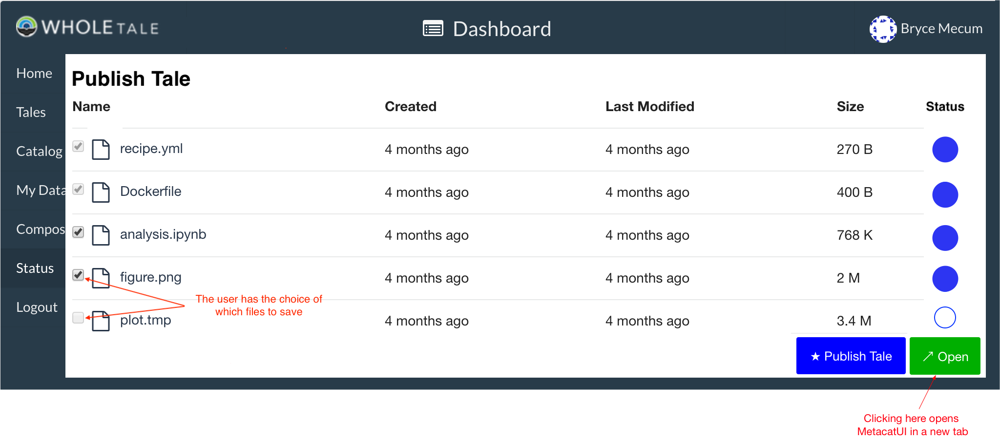
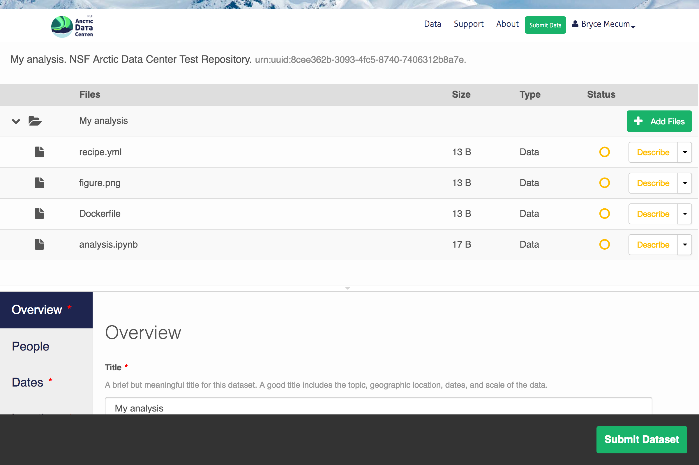
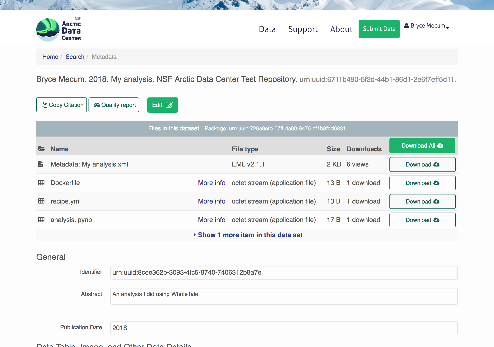
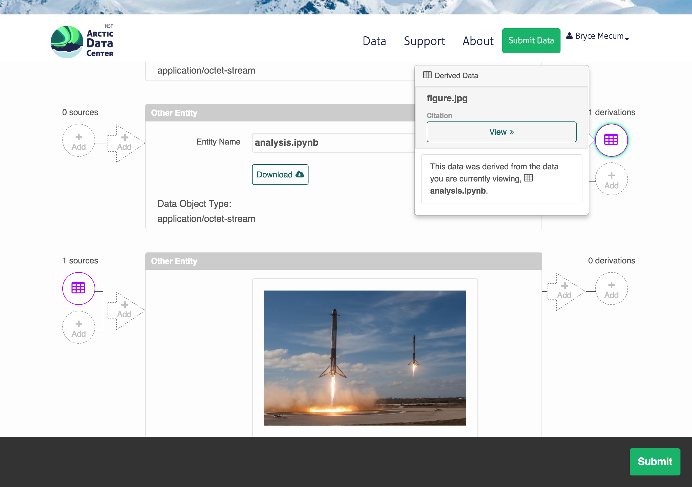
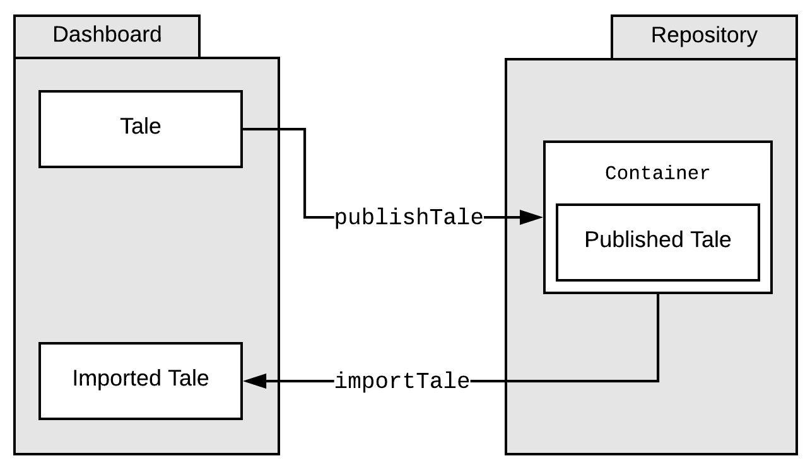
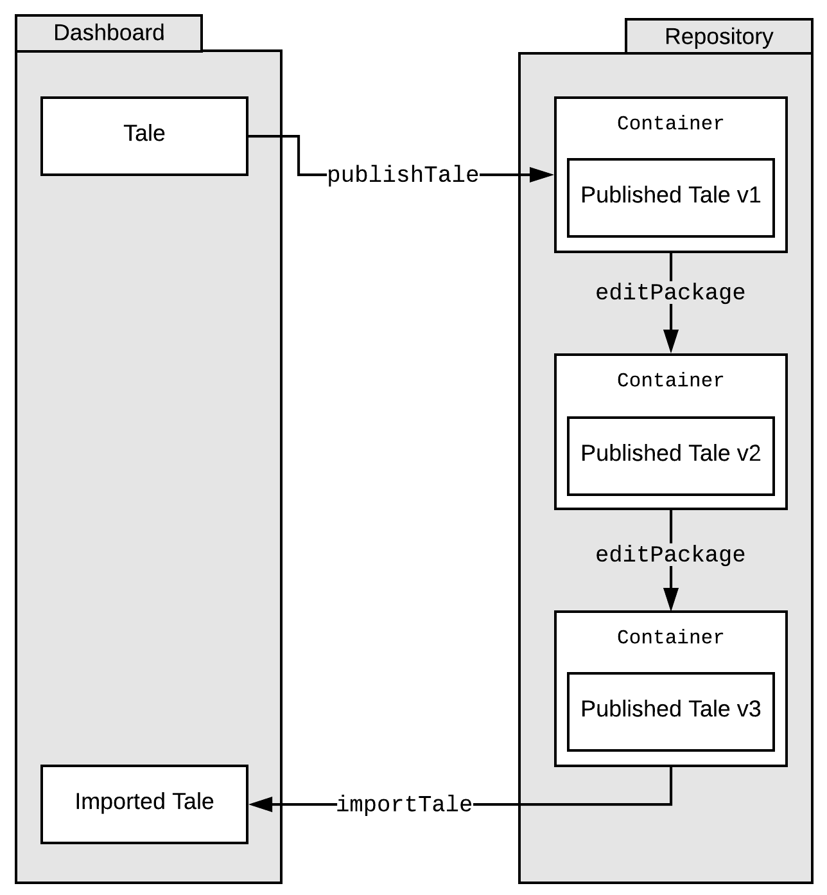

.. _publishing_tales:

Tale Publishing
===============

Background
----------

When a user has created a Tale and wishes to freeze the state and publish it so it can be shared/launched/cited by others, they will be able to publish their Tale on an external repository such as a DataONE Member Node.

High-Level Requirements
-----------------------

1. Tales can be published to one or more external repositories
2. Published Tales can be round-tripped: A Tale can be published, then imported back into a WholeTale environment, modified, and re-published
3. Tales will include detailed metadata describing the contents (files) of the Tale
4. Tales will include detailed provenance information so that the reader of the Tale understands how the filesystem artifacts contained within each tale relate to one another
5. Published Tales have to work outside the WT environment (to at least some degree)
6. Tales should function as first-class, citable research products (they get DOIs)
7. Published Tales can be linked to related journal manuscripts (See `Linking Tales to Manuscripts`_.

Development Plan
--------

In order to complete this incrementally, two phases are planned.

1. **Phase 1:** 
    Re-use as much existing tooling as possible to get _something_ working.
    Captured metadata and provenance will be minimal but we will work on those in Phase 2. OAuth
    will be used to authenticate the user with DataONE from Whole Tale. This can be considered milestone 0.5 MVP.
2. **Phase 2:**
    Extend the result of Phase 1 to include the capture of detailed metadata with a focus on enhancing provenance information.

Phase 1: 0.5 MVP
----------------

By the end of this phase, a user will be able to  Publish a Tale to DataONE. Most
of the work will be in the *girder-wholetale* plugin.

The first chunk of work is creating the necessary files needed to comply with the 
DataONE package standards. These files are outlined on the `automated metadata generation`_ page.

For enhanced metadata, MetacatUI_'s web interface will be used
For Provenance:
  - Automatically include some provenance we're already storing in WholeTale
  - For manual provenance: Re-use MetacatUI_ and its graphical provenance editor
  - Also support provenance in R (via recordr) and Python (implement. prov Python lib)

The UI is a modal dialog that allows the user to select which files are included
in the package. It also lets them choose an appropriate license for the package.
DataONE authentication is also performed from this dialog.

For more information on the UI, see `Look & Feel (Phase 1)`_.
For more information on DataONE authentication, see `DataONE Authentication`_

Phase 2
*******

- For Metadata: Consider capturing detailed metadata in the WholeTale Dashboard directly
- For Provenance: Consider capturing detailed provenance in the WholeTale Dashboard directly

See `Look & Feel (Phase 2)`_ for details.

DataONE Authentication
----------------------

Look & Feel (Phase 1)
---------------------
Once a user creates a tale, they have the option to publish it in the **run** page.

1. Click "Publish Tale" button in Tale View or Tales View
2. [Optionally] De-select some of the suggested files to publish
3. Click "Publish"
4. Wait for publishing to complete (this is a remote operation)
5. Click "Finish Publication" (launches new tab with Package Editor (MetcatUI hosted on a DataONE Member Node)
6. [Optionally] Improve metadata and provenance information and re-publish a new version using MetacatUI

Tale View
*********

The Tale View is one of the two places a user can Publish from.
Clicking "Publish Tale" launches the Tale Publication View.

*Note: This is a very rough mockup and does not reflect how it will look when implemented.*

Status View
***********

The Status View is one of the two places a user can Publish from.
Clicking "Publish Tale" launches the Tale Publication View.

*Note: This is a rough mockup.*

Tale Publication View
*********************

Once the user has clicked Publish, they'll be presented with the following modal dialog.

.. image:: images/tale_publish_empty.png

Notes:

- I think we want to show the user every filesystem artifact we're saving on their behalf, so they at they aren't confused when they see new files

Once the upload is done, the user sees filled-in circles and an Open button which opens a new tab with the Data Package Edit View so they can edit their published Tale.

*Note: This is a rough mockup.*

Authoring Metadata
******************

In Phase 1, we're re-using MetacatUI_ for advanced authoring metadata.

**Data Package Edit View**

User ends up here in a new tab after they click "Publish" on the previous page.
The previous page has already created a skeleton Data Package within DataONE.
They can (optionally) add more metadata to their Tale using the metadata editor.
If they do nothing (close the browser) now, their Tale is still saved.

**Data Package View**

User ends up here after clicking Submit and choosing to view their package.

Authoring Provenance
********************

**Provenance Edit View**

If the user scrolls down in the above view, they can edit provenance information.

Look & Feel (Phase 2)
---------------------

Authoring Metadata
******************

TBD: Extend Dashboard's ability to author metadata.

Authoring Provenance
********************

A minor step up from not capturing manual provenance in the Dashboard would be something like this. The user specifies which files are inputs, scripts, and outputs. This is nice because it (1) captures some provenance and (2) is easy for the user. This would be better if the user was drawing directly links between each file but that would increase the complexity for both developers and users.

.. image:: images/tale_publish-phase2.png

The above design captures basic provenance, but I think what we need to do to really sell WholeTale and its reproducibility aims is to develop a rich interface that lets the user make use of the PROVONE ontology. Basically a richer interface to what MetacatUI provides.

Implementation
--------------

Generating Metadata
********************

A minimal EML record will be created automatically when the skeleton Data Package is created using the information we're already capturing in the Dashboard.
The backend needs to be able to generate a minimal EML record which is fairly straightforward.
The user will then have the option of creating more descriptive metadata using MetacatUI.

Generating Provenance
*********************

There is a mix of system (we generate for the user) and user (the user generates) provenance.
System provenance includes which Recipe was used and which filesystem artifacts were available to the Frontend.
User provenance includes provenance created while using the Frontend (e.g., recordr) and provenance the user asserts after Publishing using MetacatUI.

Saving to the External Repository
*********************************

A Tale may be Published to multiple external repositories. Each of these repositories handles details such as:

- Storage and organization of the files within a Tale
- Search and discovery
- Identifiers, including DOIs

The WholeTale Backend will do the majority of the work to publish Tales.
During development, we'll use https://dev.nceas.ucsb.edu which exposes the DataONE API at https://dev.nceas.ucsb.edu/knb/d1/mn/v2.
Authentication will be performed by hard-coding a DataONE JWT as a stop-gap until we decide how to handle authentication.

We will need to extend the WholeTale API so that the Dashboard can easily trigger a Publication event (which may take a great deal of time due to file sizes).

TODO: Do we implement the API as a single call, or many calls for each item? We want the user to have feedback when the entire job fails but also when a single one fails, so the Dashboard can retry it. Do we expose this to the user to resolve (then go with many calls) or just handle it seamlessly (one call). Probably one call. But I'd like to show the user status of each file which might require many calls.

Round-tripping
~~~~~~~~~~~~~~

Because a Tale is just a colection of files, publishing to an external repository and reimporting into WholeTale is a fairly lightweight process. Each repository specifies its own method of containment (the `Container`) which may take on a few forms:

- A folder on a filesystem (local export)
- An OAI/ORE Resource Map (for DataONE and possibly other repositories)

In the simple case:

An alternate, but reasonable case is one where the published Tale is modified on the Repository before being re-imported into WholeTale:

Identifiers and DOIs
~~~~~~~~~~~~~~~~~~~~

TBD

Identifiers and DOIs are a concern of the Repository, and not WholeTale.
That said, we have a vested interest in thinking about how this is done, in part because DataONE is the main external Repository.

What gets the DOI? At this point, I think what gets the DOI might differ depending on which repository we're saving. For DataONE, I'd lobby that the Resource Map get the DOI.

Who mints the DOI? WholeTale will not mint DOIs. DOI minting is the responsibility of the repository. For DataONE, we will mint the DOI.

Sequence Diagram
~~~~~~~~~~~~~~~~

TODO: Add alternative seq diagram for individual saveTale request per object

.. uml::

    @startuml diag
      User -> Dashboard: Clicks "Publish"
      activate Dashboard
      Dashboard -> Backend: req saveTale(id)
      activate Backend
      loop each item
        Backend -> Repository: req createObject
        Repository --> Backend: resp objectCreated
      end
      Backend -> Repository: req createPackage
      Repository --> Backend: resp packageCreated
      Backend --> Dashboard: resp taleSaved(id)
      deactivate Backend
      Dashboard --> User: Updates UI
      deactivate Dashboard
      Repository -> Repository: add metadata
      Repository -> Repository: add provenance
      Repository -> Repository: assign DOI
    @enduml

Terms:

- **User:** User, executing input events in a web browser
- **Dashboard:** The WholeTale Dashboard webapp (client side)
- **Backend:** The WholeTale Backend (server side)
- **Repository:** An archival data repository, e.g., a DataONE Memnber Node

What to save
~~~~~~~~~~~~

Yes:

- Dockerfile
- WT Recipe (yml)
- Uploaded Data (internal) (non-registered)
- Scripts/notebooks
- Output files
- Provenance trace files (like from recordr)

No:

- Registered Data (external). We save the URIs instead.

No or not yet:

- Docker Image(s)

Maybe:

- Installed R and Python packages (either a list of names, or the actual package files)
- R/Python/bash history

Phased implementation:

We'll implement this in phases, in order of increasing difficulty and increasing usefulness:

- Phase 1: Just show the user files/folders from their Workspace
- Phase 2: Also show the user files/folders from their Home
- Phase 3: Automatically determine what files/folders the user is likely to want to save (i.e. calculate filesystem differences)

Linking Tales to Manuscripts
~~~~~~~~~~~~~~~~~~~~~~~~~~~~

TBD

How do we link published Tales to their related manuscripts? Does DataCite support this, does EML support this?

Saving Tales Multiple Times
~~~~~~~~~~~~~~~~~~~~~~~~~~~

TBD

What we do we do when a user publishes a Tale, optionally modifies it somehow in WholeTale, and re-publishes it? These should be linked somehow.

TODOS
-----
- Deal with the Globus side of this
- Find out how much we can instrument Girder to get provenance information for which script read which files
- PROV capture:
  - Installed R/Py packages? Each Frontend needs a heuristic to detect what the user added during the session
- How do we track which tale a tale was forked from?
- Describe how we might make use of package management conventions such as pip's requirements.txt
- How do we handle D1 Objects that were brought into WT, and then re-published? We shouldn't re-create the Objects.
- Add note about how each tale knows about the its publication state, previous publication events

Notes from 2018-02 All Hands Meeting Discussion
-----------------------------------------------

On 2018-02-21, during our 2018 All Hands Meeting at Notre Dame, we discussed publishing Tales for 2-3 hours.
Bryce Mecum took hand-written notes while he presented the contents of ./README.rst and then created this document to save those notes for the rest of the team.

- Victoria asked a clarifying question about whether we're talking about the frozen tale or simply exporting tales.
  - TODO: Make this more clear up top
- TODO: Remove mention of OAI/ORE from Requirements section and move into implementation details
- TODO: Add requirement that published Tales have metadata to the Requirements section
- We discussed how much moderation we do on the quality of tales, and their metadata and provenance. The general concensus of the room was that we would do little in this area and put the burden of publishing quality tales on the repositories storing the Tales.
- TODO: Victoria mentioned TOP guidelines for journals. Bryce: Look into this.
- TODO: Add to Requirements that published Tales can be linked tightly with published journal articles
  - TODO: Describe how this would work in subsequent sections
- The question of whether the user can delete a Tale, even if published. We discussed this and where I think we got on this is that Tales that are not published in external repositories can't be expected to stick around and, since Tales can be round-tripped back into the WT environment, Tales present in WT don't really need to be persistent.
- Victoria made a great comment about allowing the user to select/de-select which files they save. She suggested there may be existing [HCI] research on this topic and that we could potentially use our system to do such research
- TODO: Describe how we might make use of package management conventions such as pip's requirements.txt
- TODO: Design out how multiple published versions of a Tale would be linked togther
  - Bryce: This requires details both in Girder and in DataONE
- We talked about needing to standardize the serialization of Tales, whatever that means
  TODO (for Bryce): Look into Popper
Publication Modal Wish List
  Show automatically calculated diffs
- TODO: Make it clear what gets the DOI (which URL/URI) in the design doc
- TODO: Make it clear who mints the DOIs
- TODO: Investigate BrownDog (we promised this in proposal) for automatic minimal metadata creation
- TODO: Diagram out publishing in a more abstract fashion, abstracting out the provide-specific details
- TODO: Establish a set of Repository guidelines, e.g.,
  - Supports either the D1 or Globus APIs
  - Must mint DOIs
- We talked about how EML is roundtripped. When a frozen Tale is imported back into WT, it will have an EML. What do we do when the user then re freezes it? Do we re-use the EML or just parts or do we make the user re-created it from scratch
  - TODO: Deal with this in the design docs
- TODO: Add section to design doc about resurrection/reimport
- Girder probably needs to know the publication state of each Tale
- TODO: Make a generalized diagram for how publishing and reimporting works w/r/t versions.
- Bertram made a point that we might want to make the user specify the entrypoint for their Tale. This would be the file a person opening the Tale would look at first or run first. e.g., the main Jupyter notebook
- We talked about whether detailed PROV is in scope or out. After discussing, the group concensus was that detailed PROV is out of scope. That said, it's part of the proposal so it needs to be addressed somehow.
- TODO: Flesh out what is in the Maybe list in What to Save. We probably want to try to save as much as possible.

.. _MetacatUI: https://github.com/NCEAS/metacatui
.. _automated metadata generation: ../../design_notes/automated_metadata_generation.html
