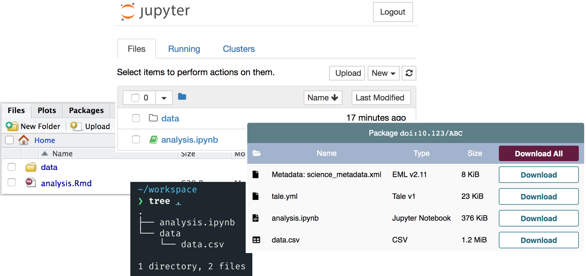

# Tale Serialization

TODO: None of this actually would work given how we're doing things. Either I need to rethink things or we need to adjust how we're doing things in WholeTale. For example, if we let the user pick and choose from their Home, Data, and, and Workspace folders, how do we bring that back into WholeTale? Say the user includes `Home/.Rprofile`, exports a Tale with that file, edits `Home/.Rprofile` in WholeTale, and then imports the exported Tale back into WholeTale. How do we manage the conflict?

## Background

In order to publish, export, or import Tales, Tales are serialzied according to a convention.
This convention:

- Has enough information to re-create the Environment the Tale was original run in
- Supports the full complexity of the WholeTale filesystem (Home, Data, Workspace)
- Contains scientific metadata such as citation information and entity-attribute information
- Can contain provenance information relating artifacts to one another
- Supports derivation of one Tale from another

## Serialization Format

Tales are serialized to filesystems using the following convention:

```text
├── tale.yml       Required. See below.
│
├── metadata.xml   Required.
│
├── recipe         Required. All filesystem artifacts required to
│                  create the Environment the Tale needs to run.
│
├── data           Optional. Selected files from Data folder
│
├── home           Optional. Selected files from Home folder
│
└── workspace      Optional. Selected files from Home folder
```

Notes:

- `data`, `home`, and `workspace` are the same Data, Home, and Workspace the user sees while using the Dashboard or their Environment but don't necessarily contain all of the files in those directories as the user can pick and choose
- Serialized Tales can be either zip/tar/tar.gz/etc'd up or untarred/expanded on disk

### Details

- `tale.yml`:

  **Required**

  The `tale.yml` file is a [YAML](http://yaml.org/)-formatted file containing minimal metadata needed to connect the rest of the filesystem artifacts in the serialized Tale as well as some operational metadata needed by WholeTale to work with the serialized Tale.

  ```yaml
  version: 1                    # Required. Version string for parsers.
  identifier: xyz               # Required. System ID for the Tale
  metadata: metadata.xml        # Required. Location to find detailed metadata
                                # (relative to the top level)
  entrypoint: workspace/run.sh  # Required. Location to find detailed metadata
                                # (relative to the top level)
  derived_from: abc             # Optional. Another Tale's system ID
  ```

- `metadata.xml`

  **Required**

  `metadata.xml` is a file (could be JSON) that provides scientific metadata about the Tale such as who made the Tale, how the Tale was made, etc.

  Note: For now, this will be an Ecological Metadata Language file (an XML format) but other formats could work.

- recipe

  **Required**

  In WholeTale, a Recipe helps us launch the Environment for the user.
  In actuality, it's a tarball of a GitHub repo that contains things like Dockerfiles or requirements.txt files.
  To make a useful serialization of a Tale, we archive these files rather than reference them at their location on GitHub because GitHub is not a long-term archive.

- `data`, `home`, and `workspace`

  **Optional**. At least one file from one of the three is required (an entrypoint)

  The user can select one or more files from their Data, Home, or Workspace directories to include in their serialized Tale.
  Because serialized Tales can be imported back into WholeTale (see Use Case 2, below), we maintain the file and folder structure the user created for their Tale's filesystem artifacts so the serialized Tale matches the imported Tale.

## Use cases

The details of the serialization of Tales are relevant to three user-driven use cases:

1. Publish a Tale to an external repository
2. Impport a Tale into WholeTale
3. Export a Tale to a local filesystem

### Use case 1: Publish a Tale

TODO

### Use case 2: Import a Tale

TODO

### Use case 3: Export a Tale

TODO

# Archived content

## Background

What makes a Tale a Tale? And how is it stored, transferred from one place to another, archived, and cited?
The answer to these questions impacts numerous parts of this project.

Let's start by listing the information contained in a Tale. The core stuff is:

- The computing environment the researcher used, e.g.,
  - A Dockerfile
  - Environment-specific 
- The data the researcher used, e.g.,
  - Files local to the WholeTale environment
  - Remote files (DataONE, Globus)
- How the researcher used that data, e.g.,
  - Python scripts, notebooks
  - R scripts, notebooks
- What the researcher did with that data, e.g.,
  - Plots
  - Derived data
  - Really _any_ output

Additionally, we want to support additional metadata about the Tale:

- Scientific metadata on the Tale and its parts (creator, license, detailed file metadata)
- Provenance information
- The paper(s) this Tale represents the analysis for
- Relationships to other Tales
  - New version of an existing Tale?
  - Fork of another person's Tale?

At a minimum, the serialized Tale needs to contain enough information to be runnable (e.g., the user can get back into the running Frontend) in a WholeTale environment, and possibly outside of one (with some minor re-configuration or some extra steps.

Whichever serialization method we use, which may change over time, the core information being serialized will be the same. For example, we may use YML today, and use JSON-LD later on but the information in each file would be the same.

## Usability:

A Tale should be recognizable as a Tale no matter the system it's in:



This needs a discussion for sure. I think it's important that the user can identify a Tale in the wild and also can identity their Tale as it moves out of WholeTale and into an archival repository. At current, we aren't striving to achieve this because the user has to manage Home, Data, and Workspace directories while in WholeTale so the artifacts they might want to archive with their Tale are scattered across numerous places.

Potential problem: DataONE doesn't deal with folders as well as we might need. DataONE federates Objects (loosely: files) into Data Packages which is presented to the user as a flat bag of Objects. Data Packages can contain other Data Packages as children so something like folders can work but, in practice, this doesn't work as well as it should (yet).

## Proposal

1. Dictate a "glue" file be also included at the top level
DataONE, other container formats as needed by archival repositories
2. Dictate that a Dockerfile should be present at the root of the folder, BagIt archive, DataONE Data Package, etc
3. Use BagIt for storage/export/transmission, DataONE Resource Maps when archiving on 

### Glue file

On https://github.com/whole-tale/whole-tale/issues/24 we were linked a super helpful Google Doc with lots of existing data packaging formats:
https://docs.google.com/document/d/155lA2BcixTl-zwJHGfLkxsmg7WmQbBK00QWyP8QggkE/edit

I think requiring a WholeTale "glue" file to give WholeTale enough information to reconstruct the Tale is not necessarily a hard requirement but more of an option at this point.

Options:

- Establish a `tale.yml` at the root (YAML or another format, such as JSON-LD) that looks something like this:

    ```yml
    version: 1
    name: "The Tale Name"
    description: "A description of the Tale"
    creator: "Tale User"
    metadata:
      - tale_metadata.xml
    data:
      - https://cn.dataone.org/cn/v2/resolve/XYZ
      - some_local_file.csv
    entrypoint: analysis.Rmd
    output:
      - output.png
      - derived_data.csv
    ```

- JSON-LD or other format version of the above at the root
- codemeta.json (JSON-LD) at the root instead (Develop our own vocab, use existing?)
  - I don't think this is quite the right fit but it's interesting to think about
- OAI/ORE at the root (may need to develop our own vocab)
- Re-use [ERC config file](http://o2r.info/erc-spec/spec/#erc-configuration-file)
    ```yml
    id: b9b0099e-9f8d-4a33-8acf-cb0c062efaec
    spec_version: 1
    main: workflow.Rmd
    display: paper.html
    ```

## Use Cases

### Local Tale Export

The user of the Dashboard wants to save a copy of a Tale to their computer

The user takes the following actions:

1. Navigates to Tale View
2. Clicks "Export Tale" button

    [A modal dialog pops up showing a list of files and other options]
3. (Optional) The user selects/de-selects some of the files
4. They click the "Export Tale" button

    [User's browser downloads a ZIP file]

The ZIP file in (3) follows makes use of the BagIt standard.

Implementation:

- Create a new Girder API method, like `/tale/export` that takes as optional input the files the user has selected
- That endpoint will create a BagIt zip that looks something like this:

```txt
tale/
|-- data
|   Dockerfile
|   \-- analysis
|       \-- analysis.ipynb
|   \-- figures
|       \-- plot.png
|   \-- data
|       \-- some_data.csv
|-- manifest-md5.txt
|     49afbd86a1ca9f34b677a3f09655eae9 data/Dockerfile
|     49afbd86a1ca9f34b677a3f09655eae9 data/analysis/analysis.ipynb
|     49afbd86a1ca9f34b677a3f09655eae9 data/figures/q172.png
|     49afbd86a1ca9f34b677a3f09655eae9 data/data/some_data.csv
\-- bagit.txt
      BagIt-Version: 0.97
      Tag-File-Character-Encoding: UTF-8
```

Potential issues:

- AFAIK ZIP files can't be created in a streaming fashion so the backend will have to buffer the entire ZIP before sending. Also AFAIK `tar.gz` can give you streaming and compression so we might think about this.
- Do we allow the user to export large data files?

### Tale Publishing (Freezing)

This flow describes the most basic case of tale publishing: freezing a tale for reference. 

Steps: 
   1. The user starts on the `Run` page. In the tale header section, they click `Publish` and choose `DataONE` from the dropdown.
   3. The user uses the `publishing` modal dialog to select the files needed to reproduce the experiment and can select which license they'd like to use
   4. The user clicks 'publish' and uses the OAuth flow if needed. Otherwise the publishing will kick off.
   5. Once complete, a new tab opens and redirects to the package page.
   6. The user can then optionally do things like generate a quality report, generate citations, or add additional metadata.

Now that the tale is in DataONE, the scientist can come back at a later time to share or import it.

### Tale Importing (Un-Freezing)

The user of an external repository has found a Tale and wants to bring it back into the WholeTale environment

[The user is already on an external repository where a Tale has been published, such as DataONE]

1. Clicks "Import into WholeTale"

    [A new tab opens in the user's browser with the WholeTale Dashboard]

Note: Not totally sure what the user experience is here

## TODO

(Notes for Bryce)

- I think it's great to make the entrypoint explicit
- What about the "result" too?
- Matt: Start with flat representation
- Other idea: Archive a bagit zip directly on dataone
- Also add in ability to scan container fs for installed packages (deb, npm, etc.)
- Add in related/prior art (like ERC, datapackage.json, etc.)
