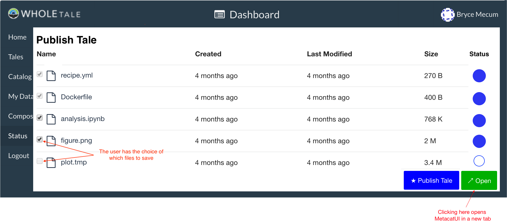
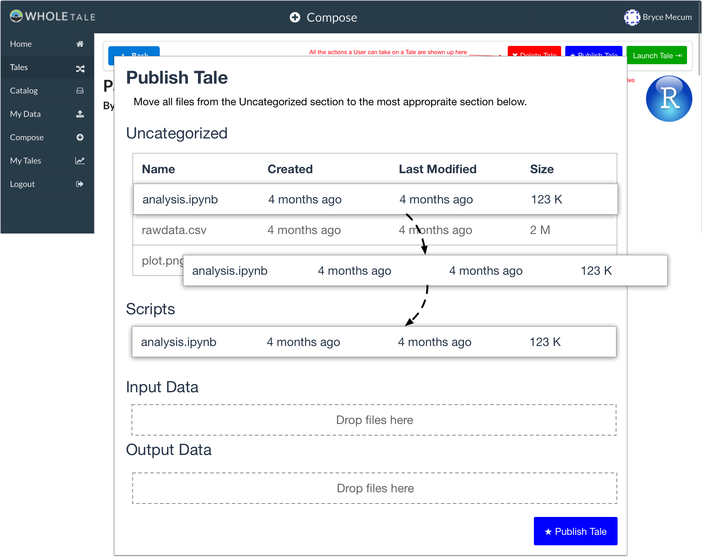

Tale Publishing
===============

Background
----------

When a user has created a Tale and wishes to publish it so it can be shared/launched by others, they will be able to publish their Tale on an external repository such as a DataONE Member Node.

Requirements
-------------

1. Tales can be published to one or more external repositories using OAI/ORE Resource Maps to bundle filesystem artifacts together
2. Published Tales can be round-tripped: A Tale can be published, then imported back into a WholeTale environment, modified, and re-published
3. Tales will include detailed provenance information so that the reader of the Tale understands how the filesystem artifacts contained within each tale relate to one another
4. Published Tales have to work outside the WT environment (to at least some degree)

Approach
--------

We'll take a two-phased approach:

- **Phase 1:** Re-use as much existing tooling as possible to get _something_ working. Captured metadata and provenance will be minimal but we will work on those in Phase 2. Think of this as Minimum Viable Product.
- **Phase 2:** Extend the result of Phase 1 to include the capture of detailed metadata and (especially) provenance information.

Phase 1
*******

Make as much use of existing tools as possible.
To publish Tales, we'll need to create metadata, provenance information, and package everything up for saving to external repositories.

- For Metadata: Re-use MetacatUI_ and its advanced EML Editor
- For Provenance: 
  - Automatically include some provenance we're already storing in WholeTale
  - For manual provenance: Re-use MetacatUI_ and its graphical provenance editor
  - Also support provenance in R (via recordr) and Python (implement. prov Python lib)

.. _MetacatUI: https://github.com/NCEAS/metacatui

See `Look & Feel (Phase 1)`_ for details.

Phase 2
*******

- For Metadata: Consider capturing detailed metadata in the WholeTale Dashboard directly
- For Provenance: Consider capturing detailed provenance in the WholeTale Dashboard directly

See `Look & Feel (Phase 2)`_ for details.

Language
--------

How we talk about this in user interfaces is important.
Use the words **publish/published/publishing** in favor of words like save, archive, reposit, etc.

Look & Feel (Phase 1)
---------------------

The user has just run an analysis in their frontend of choice.
They can now Publish their Tale in a series of steps:

1. Click "Publish Tale" button in Tale View or Tales View
2. [Optionally] De-select some of the suggested files to publish
3. Click "Publish"
4. Wait for publishing to complete (this is a remote operation)
5. Click "Finish Publication" (launches new tab with Package Editor (MetcatUI hosted on a DataONE Member Node)
6. [Optionally] Improve metadata and provenance information and re-publish a new version using MetacatUI

Tale View
*********

The Tale View is one of the two places a user can Publish from.
Clicking "Publish Tale" launches the Tale Publication View.

*Note: This is a very rough mockup and does not reflect how it will look when implemented.*

.. image:: images/tale_view.png

Status View
***********

The Status View is one of the two places a user can Publish from.
Clicking "Publish Tale" launches the Tale Publication View.

*Note: This is a rough mockup.

.. image:: images/tale_status.png

Tale Publication View
*********************

Once the user has clicked Publish Tale in either the Tale or Status View, they see this modal dialog.

*Note: This is a rough mockup.*

.. image:: images/tale_publish.png

Notes:

- I think we want to show the user every filesystem artifact we're saving on their behalf, so they at they aren't confused when they see new files

Once the upload is done, the user sees filled-in circles and an Open button which opens a new tab with the Data Package Edit View so they can edit their published Tale.

*Note: This is a rough mockup.*

Authoring Metadata
******************

In Phase 1, we're re-using MetacatUI_ for advanced authoring metadata.

**Data Package Edit View**

User ends up here in a new tab after they click "Publish" on the previous page.
The previous page has already created a skeleton Data Package within DataONE.
They can (optionally) add more metadata to their Tale using the metadata editor.
If they do nothing (close the browser) now, their Tale is still saved.

.. image:: images/package_edit.png

**Data Package View**

User ends up here after clicking Submit and choosing to view their package.

.. image:: images/package_view.png

Authoring Provenance
********************

**Provenance Edit View**

If the user scrolls down in the above view, they can edit provenance information.

.. image:: images/prov_edit.png

Look & Feel (Phase 2)
---------------------

Authoring Metadata
******************

TBD: Extend Dashboard's ability to author metadata.

Authoring Provenance
********************

A minor step up from not capturing manual provenance in the Dashboard would be something like this. The user specifies which files are inputs, scripts, and outputs. This is nice because it (1) captures some provenance and (2) is easy for the user. This would be better if the user was drawing directly links between each file but that would increase the complexity for both developers and users.

Implementation
--------------

Generating Metadata
********************

A minimal EML record will be created automatically when the skeleton Data Package is created using the information we're already capturing in the Dashboard.
The backend needs to be able to generate a minimal EML record which is fairly straightforward.
The user will then have the option of creating more descriptive metadata using MetacatUI.

Generating Provenance
*********************

There is a mix of system (we generate for the user) and user (the user generates) provenance.
System provenance includes which Recipe was used and which filesystem artifacts were available to the Frontend.
User provenance includes provenance created while using the Frontend (e.g., recordr) and provenance the user asserts after Publishing using MetacatUI.

Saving to the External Repository
*********************************

The WholeTale Backend will do the majority of the work to publish Tales.
Publishing a Tale essentially involves making API calls to the DataONE API and we already have a full-featured Python package for doing all the necessary calls.

We will need to extend the WholeTale API so that the Dashboard can easily trigger a Publication event (which may take a great deal of time due to file sizes).

TODO: Do we implement the API as a single call, or many calls for each item? We want the user to have feedback when the entire job fails but also when a single one fails, so the Dashboard can retry it. Do we expose this to the user to resolve (then go with many calls) or just handle it seamlessly (one call). Probably one call. But I'd like to show the user status of each file which might require many calls.

Sequence Diagram
~~~~~~~~~~~~~~~~

.. uml:: 
   
    @startuml diag
      User -> Dashboard: Clicks "Publish"
      activate Dashboard
      Dashboard -> Backend: req saveTale(id)
      activate Backend
      loop each item
        Backend -> Repository: createObject
        Repository --> Backend: objectCreated
      end
      Backend -> Repository: req createPackage
      Repository --> Backend: resp packageCreated
      Backend --> Dashboard: resp taleSaved(id)
      deactivate Backend
      Dashboard --> User: Updates UI
      deactivate Dashboard
    @enduml

Terms:

- **User:** User, executing input events in a web browser
- **Dashboard:** The WholeTale Dashboard webapp (client side)
- **Backend:** The WholeTale Backend (server side)
- **Repository:** An archival data repository, e.g., a DataONE Memnber Node

Questions for AHM
-----------------

- Do we give Tales DOIs?

TODOS
-----
- Deal with the Globus side of this
- Find out how much we can instrument Girder to get provenance information for which script read which files

