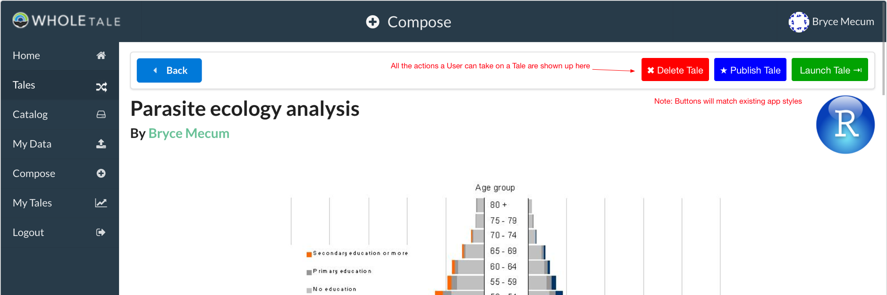
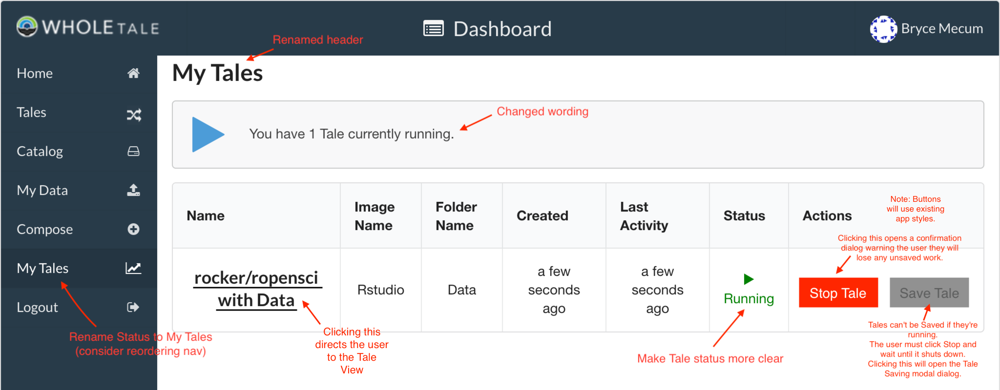
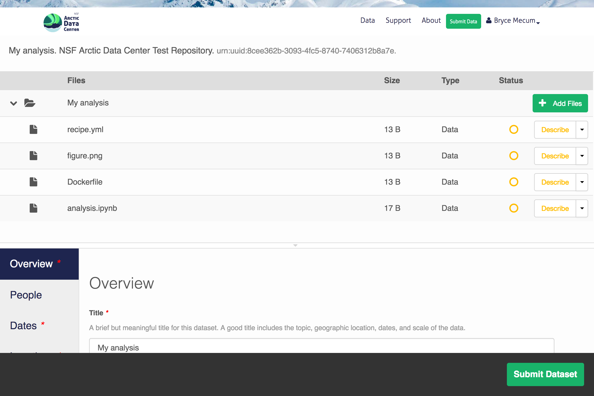
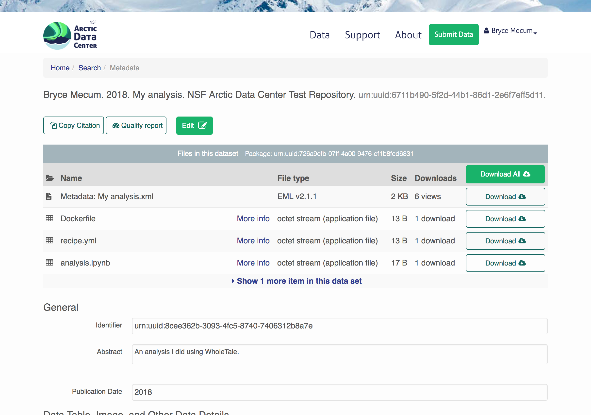
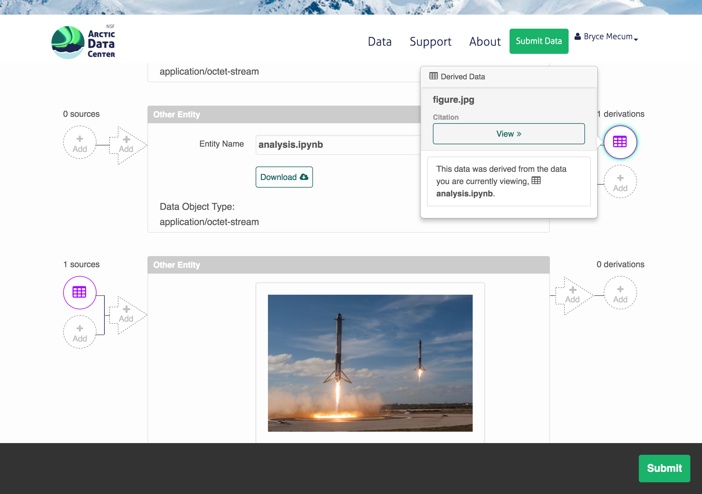

Tale Publishing
===============

TODOS
-----
- TODO: Deal with the Globus side of this

Background
----------

When a user has created a Tale and wishes to publish it so it can be shared/launched by others, they will be able to publish their Tale on an external repository such as a DataONE Member Node.

Requirements
-------------

1. Tales can be published to one or more external repositories using OAI/ORE Resource Maps as the glue between artifacts
2. Published Tales can be round-tripped: A Tale can be published, then imported back into a WholeTale environment, modified, and re-published
3. Tales will include provenance information
4. Published Tales have to work outside the WT environment (to at least some degree) (not necessarily as seamless as in WT?)

Approach
--------

Make as much use of existing tools as possible.
To publish Tales, we'll need to create metadata, provenance information, and package everything up for saving to external repositories.

- For Metadata: Re-use MetacatUI_ and its advanced EML Editor
- For Provenance: 
  - Automatically include some provenance we're already storing in WholeTale
  - For manual provenance: Re-use MetacatUI_ and its graphical provenance editor
  - Also support provenance in R (via recordr) and Python (implement. prov Python lib)

.. _MetacatUI: https://github.com/NCEAS/metacatui

Verbage
-------

How we talk about this in user interfaces is important.
Use the words publish/published/publishing in favor of words like save, archive, reposit, etc.

Look & Feel
-----------

The user has just run an analysis in their frontend of choice.
They can now Publish their Tale in a series of steps:

1. Click "Publish Tale" button in Tale View or Tales View
2. [Optionally] De-select some of the suggested files to publish
3. Click "Publish"
4. Wait for publishing to complete (this is a remote operation)
5. Click "Finish Publication" (launches new tab with Package Editor (MetcatUI hosted on a DataONE Member Node)
6. [Optionally] Improve metadata and provenance information and re-publish a new version

Tale View
*********

The Tale View is one of the two places a user can Publish from.

Note: This is a very rough mockup and does not reflect how it will look when implemented.

Status View
*******************

The Status View is one of the two places a user can Publish from.

Note: This is a very rough mockup and does not reflect how it will look when implemented.

Tale Publication View
*********************

Once the user has clicked Publish Tale in either the Tale or Status View, they see this modal dialog.

Note: This is a very rough mockup and does not reflect how it will look when implemented.

.. image:: images/tale_publish.png

Data Package Edit View
**********************

User ends up here in a new tab after they click "Publish" on the previous page.
The previous page has already created a skeleton Data Package within DataONE.
They can (optionally) add more metadata to their Tale using the metadata editor.
If they do nothing (close the browser) now, their Tale is still saved.

Data Package View
*****************

User ends up here after clicking Submit and choosing to view their package.

Provenance Edit View
********************

If the user scrolls down in the above view, they can edit provenance information.

Implementation Details
----------------------

Generating Metadata
********************

A minimal EML record will be created automatically when the skeleton Data Package is created.
The Dashboard or Backend needs to be able to generate a minimal EML record which shouldn't be hard.
The user will create more descriptive metadata using MetacatUI.

Generating Provenance
*********************

Provenance traces generated from scripted environments will be published with the Tale by default.
The user can also manually describe provenance with the MetacatUI provenance editor.

Saving to the External Repository
*********************************

Main question right now: Do we want the Dashboard or the Backend to do this work?
We have DataONE libraries in Python already written and some existing JavaScript code that could be refactored out and repurposed for this use case.

Dashboard approach:

  Pros:

  - Probably a bit faster to implement something basic for a proof of concept

  Cons:

  - Creating XML and RDF/XML in JavaScript is probably more painful than in Python
  - I'm not sure if we can stream to DataONE from Girder. We need to submit a POST request to DataONE for each file which has to contain the bytes of the object so how would that work? I worry this might require us loading each file into the user's browser to do the POST which won't scale.

Backend approach:

  Pros:

  - User can close their browser tab while saving happens
  - We already have existing Python libraries for the DataONE API
  - Closer to Girder so it seems like it'd be easier to submit the POST request to DataONE to create each Object

  Cons:

  - Would require changes to WholeTale API (maybe not a real con)
  - Might require us to figure out our authentication issues soon (so the Backend can POST into DataONE on behalf of the user) (is this a Pro?)

The Dashboard or Backend will need to be able to execute the necessary API calls in order to Publish a Tale.

For DataONE, this includes:

- Generating System Metadata records (XML) for each file (Object in DataONE speak)
- Create Resource Maps (RDF/XML) (OAI/ORE Resource Maps w/ DataONE conventions)
- Call ``MNStorage.create()`` for each 

Archived Material
=================

Everything below here is old stuff I didn't want to nuke just yet.

High-level Questions
--------------------

- What files get saved?
- How will we generate metadata for Tales?
- How will authentication happen with the DataONE Member Node?
- Will Tales get DOIs?

Requirements
-------------

Solution should satisfy these requirements:

1. Tales can be published to one or more external repositories using OAI/ORE Resource Maps as the glue between artifacts
2. Published Tales can be round-tripped: A Tale can be published, then imported back into a WholeTale environment
3. A none-zero amount of provenance information should be archived
4. Published tales have to work outside the WT environment (to at least some degree) (not necessarily as seamless as in WT?)

What files get saved?
---------------------

Types of things
***************

There are three main categories of Things involved in Tale saving:

::

   ----------------       ------      --------------
  | Registered Data | -> | Tale | -> | Derived Data |
   ----------------       ------      --------------

**Registered Data**
  Zero or more filesystem artifacts, either externally registered or uploaded directly to the Dashboard. This is the data the user will compute with using their Frontend.
**Tale**
  The combination of the Tale metadata and other artifacts (e.g. Dockerfiles) plus the analytical code (Jupyter Notebooks, R scripts, etc.)
**Derived Data**
  Any filesystem artifacts derived from executing a script/notebook.
  This includes provenance traces.

(There are definitely other ways of thinking about this)

Use cases
*********

We can certainly save a lot of stuff. Whatever gets saved needs to serve a use case. Tales have two different modalities of use:

1. Re-tell Tale (e.g., re-compute each cell in a Jupyter Notebook, re-run the R script)
  
  For this case, the user doesn't necessarily need the *Dervied Data* because they can generate it themselves.
  However, this requires them to have the computational resources to do so, which can't be counted on.

  Advantages:

  - Encourages re-running analysis and investigating results
  - Fewer files / less data to archive

  Disadvantages:
  
  - User viewing Tale would have to re-run analysis to see the result
  - User viewing Tale may not be able to re-run analysis (decently likely, probability increasing with time from Tale publication date)

2. Read through Tale to see what was done (read the code, look at the output)

  For this case, the user *does* need the *Derived Data* (they need everything, really).
  But they don't need the computational resources to re-run the analysis

  Advantages:

  - User viewing Tale doesn't need to have access to WholeTale to see results
  - User viewing Tale doesn't need to come up with the computation resources to see results

  Disadvantages:
  
  - More files / more data to archive

We want to cover both of these use cases and covering use case 2 covers use case 1.
Therefore, we need to archive enough information so the user doesn't have to re-run the analysis to read the Tale.

Proposal
********

There are a lot of things to archive, because of this, it makes a lot of sense to build this up in phases, starting just getting basic publishing work from WT -> (DataONE).

=============== ======= ======= ======= ====
Artifact        Phase 1 Phase 2 Phase 3 Note
=============== ======= ======= ======= ====
Registered Data N       N       N       Probably never (See below)
Uploaded Data   N       Y       Y
Recipe          Y       Y       Y
Dockerfile      Y       Y       Y
Script(s)       Y       Y       Y  
Metadata        Y       Y       Y      
Derived Data    N       Y       Y
PROV            N       N       Y
=============== ======= ======= ======= ====

To make WholeTale useful/special, we really need to get to Phase 3.

Provenance
----------

**Problem:** We need to capture provenance for Tales.

See `Provenance Capture <../provenance-capture/README.rst>`_

Authentication
--------------

See ongoing discussion https://github.com/whole-tale/wt-design-docs/issues/4

**Problem:** Right now, WT (Globus) Auth and DataONE auth aren't designed such that a user working within WT can write to DataONE and this needs to be resolved if the user is going to save Tales or if the WT backend is going be able to save tales for the user.

**Problem:** Globus and DataONE have different ways of identifying users (Subjects): In DataONE, we use strings like the user's LDAP DN or their ORCID. Globus Auth generates unique identifiers for each user. If a user create content in DataONE, how is that linked to their work in WT?

- Do we make DataONE trust Globus?

  From what others on the team are saying, it sounds like we could essentially just store a Globus certificate on a DataONE CN and authenticate the incoming request from WholeTale this cert. I don't really know how this would work.

  Pros:

  - The user doesn't have to log into DataONE ever. Users hate logging into things.

  Cons:

  - Will require discussion with DataONE CI about the change
  - Potentially incompatible with how DataONE likes to do things
  - If a user archives a Tale from the Dashboard, the Objects may not show up in their profile on DataONE because the Globus subject is unlikely to match their identity in DataONE

- Give the user a way to retrieve and store a DataONE auth token in the Dashboard

  Pros:

  - Requires no buy-in from DataONE and no codebase changes on the DataONE side
  - Doesn't require storing a Globus cert on a DataONE CN which reduces complexity and maintenance
  - The user will definitely be able to view/edit their content they create from the Dashboard once on DataONE because the Objects they create will have been created by their Subject

  Cons:
  
  - If we choose to generate tokens with an 18 hour expiry, the user would have to get a token more than once which is annoying and unusual for users
  - The user would have to log into DataONE which is normal for third-party integrations but is still extra steps

- Set up a shadow account on Globus
  This is from Kacper, I have on clue how any of this would work:
  
  > Could also set up a shadow account on WT/Globus? that automatically connects the Globus user to DataONE. Would need to establish transitive trust between the two systems (DataONE needs to trust Globus)

  Pros:

  - It sounds like this would be seamless for the user

  Cons:

  - Not sure. Is this hard to maintain?
  - (From above) If a user archives a Tale from the Dashboard, the Objects may not show up in their profile on DataONE because the Globus subject is unlikely to match their identity in DataONE

**Proposed solution:**

- Phase 1: Store a DataONE JWT in the Dashboard and send it with requests
- Phase 2: Decide on the above issues (either trust Globus w/in DataONE or stick with the storing a DataONE token approach)
  - If we just store a DataONE token, build out UI/UX for supporting this in the Dashboard
  - If we choose to trust Globus w/in DataONE, we need to implement that on the backend in WT

Metadata Creation
-----------------

General questions:

- How much metadata do we let/make the user submit?
- Which standard? => EML
- How will the user generate it?

**Problem:** To publish in DataONE, and also to make a useful Tale, we'll need a metadata record for the Tale.

**Possible solutions:**

- Generate a minimal metadata record automatically for the user (w/o interaction)
- Create a minimal metadata editor in the Dashboard
- Send the user to the MetacatUI EML Editor pre-populated with files and metadata and let them finish the upload there

**Proposed solution:**

- Phase 1: Automatically generate an EML record
- Phase 2: Offer a rich metadata-editing environment, either in the Dashboard or via MetacatUI

Saving to Data Repositories
---------------------------

Saving to DataONE
*****************

TODO

**Problems:** DataONE itself cannot be published to. New content can only come into DataONE through a Member Node

Possible solutions:

- Publish to an existing Member Node (KNB is a good candidate)
- Set up a dedicated Member Node just for WholeTale
- Unlikely: Don't publish into DataONE

**Proposed solution:**

- Phase 1: Publish to a test MN just to get things working
- Phase 2: Decide on whether to re-use a production MN or set up a new one and make that work

Saving to Globus
****************

TODO

Other potential risks/problems
------------------------------

- What if the user generates a massive file, how will we save that (or tell the user we won't?)

  Notes
  - Metacat has a max file (object) size

- MN performance issues

What subset of the content do they want to archive?

- Get a candidate list of things from the folders they mounted
- We may have to re-design the Dashboard somehow

There are three mounts:

- Read only dir with data
- Home dir
- Workspace

Suggestion from Matt:

- Come up with a reasonable default, just to get started
- Just put in mechanisms to save **some** resources
- Just put up a prototype of writing to DataONE
- And at the same time, plan for a presentation for a whole-system level effort
  - Sequence diagrams: Tale saving, Tale importing
  - Arch. diagram for publication / importing

TODO: Mock up Tale round-tripping

? How can I get a list of files from a stopped or running container?
  - Are these all in Girder so I can just query?
  - Are any of them ephemeral?

- MN grabs token
- parses tokens
- goes to cn, grabs the pubkey
- then does sig verif.
