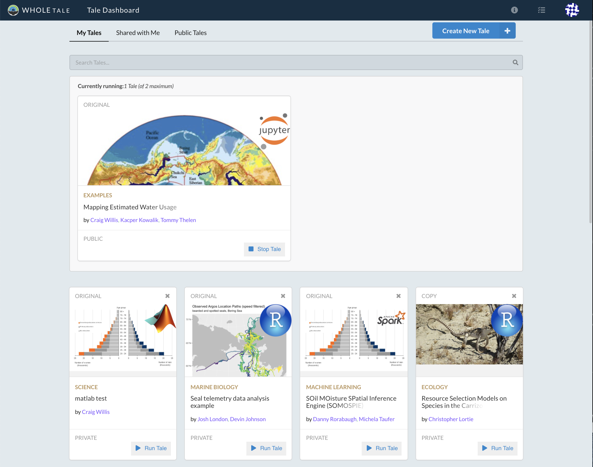

.. _browse:

Browse: Exploring existing tales
================================

The **Browse** page allows you to discover and create Tales. This section covers the following:

* :ref:`Browsing and searching for tales <browse-tales>`
* Basic operations such as :ref:`viewing <view-tale>`, :ref:`launching
  <launch-tale>` and :ref:`stopping <stop-tale>` tales.
* Additional operations for tale creators including :ref:`sharing <share-tale>`
  and :ref:`deleting <delete-tale>` tales.

     Whole Tale's main landing page

.. _browse-tales:

Browse Tales
------------
The **Browse Tales** page is the main landing page for Whole Tale. It supports three primary tasks: browsing/searching,
launching, and creating Tales.

When you make a Tale public, it will show up on this page for other users to interact with. If your Tale is not public,
it will still show up on this page, but will only be displayed to you.

To view all of the Tales that you have created, use the filter that's highlighted in the image above. This will also display Tales
that you've copied from other users.

.. _view-tale:

View Tale 
~~~~~~~~~
Hovering over the Tale card and selecting **View** will bring you to a page that displays important metadata about the Tale.
This includes information about the authors, doi, and datasets that the Tale used. If you are the
owner of the Tale, you can use this page to attribute credit to other authors via their ORCID.

.. _launch-tale:

Launch a Tale
~~~~~~~~~~~~~
Tales that are shown on this page can be accessed by the public. To interact with one of these Tales, click
**Run Tale**. If you don't own the Tale, you'll be asked if you'd like to create a copy. Once created, you'll be brought
to the **Run** page where you can interact with the experiment in the environment.

Launched Tales
--------------
See :ref:`Launched Tales <launched-tales>`.

.. _operations-for-creators:

Operations for Tale Creators
----------------------------

Delete a Tale
~~~~~~~~~~~~~

To delete a Tale, click the trash bin icon next to the **Run Tale** button. You will be prompted to confirm before
the Tale is deleted.  It is important to understand the difference between *stopping an instance of a Tale*
and *deleting a Tale*. Stopping a Tale will delete the instance, while deleting a Tale will completely remove it from Whole Tale.

