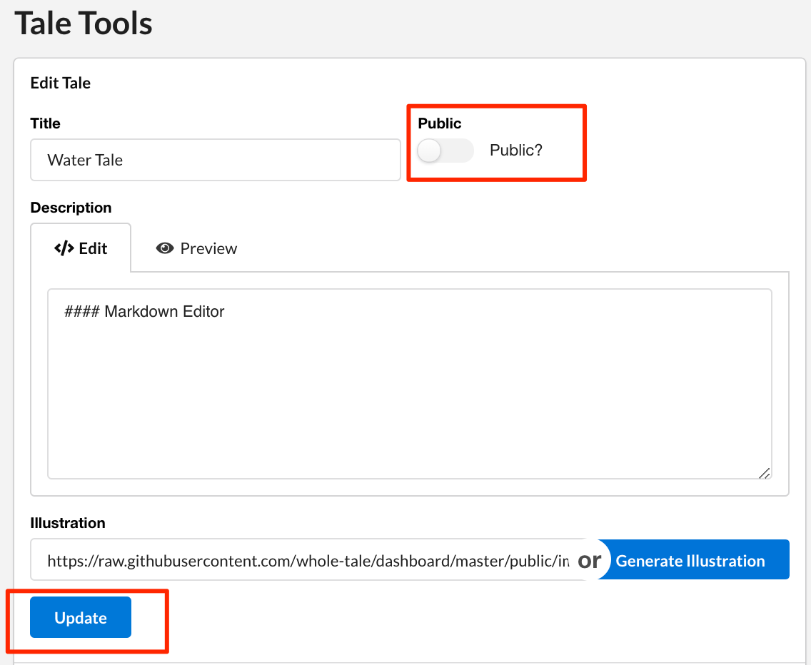
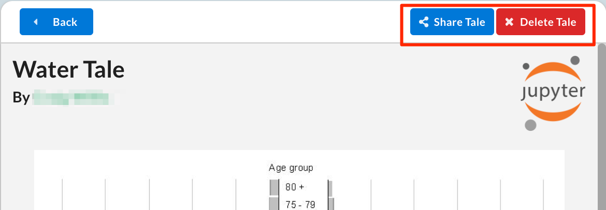
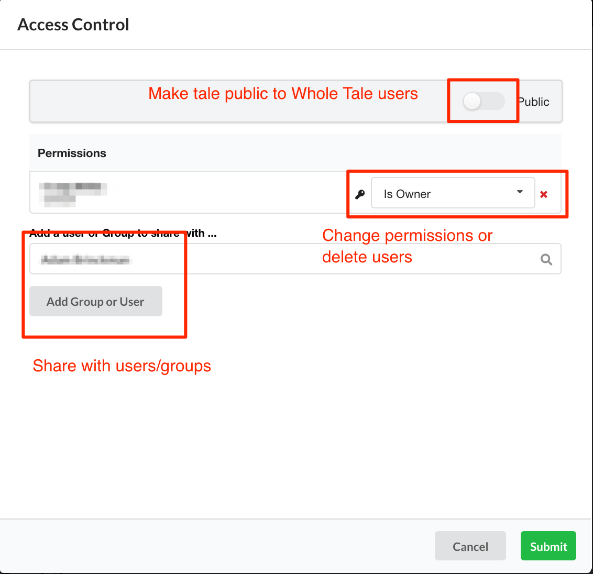

.. _browse:

Browse: Exploring existing tales
================================

The **Browse** page allows you to discover and launch existing Tales in the  
the Whole Tale system. This section coverse the following:

* :ref:`Browsing and searching for tales <browse-tales>`
* Basic operations such as :ref:`viewing <view-tale>`, :ref:`launching
  <launch-tale>` and :ref:`stopping <stop-tale>` tales.
* Additional operations for tale creators including :ref:`sharing <share-tale>`
  and :ref:`deleting <delete-tale>` tales.

.. image:: images/browse/browse_overview.png
     :align: center

.. _browse-tales:

Browse Tales
------------
The **Browse Tales** panel supports three primary tasks: browsing/searching,
viewing, and launching Tales. 

The panel includes a search box, filter and catalog of available Tales represented by cards (in card view) or rows (in list
view).

* **Search**: enter keywords to search across available tales.
* **Filter**: select one of the filters to constrain the list. Options include
  **All** tales, *Mine* (those you've created), *Published* (published tales), and
  **Recent** (created or updated in the last month)
* **View**: toggle between card and list views

.. _view-tale:

View Tale 
~~~~~~~~~
Hovering over the Tale card, select the **View** button to view Tale attributes
incuding category, and detailed description.  From this view you can launch (aka
instantiate), view properties, or edit properties if you are the creator.

To launch a Tale, select the **Launch Tale** button in the upper right or under the **Launch Tale**
heading, entering an optional title.

To view detailed properties, select the **View Tale Properties** heading. This
will display information including creation date, last update date.

If you are the Tale creator, select the **Edit Tale** heading to edit the title,
description, illustration, or change the "Public setting".  Select **Generate
Illustration** to create an image from the Tale. See below for additional
information about deleting and sharing Tales.

.. _launch-tale:

Launch a Tale
~~~~~~~~~~~~~
Select the **Launch** button to launch an instance of any Tale. Once started, the
Tale will appear in the **Launched Tales** panel on both the **Browse** and **Run**
pages. Select **Go to Tale** or select the entry in **Launched Tales** panel to access
the instance. This will take you to the **Run** page or open a new tab for
frontends that do not support iFrames.

Launched Tales
--------------
See :ref:`Launched Tales <launched-tales>`.

.. _operations-for-creators:

Operations for Tale Creators
----------------------------
As the creator of a Tale, you have the ability to share and delete your Tale.

.. _share-tale:

Share a Tale
~~~~~~~~~~~~

To share a Tale with other Whole Tale users, select the **View** button and then
the **Share Tale** button. You will have the option to change the Tale to **Public**
or to enter the name of a group or user to share with.

.. _delete-tale:

Delete a Tale
~~~~~~~~~~~~~

To delete a Tale, select the red **X** from the **Browse Tales** page or the **Delete
Tale** button from the **View Tale** page. You will be prompted to confirm before
the Tale is deleted.  It is important to understand the difference between
*stopping an instance of a Tale* and *deleting a Tale*.  When the Tale is
deleted, it will no longer be available in th system.

