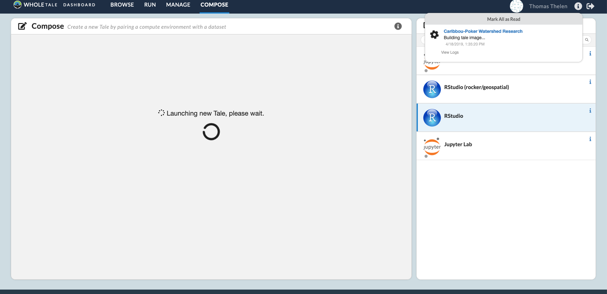
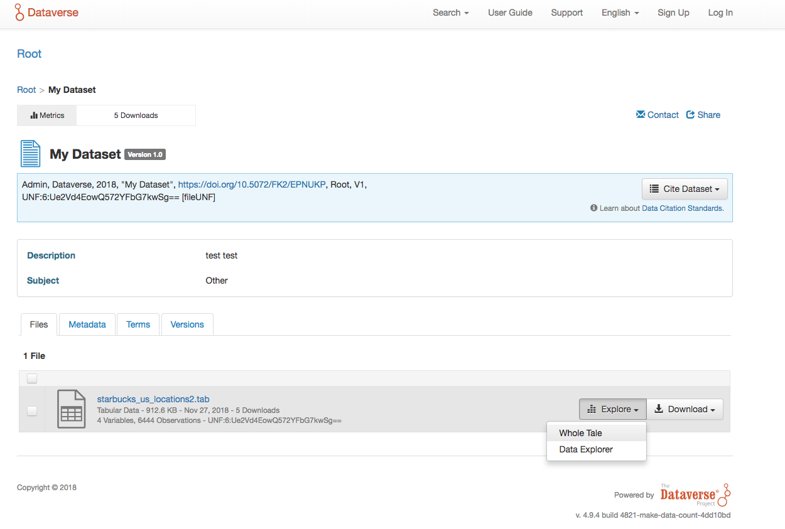
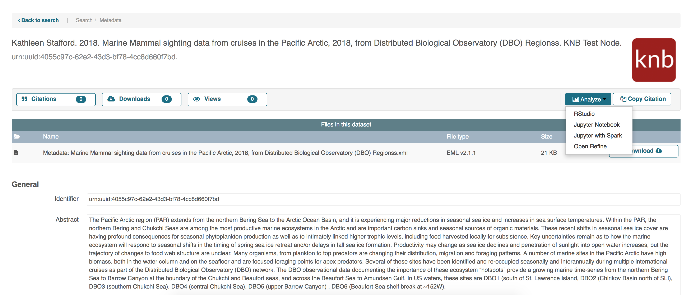

.. _compose:

Creating New Tales
===========================

The **New Tale Dialog** allows you to create new tales that can be executed and 
shared with others.

.. _environment-section:

Environments
------------
On the right hand side of the screen there is a list of environments that
have programming frontends inside. For example, the **RStudio** Environment
is bundled with RStudio while the **Jupyter Notebook** Environment is bundled
with Python and Jupyter Notebook. You'll want to pick the appropriate
Environment that supports the language that you're working in.

Provided Environments
^^^^^^^^^^^^^^^^^^^^^
Whole Tale provides a number of pre-build environments for convenience. To
create your own environment, refer to the documentation page on the page for
`creating environments`_.

  1. **RStudio**: Contains RStudio with R 3.4.1
  2. **Jupyter Notebook**: Contains Jupyter Notebook with Python 
  3. **JupyterLab**: The next generation user interface for Jupyter
  4. **Jupyter with Spark**: Jupyter Notebook bundled with Apache Spark
  5. **OpenRefine**: A frontend for cleaning messy data
.. _data-section:

Launching the Tale
------------------
After you have finalized your tale and click `Create New Tale and Launch`, you'll be brought
to the **Run** page where it will start up, seen in the image below. From here
you can access the tale, along with an assortment of other actions that are
documented on the `run page`_.

     A tale that is being created and configured.

.. _importing-section:

Importing Datasets as Tales
---------------------------
Some third parties have integrated their services with Whole Tale to provide seamless integration between datasets and Tales.

Dataverse
^^^^^^^^^
Select Dataverse nodes have added support for creating Tales from dataset landing pages.

To create a Tale with a data file from a data package hosted by Dataverse, locate the file listing in the data package. The ``Whole Tale`` 
link under the Explore tab will launch Whole Tale in a new window, where you can further tailor the environment.

     A Dataverse package whose node supports Whole Tale integration.
     
When the Tale properties satisfy your needs, data registration and Tale launching will begin after clicking ``Create New Tale and Launch``. Once 
the Tale is ready to launch, you'll be automatically re-directed to it.

DataONE
^^^^^^^
DataONE allows users to launch Tales with entire datasets. To create a Tale from a DataONE dataset, visit your dataset on the 
DataONE `demo server`_ and look for the ``Analyze`` dropdown menu in the citation and downloads bar. 

     A DataONE package that supports Whole Tale integration.

After selecting one of the listed environments, you'll be transferred to Whole Tale where you can further tailor your Tale. You may also 
select a different environment than the one that was chosen in DataONE. One customizations have been made, click the ``Create New Tale and Launch`` button to
register the data and create the Tale. 

.. _creating environments: environments.html
.. _run page: run.html
.. _demo server: https://search-dev.test.dataone.org/data
