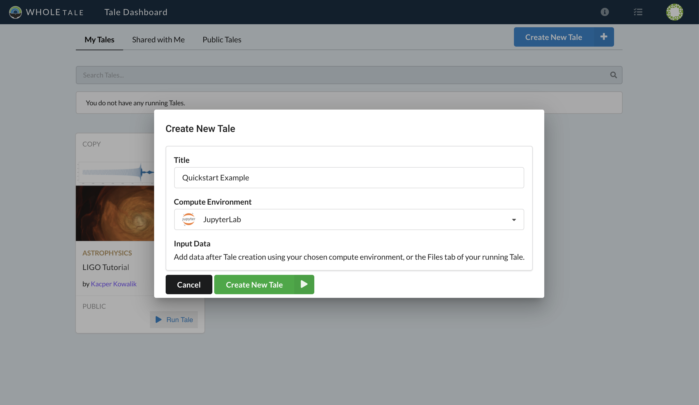
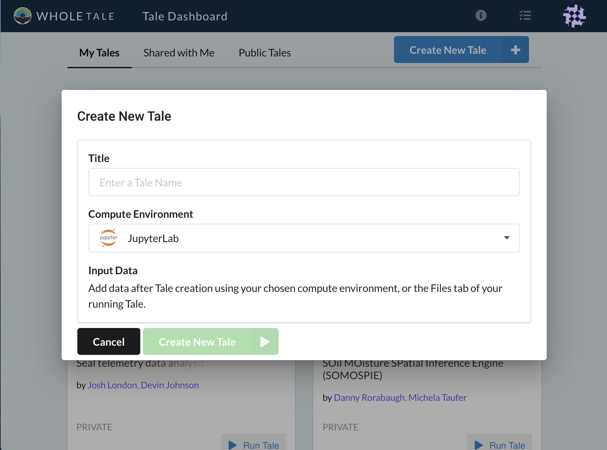
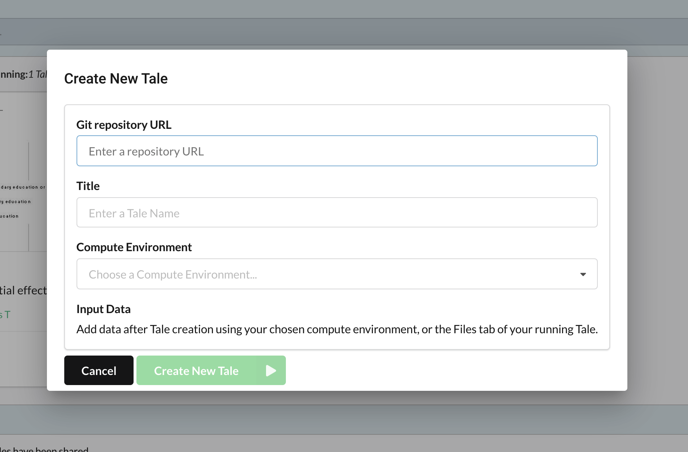
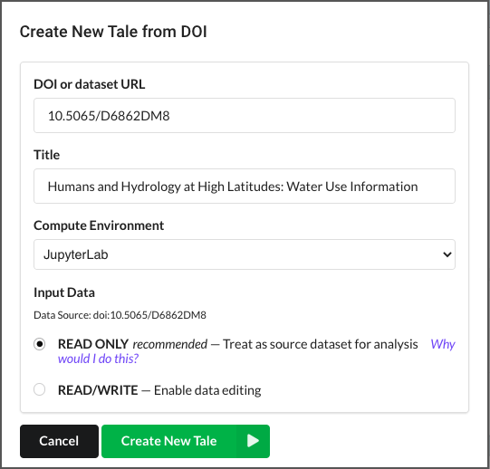

.. _compose:

Creating New Tales
===================

Tales contain the inputs, outputs, data, code, execution environment, provenance
and other related metadata about the results of computational research. A tale
is typically associated with a single publication and contains all information 
necessary to reproduce reported results.

Tales can be created as follows:

* :ref:`New Tale <create-new>`: Create a new empty tale
* :ref:`Github repository <create-git>`: Create a tale based on an existing Github
  repository
* :ref:`From data repository <create-import>`: Create a tale based on an existing 
  dataset stored in a research repository (such as Dataverse, Zenodo or DataONE)

.. note:: 
   You can create as many tales on the system as you'd like, but you can only have
   2 interactive environments running concurrently.

     Creating a new Tale

Environments
------------
When creating a new tale, you must select the default interactive environment that
will be used. Supported environments include :ref:`JupyterLab <jupyter>`, 
:ref:`RStudio <rstudio>`, :ref:`MATLAB <matlab>`, :ref:`STATA <stata>`, 
and :ref:`OpenRefine <openrefine>`. For more information including how to customize
installed packages, see the :ref:`Environments <environments>` section.

.. _create-new:

Creating an Empty Tale
----------------------
To create an empty Tale, click the **Create New Tale** button and select the 
**Create New Tale** option. The **Create New Tale** dialog will appear allowing
you to enter a title and select the interactive environment. Select the 
**Create New Tale** button and you will be taken to the your new tale where you 
can upload files, register external data, edit metadata, share with other users,
or start an interactive environment. For more information see the 
:ref:`Accessing and Modifying Tales <run>` section.

.. figure:: images/compose/create_menu.png
     :align: center

     Create New Tale menu

     Dialog for creating a new Tale

.. _environment-section:

.. _create-git:

Creating Tales from Git Repositories
------------------------------------
Tales can also be created from existing public Git repositories. To create a new 
tale that contains a Git repository, select the **Create New Tale** dropdown menu 
then **Create Tale from Git Repository**.

     Dialog for creating a new Tale from a Git repository

Enter the URL of a public repository, title for your tale, and select the desired
interactive environment. Select the **Create New Tale** button to create the tale
and import contents from the specified Git repository. For more information 
about using Git in Whole Tale, see :ref:`Working with Git <github>`.

.. _create-import:

Creating and Importing Tales from External Repositories
-------------------------------------------------------
Tales can also be created from third-party research data repositories. Currently
supported repositories include Zenodo, Dataverse, OpenICPSR, and DataONE. 

     Dialog for creating a new Tale from a DOI

Choosing Between Read-Only and Read/Write
~~~~~~~~~~~~~~~~~~~~~~~~~~~~~~~~~~~~~~~~~

When a tale is created from an exeternally registered dataset (e.g., via DOI), 
you have the choice to mount the dataset read-only via :ref:`external data
<external_data>` or for the contents of the dataset to be copied to the
workspace, enabling you to write. Citations are automatically generated for
read-only external datasets.

