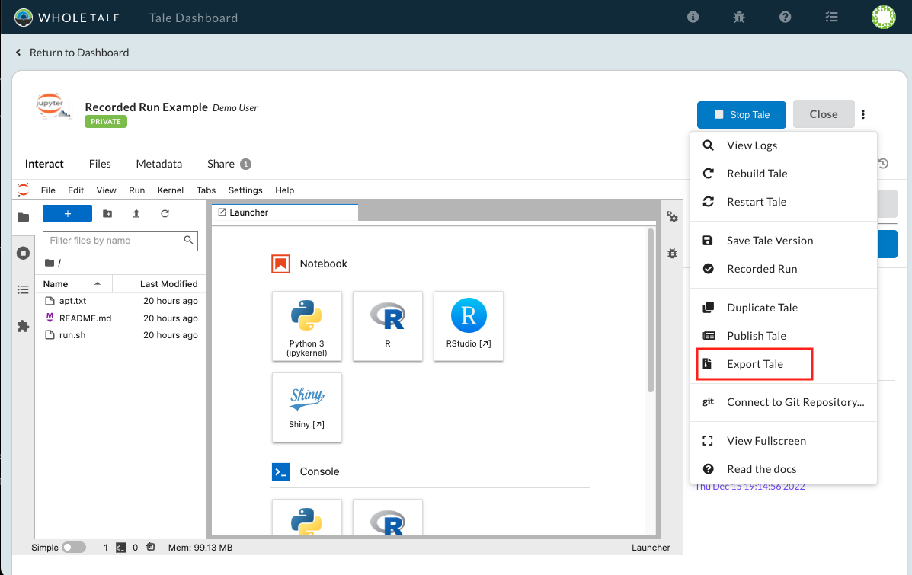

.. _export_run:

Exporting and Running Locally
=============================

Exporting
-----------
Tales can be exported as a BagIt archive. This is the same format used for
publishing. 

To export a tale, navigate to the Run page, select the **Tale Action** (**...**) menu
and then select **Export Tale**:

     
     Exporting a Tale

The tale will be exported as a BagIt archive. BagIt is a standard format defined
for archival storage of digital objects.

BagIt Format
^^^^^^^^^^^^
Tales exported under BagIt have additional metadata and an additional ``fetch.txt`` 
file that lists where external data resides.  Tales that are exported in this format 
also have the ability to be run locally.

.. list-table:: BagIt files
   :widths: 20 80
   :header-rows: 1

   * - File or Folder
     - Description
   * - README.md
     - Whole Tale readme 
   * - bag-info.txt
     - Bag metadata
   * - bagit.txt
     - Bag declaration
   * - data 
     - Bag "payload directory"
   * - data/LICENSE
     - Tale license
   * - data/workspace
     - Tale workspace for exported version
   * - data/runs
     - Recorded runs for exported version
   * - fetch.txt
     - BagIt fetch file for external data
   * - manifest-*.txt
     - Payload manifest files for integrity checking.
   * - metadata/metadata.json
     - Tale metadata for exported/published tale version
   * - metadata/environment.json
     - Environment metadata for exported/published tale version
   * - run-local.sh
     - Script to run tale locally
   * - tagmanifest-*.txt
     - Payload manifest files for integrity checking.

To validate an exported bag using the bdbag package:

.. code-block::
   pip install bdbag
   bdbag --resolve-fetch all .
   bdbag --validate full .
   

Running Tales Locally
---------------------

Exported Tales under the BagIt format have a ``run-local.sh`` file that can be run to 
re-create the tale.  Before running ``run-local.sh``, ensure that you have Docker 
running in the background.

When you're ready to run the Tale, open up the terminal and navigate to the top level 
of the bag.  Run ``sh run-local.sh`` and wait for the setup to complete. If this is your 
first running a tale locally, it may take some time to download the container image.
