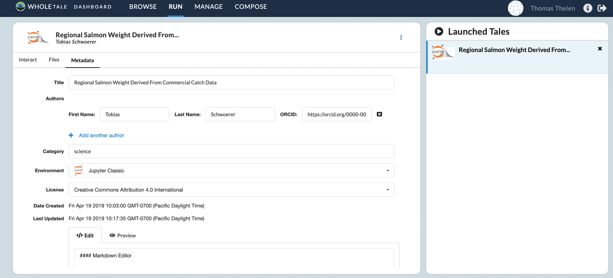

.. _export_run:

Exporting and Running Locally
=============================

Exporting
-----------
Tales can be exported in the following formats
  1. ZIP (Best for quick browsing)
  2. BagIt (For archiving and running locally)

To export a Tale, navigate to the Run page, select the ``...`` dropdown menu, and then select an appropriate format.

     
     Exporting a Tale

ZIP Format
^^^^^^^^^^
Zipped Tales have a basic structure that includes a minimal amount of metadata and data.

tale-id
   - LICENSE
   - README.md
   - metadata/
      - manifest.json
      - environment.json
   - data/

The data that was saved in the Tale's Workspace is saved in the data/ folder. Information about external data can
be found in ``metadata/manifest.json``

BagIt Format
^^^^^^^^^^^^
Tales exported under BagIt have additional metdata and an additional ``fetch.txt`` file that lists where external data resides.
Tales that are exported in this format also have the ability to be run locally.

tale-id
   - run-local.sh
   - tagmanifest-sha256.txt
   - tagmanifest-md5.txt
   - bag-info.txt
   - manifest-sha256.txt
   - manifest-md5.txt
   - README.md
   - bagit.txt
   - fetch.txt
   - metadata/
      - manifest.json
      - environment.json
   - data/
      - LICENSE

External datasets can be found in ``fetch.txt``. Data that was in the Tale workspace can be found in ``data/``

Running Tales Locally
---------------------

Exported Tales under the BagIt format have a ``run-local.sh`` file that can be run to re-create the Tale.
Before running ``run-local.sh``, ensure that you have Docker running in the background.

When you're ready to run the Tale, open up the terminal and navigate to the top level of the bag.
Run ``sh run-local.sh`` and wait for the setup to complete. If this is your first running a Tale locally, it may take
some time to download the docker image.