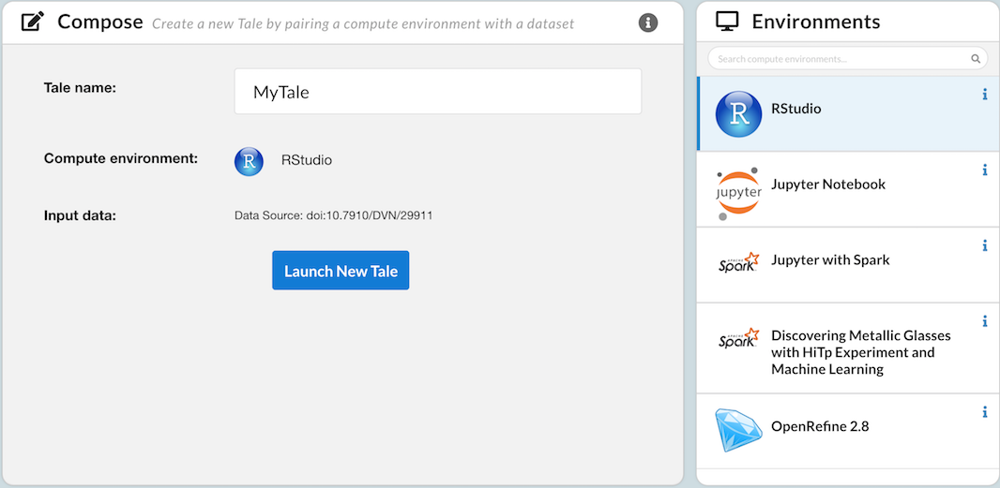

.. _integration:

Integrating with Whole Tale
===========================

The Whole Tale platform provides several integration options for remote
repositories including:

* **Data registration**: allows users to import and reference data from your
  repository
* **"Analyze in Whole Tale"**: allows users to launch interactive analysis
  environments using data or Tales published in your repository 
* **Tale publishing**: allows users to publish Tale packages to your repository

Data registration
-----------------

Whole Tale enables users to import and work with datasets from a variety of
remote resources. After registering data, users can launch interactive analysis
environment and package new Tales that reference the data stored on remote systems.

As of release v0.8, supported data providers include:

* **HTTP**: any data accessible via HTTP protocol
* **DataONE**: any dataset available through the DataONE network
* **Dataverse**: any dataset available through the Dataverse network
* **Globus**: data available through the Materials Data Facility (MDF)
* **DERIVA**: currently in testing/development with data from the `The Pancreatic β-cell Consortium <https://pbcconsortium.isrd.isi.edu/>`_

New data providers can be added by extending the `Girder Whole Tale plugin <https://github.com/whole-tale/girder_wholetale/>`_.

.. _analyze-in-wholetale: 

Analyze in Whole Tale
---------------------

The "Analyze in Whole Tale" feature enables one-stop data registration and Tale
creation from remote repositories.  Remote systems simply construct a URL
pointing to the Whole Tale ``integration/`` endpoint providing the URI for a dataset,
optional Tale name and environment. Note that this requires that the provided
URI is supported by one of the above data registration providers.

For example, the following URL will open the Browse page with the Tale name,
data, and environment pre-populated:
`<https://girder.dev.wholetale.org/api/v1/integration/dataone?uri=doi:10.7910/DVN/29911&name=MyTale&environment=rstudio>`_

     Pre-populated New Tale Modal

After selecting *Launch New Tale*, the user will be taken to an RStudio environment
with the selected dataset mounted under ``/data``.

Bookmarklet for Analyze in Whole Tale
-------------------------------------

You can enable Analyze in Whole Tale for virtually any web resources by using a bookmarklet.

How it works?
^^^^^^^^^^^^^

1. Install the AinWT bookmarklet in your browser’s bookmark toolbar.
2. When you come across a dataset from a provider that Whole Tale supports, click the AinWT bookmarklet
   in your bookmark toolbar.
3. You will be redirected to the Whole Tale's dashboard where a modal will prompt you to create a Tale
   which will include the selected dataset.

How to Install
^^^^^^^^^^^^^^

Firefox
"""""""

Right-click on the following link: `AinWT for Firefox <javascript:void(window.location='https://dashboard.wholetale.org/mine?name=My%20Tale&asTale=true&uri=%27+encodeURIComponent(location.href))>`_, then select the "Bookmark This Link" option.

Chrome
""""""

Drag this link to the bookmarks toolbar: `AinWT for Chrome <javascript:void(window.location='https://dashboard.wholetale.org/mine?name=My%20Tale&asTale=true&uri=%27+encodeURIComponent(location.href))>`_.

Safari
""""""

Drag this link to the bookmarks toolbar: `AinWT for Safari <javascript:void(window.location='https://dashboard.wholetale.org/mine?name=My%20Tale&asTale=true&uri=%27+encodeURIComponent(location.href))>`_.

iPhone and iPad
"""""""""""""""
In iPad, iPhone or iPod Touch, copy this line of text:

.. code-block::

    javascript:void(window.location='https://dashboard.wholetale.org/mine?name=My%20Tale&asTale=true&uri=%27+encodeURIComponent(location.href))

Bookmark this page or any page, then tap the Bookmarks button to edit the new bookmark, paste the text you just copied, then tap "Bookmarks" and then "Done".

Dataverse External Tools
------------------------

Whole Tale provides specific integration with Dataverse via the `External Tools
<http://guides.dataverse.org/en/latest/installation/external-tools.html>`_
feature. 

The following External Tools manifest can be used to enable Whole Tale
integration on your Dataverse installation:

.. literalinclude:: wholetale.json

Download the :download:`manifest <wholetale.json>`

To install, simply ``POST`` the manifest your instance. For example:

.. code:: 

   curl -X POST -H 'Content-type: application/json' --upload-file wholetale.json  \ 
      http://localhost:8080/api/admin/externalTools
