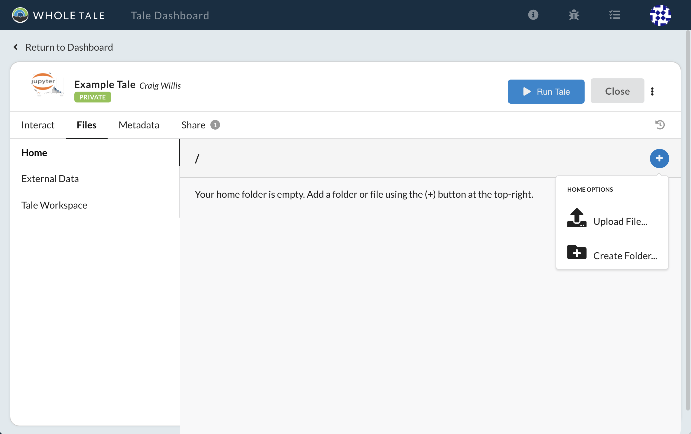
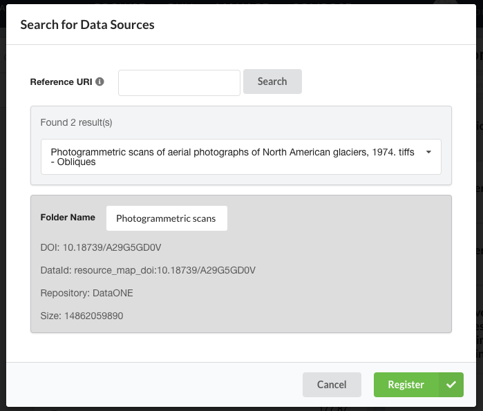
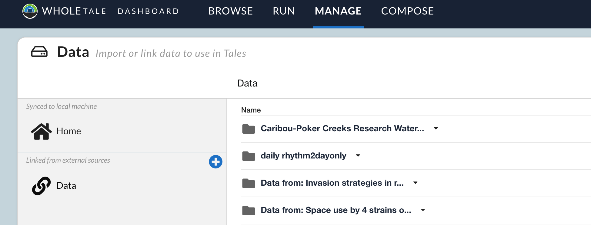

.. _manage:

Manage: Managing data
================================

The **Manage** page allows you manage data in the Whole Tale system including:

- Uploading data from your local machine
- Registering data from remote resources
- Sharing data with other users

.. _home-folder:

Home Folder
-----------

The **Home** folder is your personal workspace in the Whole Tale system. You
can perform most common operations including uploading, creating, 
moving, renaming, and deleting files and folders.  

Your **Home** folder is mounted into every running tale instance with full
read-write permissions. This means that you can access and manage files from
both the Whole Tale dashboard and within tale environments. This is in contrast
to the **Data** folder described below, which is limited to read-only access.

Adding Data
^^^^^^^^^^^
Files on your computer can be uploaded to the **Home** folder by using the 
file selector dialog. To open the file selector, 

    1. Click on the **Home** directory
    2. Mouse over the blue addition symbol
    3. Select the **Upload** icon

     An empty *Home* directory.
         
.. _data-folder:

Data Folder
-----------

The **Data** folder contains references to data you've registered in the system
for use with tales. This data is meant to be read only, and can only be added
from external sources.

Supported Data Repositories
^^^^^^^^^^^^^^^^^^^^^^^^^^^
The current supported repositories that you can register data from are 
  1. DataONE_:
  A federation of data repositories with a focus on scientific data.
  A list of participating member nodes can be found on the member
  node `information page`_.
  
  2. Globus_:
  A service geared towards researchers and computing managers that allows
  custom APIs, data publication, and file transfer.

Adding Data
^^^^^^^^^^^
Files and folders cannot be uploaded to the **Data** folder directly. To
encourage reproducibility, only data registered from external resources or
associated with a tale will be available in the **Data** folder.

To register data from an external resource, use the data registration dialog,
shown below.

     The data registration dialog allows you to search by DOI and ingest data
     into Whole Tale.
     
To access this dialog, navigate to the **Data** folder by clicking the link icon
below the home directory folder.

     A user's *Data* folder, populated with data that was registered from
     external sources.
     
The blue addition icon will open the registration dialog where you can find 
and register your data. You'll need to have either the DOI or data package URL
to find the data.

Adding Data From DataONE
""""""""""""""""""""""""
Data packages from DataONE_ can be integrated into Whole Tale by searching for
the DOI of the package or by pasting the URL into the search box in the 
registration modal.

By DOI
""""""
Consider the following package_. Visiting the package landing page we can
see that the DOI is "doi:10.18739/A29G5GD0V". To register this data package
using the DOI, open the registration dialog and paste the DOI into the
search box. Click "search" and check that the correct package was found.
Click "Register" to begin data registration. 

By URL
""""""
The URL of the data package can also be used to locate the package instead 
of the DOI. In the previous example, pasting 
"https://search.dataone.org/#view/doi:10.18739/A29G5GD0V" into the search box
will give the same data package which can subsequently be registered.

Adding Data From Globus
^^^^^^^^^^^^^^^^^^^^^^^
Data can also be retrieved from Globus by specifying the DOI of the package,
as done in the DataONE case.
 
Supported Repositories
""""""""""""""""""""""
 1. `Materials Data Facility`_

By DOI
""""""
The DOI of the dataset can be found on the dataset landing page. For example,
the `Twin-mediated Crystal Growth an Enigma Resolved`_ package has DOI
*10.18126/M2301J*. This DOI should be used in the data registration dialog when
searching for the dataset.

Adding Data From The Filesystem
^^^^^^^^^^^^^^^^^^^^^^^^^^^^^^^
Files and folders cannot be uploaded to the **Data** folder directly. To
encourage reproducibility, only data registered from external resources or
associated with a tale will be available in the **Data** folder. The data can
however, be uploaded to the **Home** directory.

.. _common:

Common Operations
-----------------

Selecting a folder or file will present a menu with the following options:

- Move To: move a file or folder
- Rename: rename a file or folder
- Share: share a file or folder with a user or group  
- Copy: copy a file or folder
- Download: download a file or folder
- Remove: remove a file or folder

.. _environments:

Environments
------------

The **Environments** panel lists all available environments (or frontends) in
the Whole Tale system. 

.. _DataONE: https://www.dataone.org/ 
.. _information page: https://www.dataone.org/current-member-nodes
.. _Globus: https://www.globus.org/
.. _package: https://search.dataone.org/#view/doi:10.18739/A29G5GD0V
.. _Materials Data Facility: https://www.materialsdatafacility.org/
.. _Twin-mediated Crystal Growth an Enigma Resolved: https://publish.globus.org/jspui/handle/ITEM/113