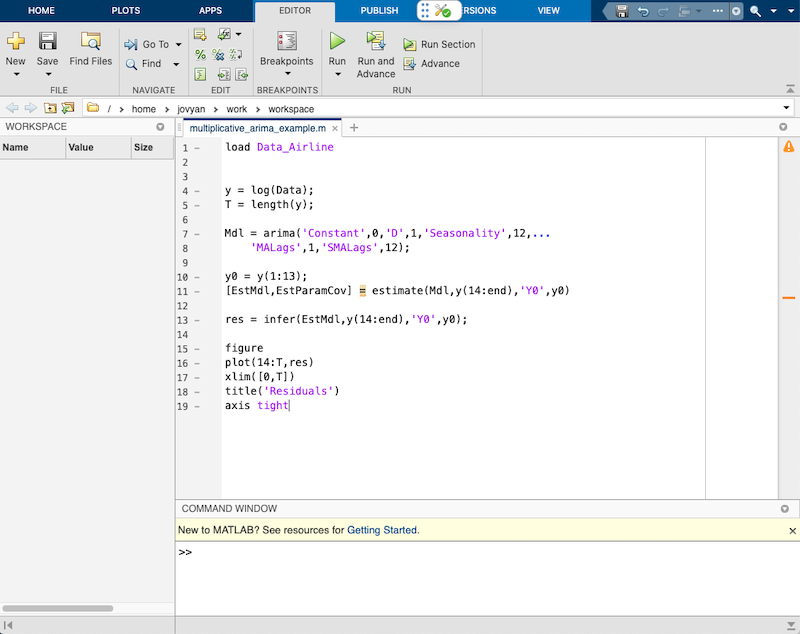
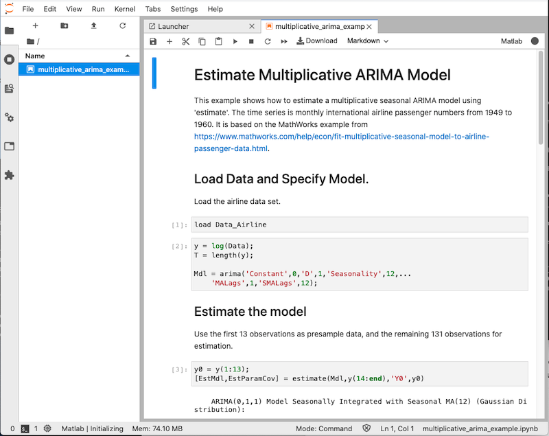
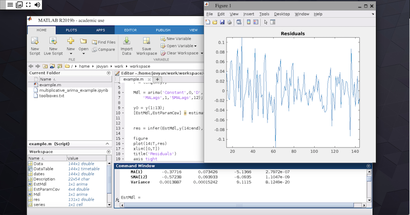

.. _matlab:

Using MATLAB
============

Whole Tale supports the creation, publication, and execution of Tales that
rely on MATLAB software. We provide three different interfaces to MATLAB
including the Web Desktop (available with MATLAB R2020b and greater), 
JuptyerLab with MATLAB kernel (all supported versions), and Linux Desktop
via XPRA (all supported versions).

Use of MATLAB is subject to our :ref:`Terms of Use <tos>`.

Web Desktop
-----------
Available with MATLAB R2020b and greater, the web desktop provides access to 
the new MATLAB Online-style IDE that can be used from any standard web browser. 
The web desktop experience will be familiar to all MATLAB users.

Jupyter with MATLAB Kernel
--------------------------
Available for any supported version of MATLAB, the JupyterLab IDE with 
MATLAB kernel can be used to create and run MATLAB code or Jupyter notebooks using
the MATLAB kernel.  The JupyterLab terminal provides access to a Linux shell 
environment to run MATLAB code.

Linux Desktop via XPRA
----------------------
Available for any supported version of MATLAB, Xpra HTML5 client provides remote access
to the native MATLAB Linux desktop. 

Technical Details
-----------------

MATLAB Installation Media
~~~~~~~~~~~~~~~~~~~~~~~~~
Whole Tale requires access to the installation media for each supported release of 
MATLAB. Downloadable ISO images from Mathworks are converted to Docker images used 
for installation of the base MATLAB software and selected toolboxes. These images 
are private to the Whole Tale system, but anyone with an appropriate license should be 
able to access them from Mathworks. Instructions for creating the installation image 
are available in the `matlab-install <https://github.com/whole-tale/matlab-install>`_ repository.

MATLAB BuildPack
~~~~~~~~~~~~~~~~~
To support the creation of custom MATLAB environments, Whole Tale has created a `Binder-
compatible buildpack <https://github.com/whole-tale/repo2docker_wholetale/>`_. MATLAB
environments begin with only the base MATLAB software installed and users can customize
selected toolboxes by listing them in a `toolboxes.txt` file. The purpose of this is minimize 
image sizes at the time of publication by enabling the selection of only those packages
required for reproduction. For example, see https://github.com/craig-willis/matlab-example.

License Information
~~~~~~~~~~~~~~~~~~~
Access to MATLAB on the Whole Tale platform is provided by institutional licenses 
from the University of Texas at Austin and Indiana University through the NSF Jetstream
Cloud service. Tales that are published/exported and run outside of the Whole Tale system will
require you to provide your own license information. 

As noted in our :ref:`Terms of Use <tos>`, MATLAB on Whole Tale is for academic use only.
