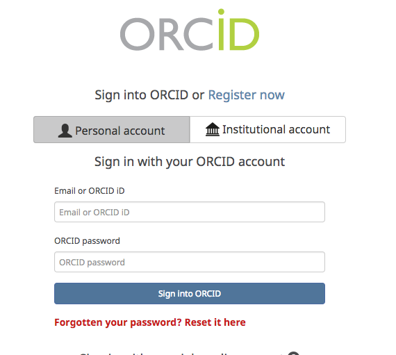
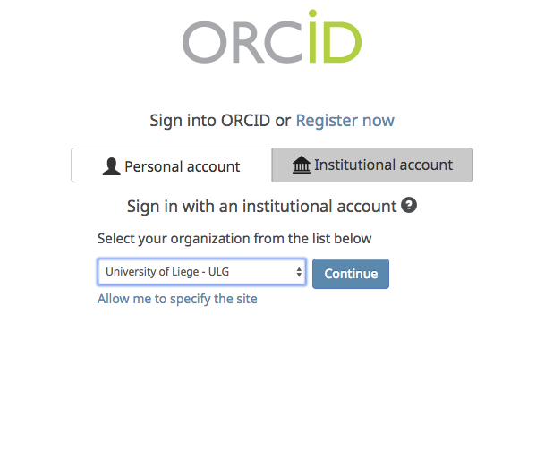

.. publishing:

Publish: Preserve and Share your Work
=====================================
Once you finish creating your tale and are ready to reference it in a journal, you can publish it to
DataONE and receive a citable DOI.

[Screenshot of dialog]

DataONE
^^^^^^^

Signing Into DataONE
^^^^^^^^^^^^^^^^^^^^
In order to create the package, you'll first need to log into DataONE. If you haven't done so already, you'll be prompted to when publishing. You can use either your `ORCID ID`_ or university account with `CILogon`_.

     Login screen for a personal orcid account
     

     Login screen for an institutional account

Data Files
^^^^^^^^^^

Environment Files
^^^^^^^^^^^^^^^^^
In order to preserve as much information about the computation environment, we generate files that provide extra context for the Tale. 

Tale.yaml
~~~~~~~~~
This configuration file contains important information needed to reproduce the experiment. Information such as file paths, entry point, and are recorded here.

repository.tar
~~~~~~~~~~~~~~
The repository tar contains the dockerfile that was used to create the virtual machine that the tale run on. Additional files that may be present include readmes and configuration files. 

Licensing
^^^^^^^^^
When publishing your tale, you'll be asked to presented with a choice of licenses to choose from which will be attached to your package. 

https://creativecommons.org/share-your-work/public-domain/cc0/

https://creativecommons.org/licenses/by/3.0/

https://creativecommons.org/licenses/by/4.0/

Adding Additional Metadata to Your Package
^^^^^^^^^^^^^^^^^^^^^^^^^^^^^^^^^^^^^^^^^^

.. _ORCID Id: https://orcid.org/
.. _CILogon: https://cilogon.org/
