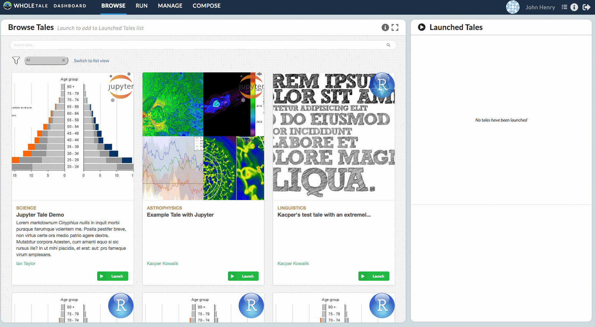
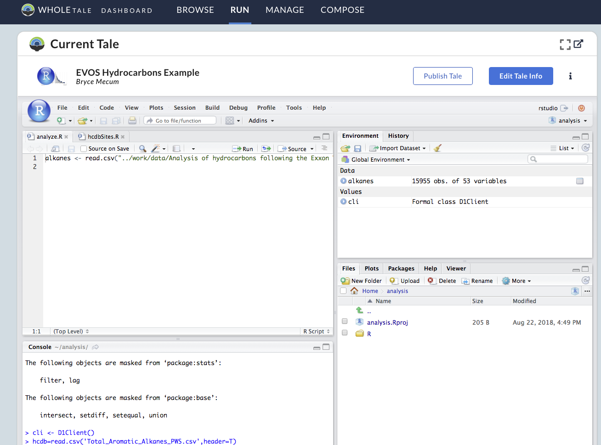
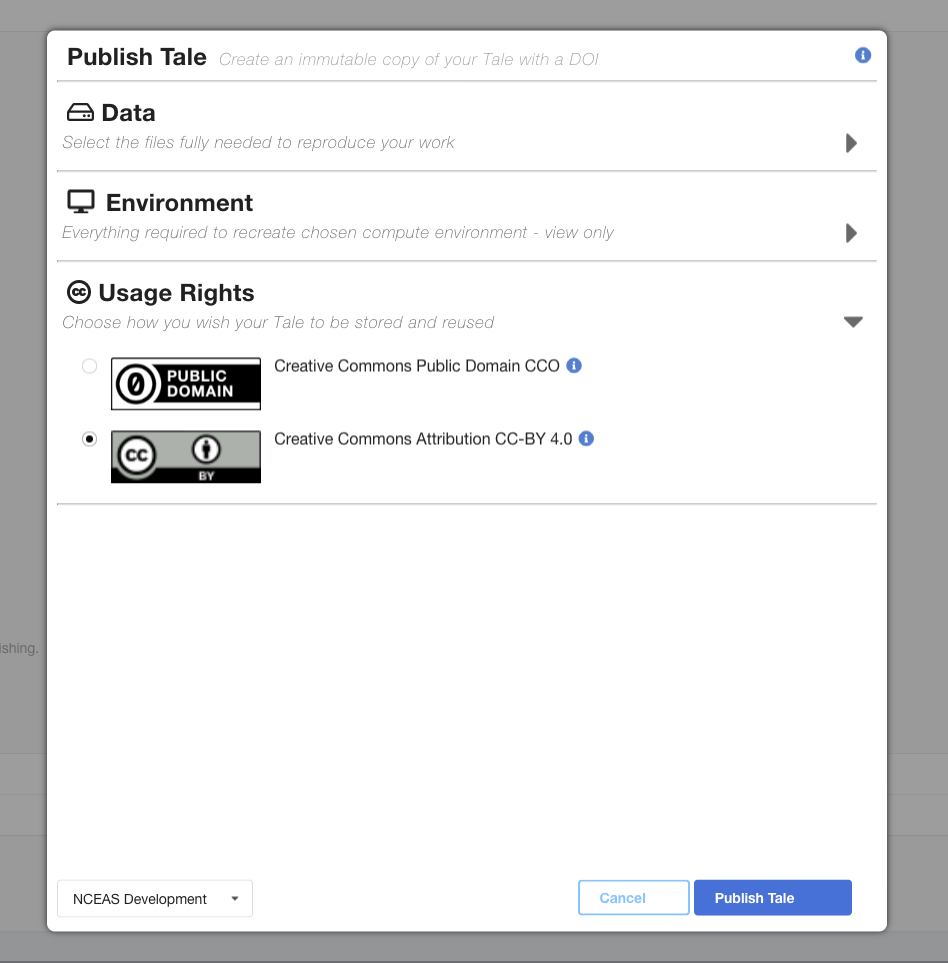

.. publishing:

Publish: Preserve and Share your Work
=====================================
Once you finish creating your tale and are ready to reference it in a journal, you can publish it to
DataONE to receive a citable DOI. In addition to receiving a DOI, you can also use the metadata
editor that allows you to specify Tale outputs.

DataONE
^^^^^^^
DataONE is a network of data centers and organizations that share their information across the network, where data
is replicated and described with rich metadata. Publishing your Tale into the DataONE network will allow you to
archive your work, collect usage statistics, and make it easy to share with other scientists.

To publish your tale, click the ``Publish`` button on the Tale ``Run`` page.

     Publishing is accessed through the Tale Run page
     
Signing Into DataONE
^^^^^^^^^^^^^^^^^^^^
Before publishing, you'll need to first log into DataONE. If you haven't done so already, you'll redirected
to the DataONE login page after clicking ``Publish``. Once logged in, you'll be brought back to 
Whole Tale and the publishing dialog will be open.

You can use either your `ORCID ID`_ or university account with `CILogon`_ to access the DataONE system.

.. figure:: images/publish/orcid-personal.png
     :align: center

     Login screen for a personal orcid account
     

Select Tale Data Files
^^^^^^^^^^^^^^^^^^^^^^
TBD

Environment Files
^^^^^^^^^^^^^^^^^
In order to preserve as much information about the computation environment, we generate files that provide extra context for the Tale. 
These files range from descriptions about script execution order, original file locations, virtual machine configurations, and which license
the package is under.

tale.yaml
~~~~~~~~~
This is a configuration file that saves information about the environment that the was used when executing the Tale. The information in this file
ranges from external data sources, file paths, entry point, and Tale version.

docker-environment.tar.gz	
~~~~~~~~~~~~~~~~~~~~~~~~~
The environment tarball contains a snapshot of the GitHub repository that was used to create the docker image. The snapshot was taken at the commit ID
that was specified during Recipe creation.

LICENSE
~~~~~~~
The LICENSE file is the license that was picked from the *Licensing* section. It describes the license that the published Tale is under.

Licensing
^^^^^^^^^
Each published tale is assigned a license that can be selected from the publishing dialog. Different DataONE repositories may require different licensing,
and the dialog will only present licenses that are available.

.. _ORCID Id: https://orcid.org/
.. _CILogon: https://cilogon.org/
.. CC0: https://creativecommons.org/share-your-work/public-domain/cc0/
.. CC-BY 3.0: https://creativecommons.org/licenses/by/3.0/
.. CC-BY 4.0: https://creativecommons.org/licenses/by/4.0/

