:orphan:

.. _quickstart:

Quickstart
==========

This section provides a step-by-step tutorial covering central features of Whole Tale.
It assumes that you have already :ref:`signed in <sign_in>`.

-  :ref:`Finding and launching an existing tale <quickstart-launching>`
-  :ref:`Creating a new tale <quickstart-composing>`

.. _quickstart-launching:

Launching a tale
----------------
In this example, you'll launch the LIGO Tutorial tale which runs in a classicy Jupyter
Notebook environment. 

1. Select the **Public Tales** tab and search for "LIGO". Select the **Run Tale** button. 

.. figure:: images/quickstart/browse_ligo.png
     :align: center

     Searching for and run the LIGO Tale

2. Because you do not have edit permissions, you are prompted to create a copy of the Tale. Select **Confirm** to create your local copy.

.. figure:: images/quickstart/ligo_access.png
     :align: center

     LIGO access request

3. The Tale view is opened where you can access metadata, files, and launch a Jupyter instance:

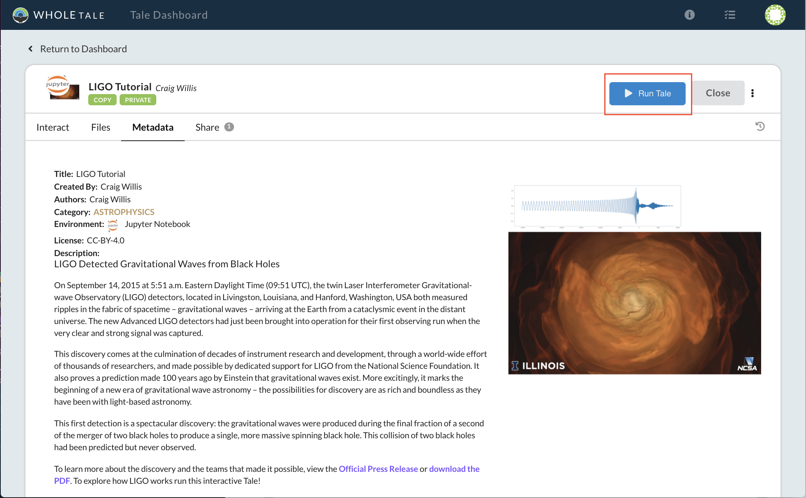

     LIGO Tale metadata

4. Select the **Run Tale** button to start the Jupyter instance:

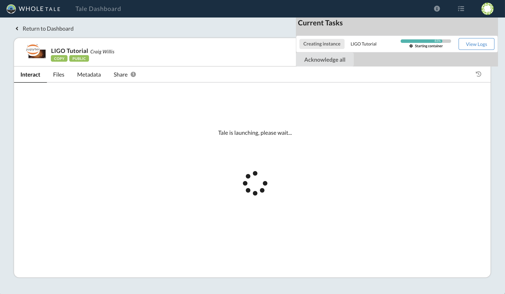

     LIGO Tale creating the compute environment

5. Once the Jupyter instance has started, open and run the **LOSC_Event_tutorial.ipynb** analysis script.

.. figure:: images/quickstart/ligo_running.png
     :align: center

     LIGO Tale running

Congratulations! You've successfully run your first tale.

Here's what happened behind the scenes:

- Since the original Tale is read-only for you, a copy was made that allows you
  to run and modify the Tale's contents.
- When you hit **Run** a Docker container was created using a Jupyter image
  containing all necessary dependencies to run the LIGO tutorial notebook, as
  specified by the Tale's author.
- Data for the Tale, which were originally registered by the author, are mounted
  read-only and available under the `data` directory. 
- Your Whole Tale `home` directory was mounted into `home`. This allows you
  to access personal files from within the running tale.

In the next example, you'll create a Tale using data published in DataONE.

.. _quickstart-composing:

Creating a new tale
--------------------

In this example you'll learn how to create a new Tale based on the JupyterLab environment,
register an external dataset from DataONE, and upload analysis scripts from your local
computer.  The following :download:`example files <quickstart.zip>` 
will be used to analyze and plot the data. The zip archive also includes a postBuild and requirements.txt file which are repo2docker `config files <https://repo2docker.readthedocs.io/en/latest/config_files.html>`_.
When the compute environment is created, requirements.txt is used to install any additional Python libraries and uses postBuild to run additional code once complete.

1. Select **Create New** from the Browse page to open the dialog for creating new Tales.
   
   .. figure:: images/quickstart/quickstart_create_button.png
     :align: center

     Location of the Create New Tale button

2. After the dialog opens, give the Tale a name. In this example we name it **Quickstart Example**.  Select "JupyterLab" from the **Compute Environment** drop down and click **Create New Tale** to create the tale.

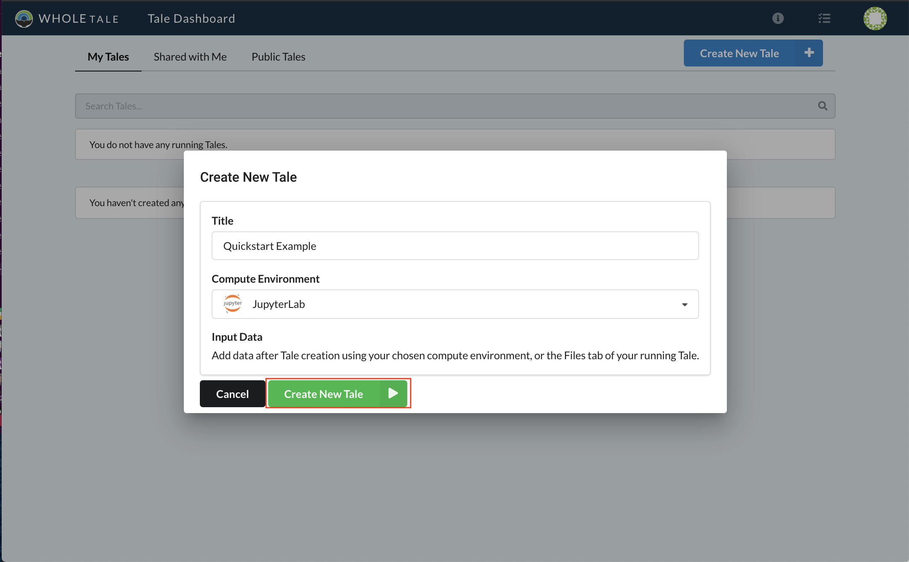

     Creating a new Tale

3. To register a dataset from a research data repository, select the **Files* tab, then **External Data**, then the blue **+** sign. From the dropdown menu select **Web (DOI or URL)**.

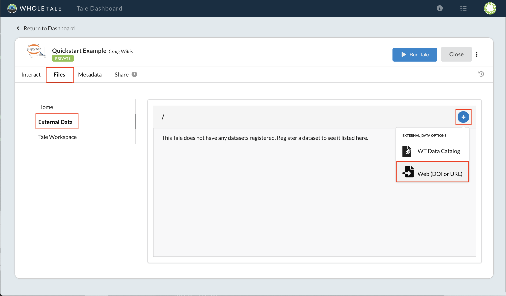

     Register and external dataset by DOI

4. Enter the Digital Object Identifier (DOI) **10.5065/D6862DM8** for the *Humans and Hydrology at High Latitudes: Water Use Information* dataset published in DataONE. Select Search and then Register.

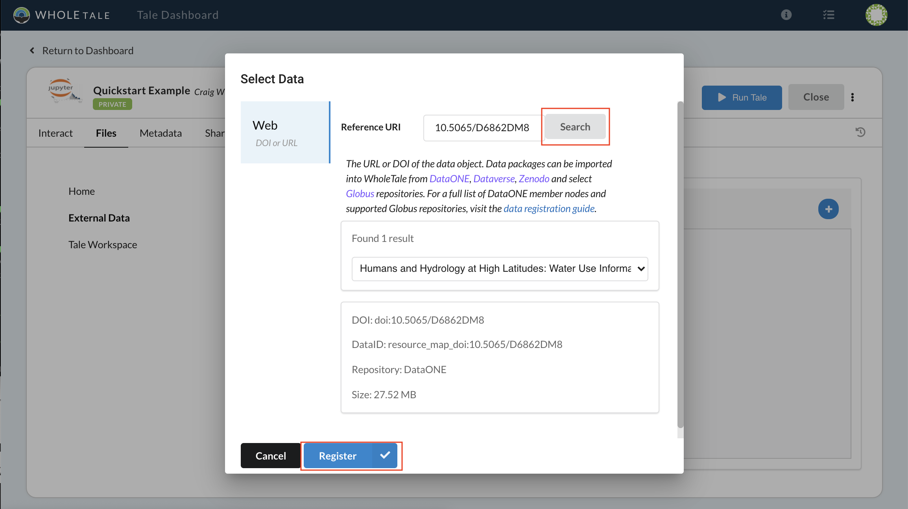

     Registering a DataONE dataset by DOI

5. A notification window will appear indicating the status of the registration process. 

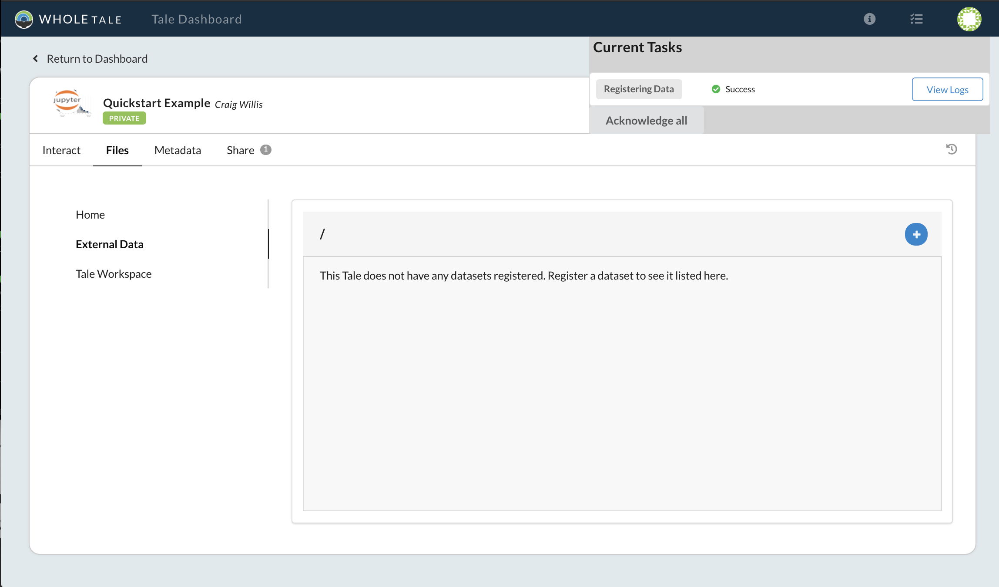

     Dataset registration progress and status

6. To add one or more files from the registered dataset to your Tale, again select **Files** > **External Data** then the blue **+** icon. From the dropdown menu select the **WT Data Catalog**:

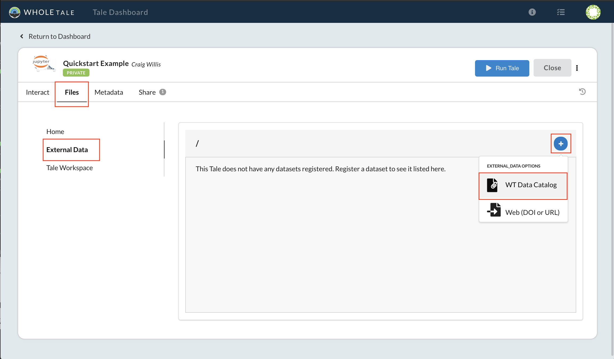

     Browse to the WT Data Catalog

7. Use the **Select Data** window to browse the dataset. Highlight the file "usco2005.xls" and click **Add Selected** and finally click the **Save** button to save the changes to your Tale.

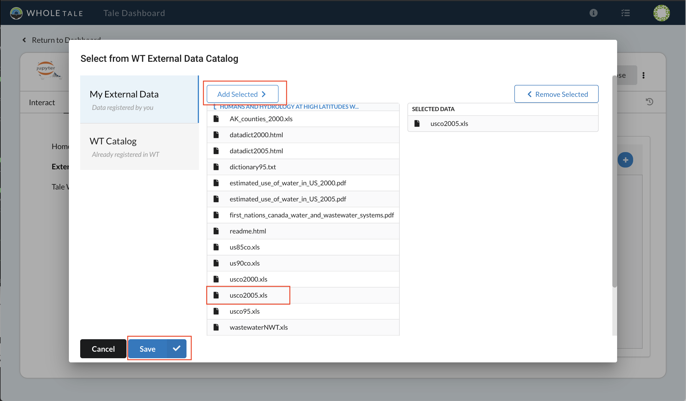

     Select and add "usco2005.xls"

8. The selected file will appear in your **External Data** folder (and is accessible in the **data** directory when you start your JupyterLab environment).

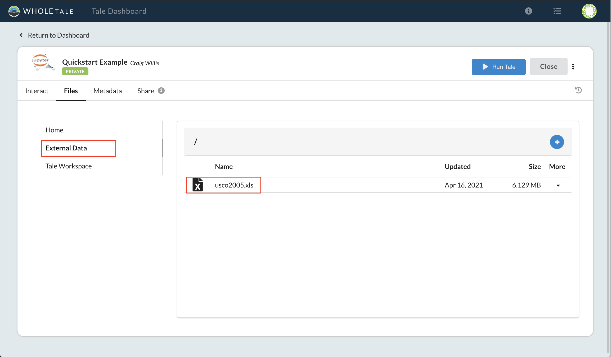

     External Data folder with selected file

9. Download the :download:`example files <quickstart.zip>`. Select the **Tale Workspace** folder on the left hand side. Select the "+" button and **Upload File** from the dropdown. Upload the postBuild, requirements.txt, and quickstart notebook.

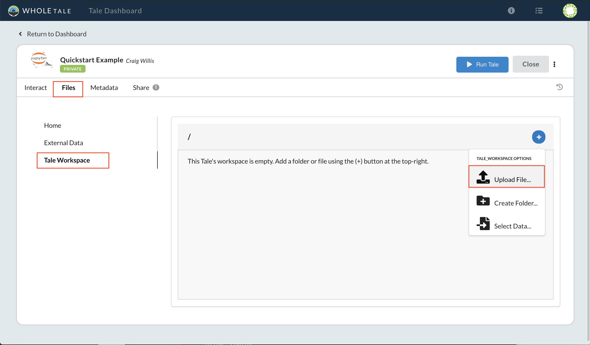

     Upload files to your Tale workspace

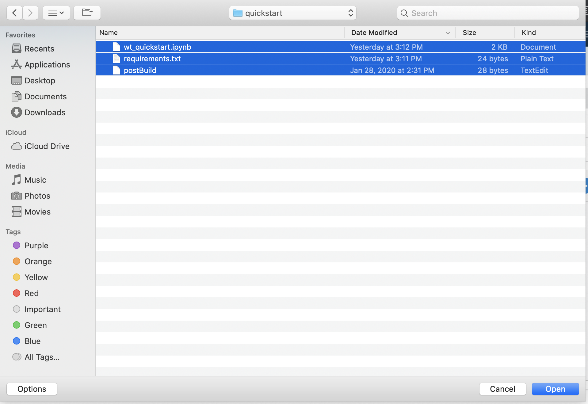

     Select files from local system

10. Select the **Run Tale** button to start the JupyterLab environment. A notification window will appear with the status and progress of your instance.

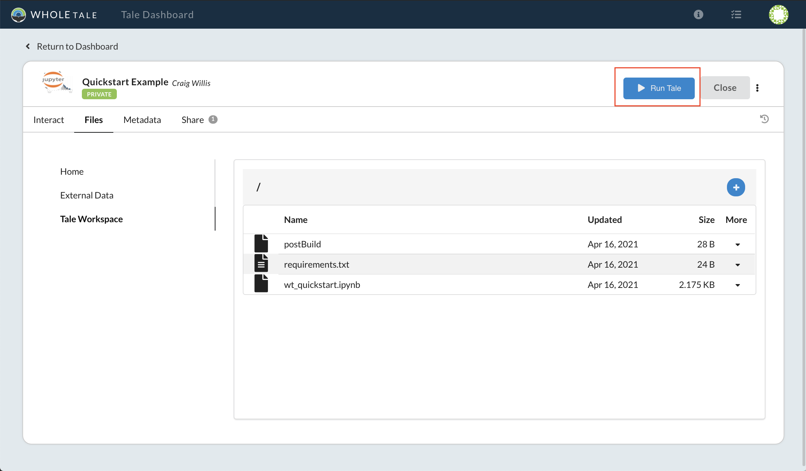

     Run Tale button

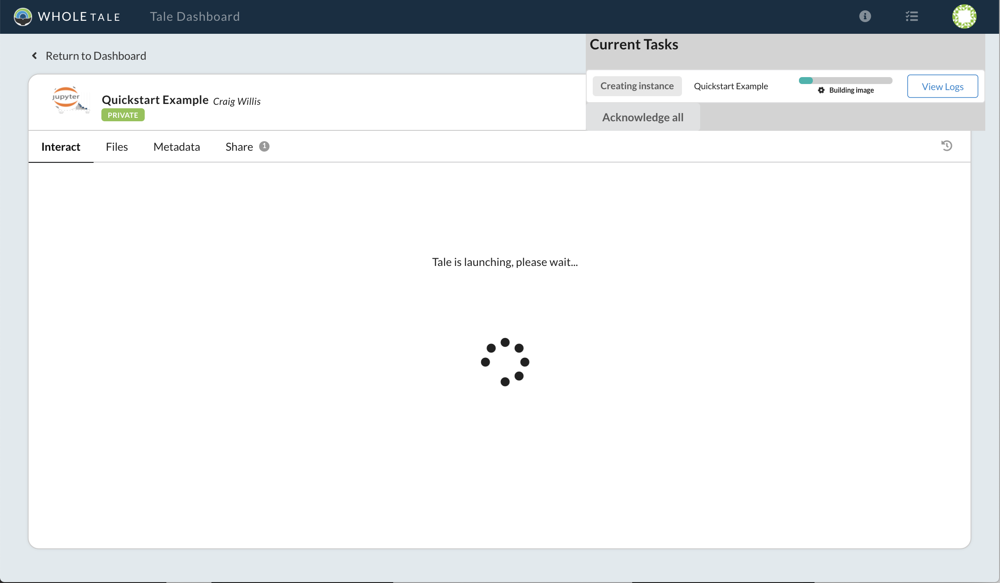

     Run Tale progress

11. After successful startup, the JupyterLab interface will display. Double-click on the **wt_quickstart.ipynb** file to open the notebook. Select the **play** button to run the notebook.

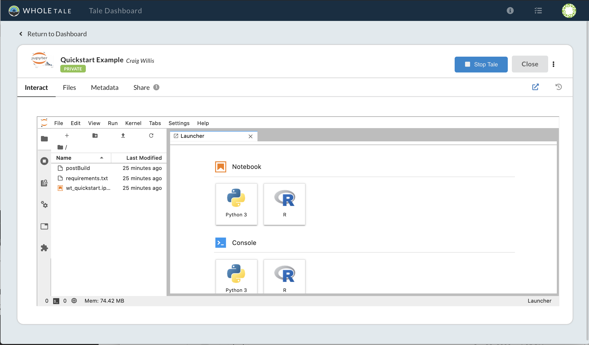

     JupyterLab environment

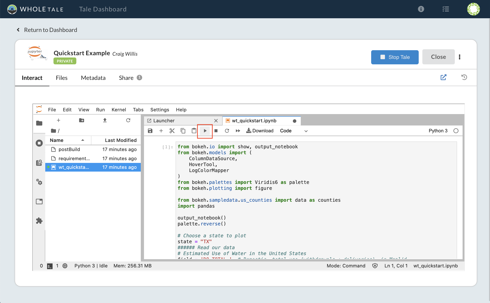

     Jupyter notebook

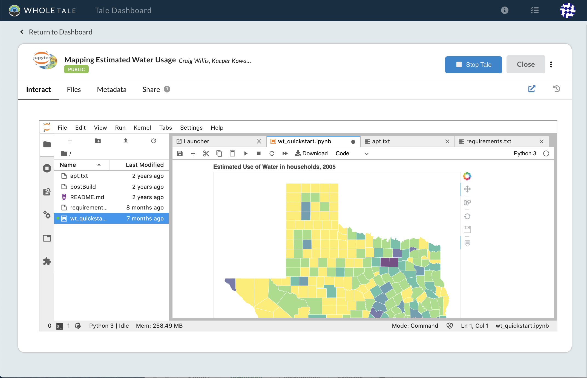

     Visualization of registered data

Here's what happened behind the scenes:
 
- When you registered the DOI, a link to the data in DataONE was made in the
  Whole Tale catalog, available to all users.
- You added a reference to registered dataset to your new Tale and it
  appeared in the `data` directory of your running JupyterLab environment.
- When you selected **Run Tale** a Docker image was created using 
  `repo2docker <https://repo2docker.readthedocs.io/>`_. Dependencies 
  were installed based on the provided "requirements.txt" fiel.
- You uploaded the example notebook to the Tale workspace. The notebook
  references the dataset in the `data` directory to produce a graphic.
