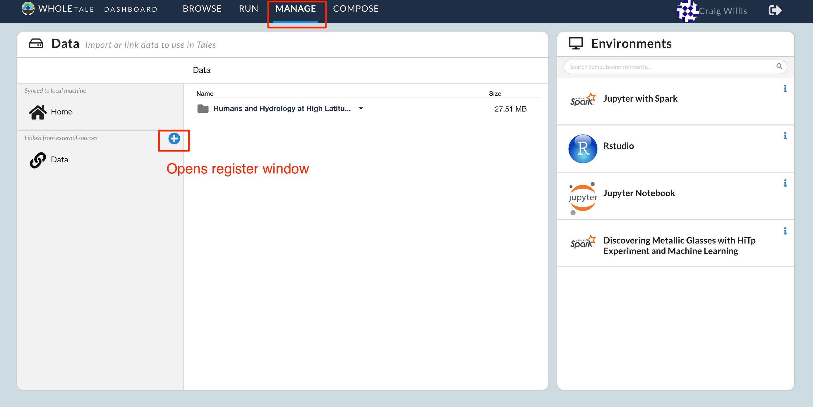
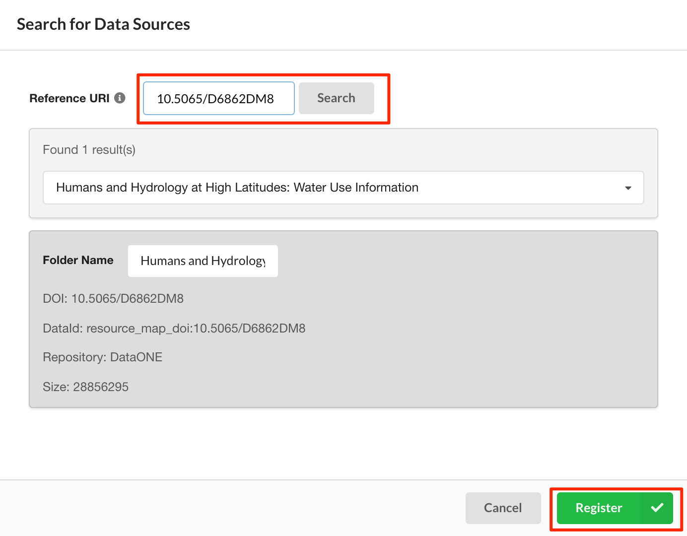
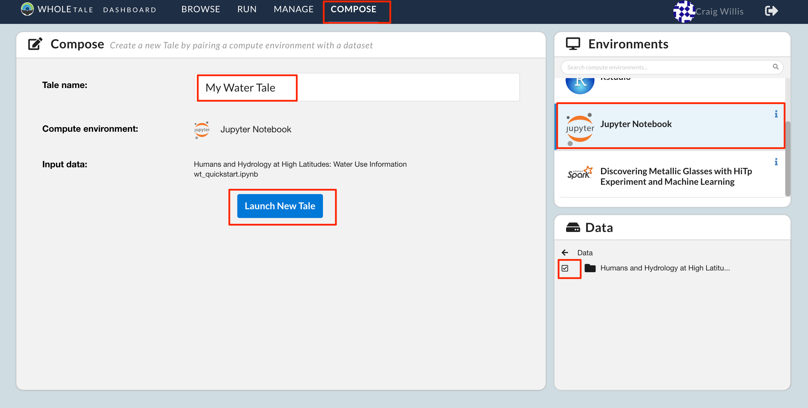

.. _quickstart:

Quickstart
==========

This page provides a brief step-by-step tutorial covering two primary Whole Tale
usage scenarios:  

-  :ref:`Finding and launching an existing tale <quickstart-launching>`
-  :ref:`Composing a new tale <quickstart-composing>`

.. _quickstart-launching:

Launching a tale
----------------
In this example, you'll launch the LIGO Tutorial tale:

- Go to the **Browse** page and search for "LIGO"
- You should now see the tale "LIGO Tutorial: LIGO Detected Gravitational Waves
  from Black Holes"
- Hover over the tale image and select the **View** button. Select this to view
  the tale description.
- On the **View Tale** page or back on the **Browse** page select the **Launch**
  button. This will start your instance of the LIGO tale.
- You should be taken to a Jupyter environment for this tale.
- Browse to ``work/data/`` and open the ``LOSC_Event_tutorial.ipynb`` notebook
- Follow the notebook narrative.

.. image:: images/quickstart/browse_ligo.png
     :align: center

.. image:: images/quickstart/run_ligo.png
     :align: center

.. image:: images/quickstart/ligo_notebook.png
     :align: center

Congratulations! You've successfully run your first tale.

Here's what happened behind the scenes:

- When you hit **Launch** a Docker container instance was created containing a 
  Jupyter environment and all necessary dependencies to run the LIGO tutorial 
  notebook.
- The `data` for the tale, including the tutorial notebook, were mounted into
  your running environment under the `work/data` directory. This is an immutable
  copy of the data stored on the Whole Tale system.
- Your Whole Tale `home` directory was mounted into `work/home`. This allows you
  to access personal files from within the running tale.

In the next example, we create a tale using data published in DataONE.

.. _quickstart-composing:

Composing a new tale
--------------------

The following steps demonstrate how to create a new tale based on a dataseti
published in DataONE.

- From the **Manage** page select **Data** and then the **+** icon to register 
  a new external dataset.
- Enter the Digital Object Identifier (DOI) ``10.5065/D6862DM8`` for the 
  *Humans and Hydrology at High Latitudes: Water Use Information* dataset 
  published in DataONE. 
- Select **Search** and then **Register**..
- The dataset *Humans and Hydrology at High Latitudes: Water Use Information*
  should appear under your **Data** folder.
- Download the :download:`example notebook <wt_quickstart.ipynb>`  and upload
  to your **Home** folder.
- Select **Compose** to create a new tale with the name "My Water Tale".
- Select "Jupyter Notebook" from the **Environments** panel.
- From the **Data** panel, select the checkboxes for 
  ``Data/Humans and Hydrology at High Latitudes:
  Water Use Information`` and  ``Home/wt_quickstart.ipynb``.
- Select **Launch New Tale** to create the tale.

Here's what happended behind the scenes:
 
- When you registered the dataset, a link to the data in DataONE was made in the
  Whole Tale system.  This dataset is now available to all users on the system
  and a link created in your private **Data** folder.
- When you selected the ``Home/wt_quickstart.ipynb`` file, an immutable snapshot
  of the file was made for the tale. This means that you can continue editing
  the file in your **Home** folder, but the file in the tale will remain
  unchanged.

