.. _quickstart:

Quickstart
==========

This page provides a brief step-by-step tutorial covering two primary Whole Tale
usage scenarios:  

-  :ref:`Finding and launching an existing tale <quickstart-launching>`
-  :ref:`Creating a new tale <quickstart-composing>`
-  :ref:`Analyze in Whole Tale <quickstart-composing>`

.. _quickstart-launching:

Launching a tale
----------------
In this example, you'll launch the LIGO Tutorial Tale which runs in Jupyter Notebook:

1. Go to the **Browse** page and search for "LIGO". Select the **Launch** button. 
   This will start your instance of the LIGO tale.

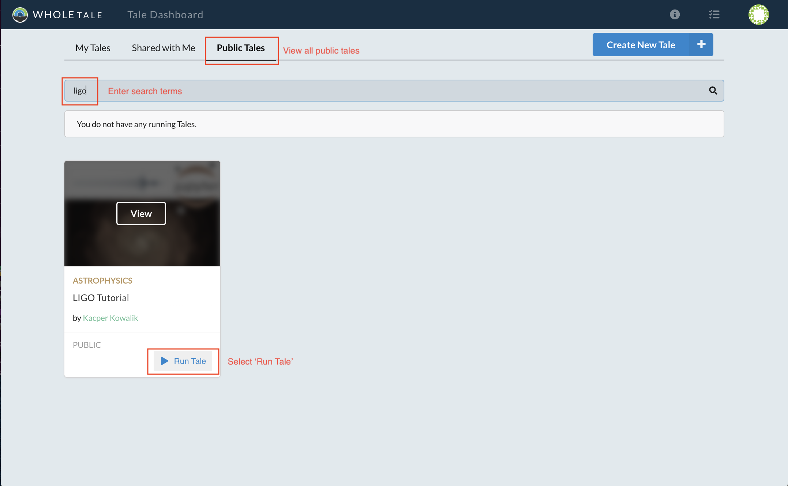

     Searching for and launching the LIGO Tale

2. Because this Tale was created by someone else, you'll be asked if you want to create a copy for yourself. Select **Copy and Run**.

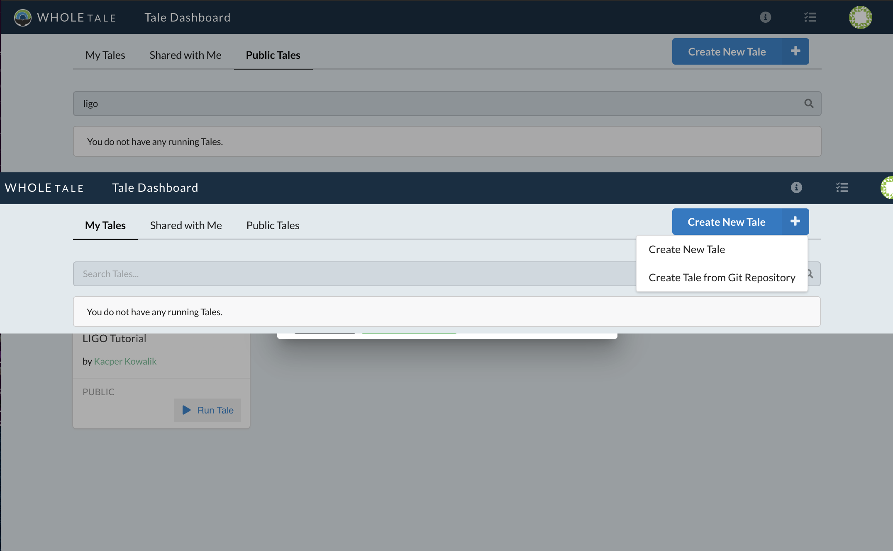

     LIGO access request

3. You'll be brought to the **Run** view, where you can access the Jupyter instance. In the case that you need to wait for the instance to 
start, you'll be shown a loading screen and progress indicator.

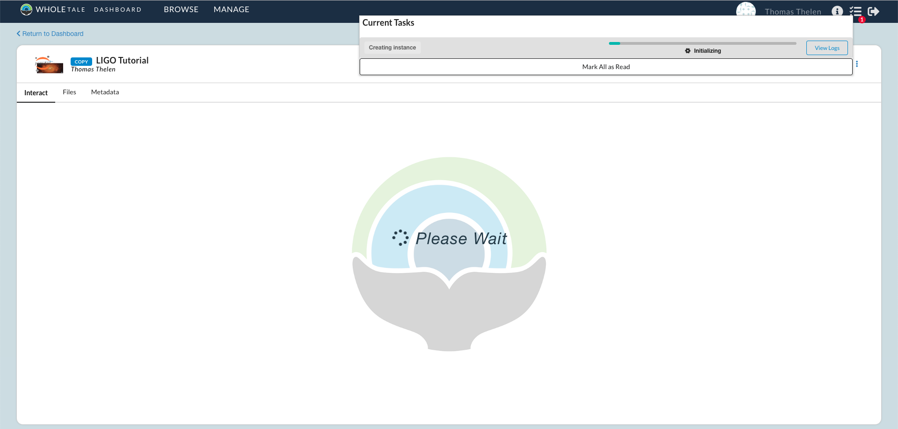

     LIGO Tale creating the compute environment

4. Once the Jupyter instance has spawned you may open and run the **LOSC_Event_tutorial.ipynb** analysis script.

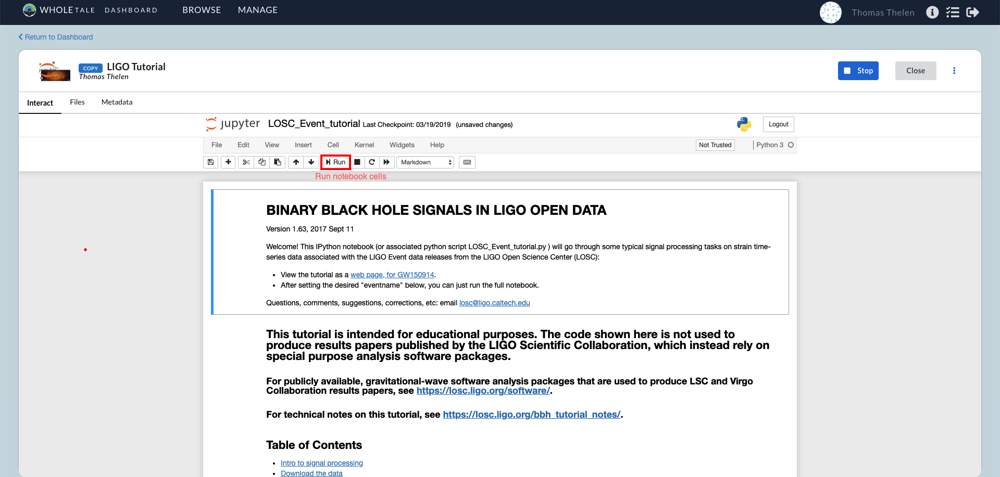

     LIGO Tale running

Congratulations! You've successfully run your first tale.

Here's what happened behind the scenes:

- When you hit **Launch** a Docker container was created using a Jupyter image
  containing all necessary dependencies to run the LIGO tutorial notebook.
- The Tale Workspace directory contains a notebook and python script required to
  run the LIGO tutorial
- The for the Tale, which were registered by the Tale creator, are
  mounted read-only and available under the `data` directory.
- Your Whole Tale `home` directory was mounted into `home`. This allows you
  to access personal files from within the running tale.

In the next example, we create a Tale using data published in DataONE.

.. _quickstart-composing:

Creating a new tale
--------------------

The following example demonstrates how to create a new tale based on Jupyter, using
a dataset that resides in DataONE. An :download:`example notebook <wt_quickstart.ipynb>` 
will be used to analyze the data.

1. Select **Create New** from the Browse page to open the dialog for creating new Tales.
   
   .. figure:: images/quickstart/create_new_button.png
     :align: center

     Location of the Create New... button

2. After the dialog opens, give the Tale a name. In this example we name it **Water Tale**.
Select "Jupyter Notebook" from the **Compute Environment** drop down and click  **Create New Tale and Launch** to create the tale.

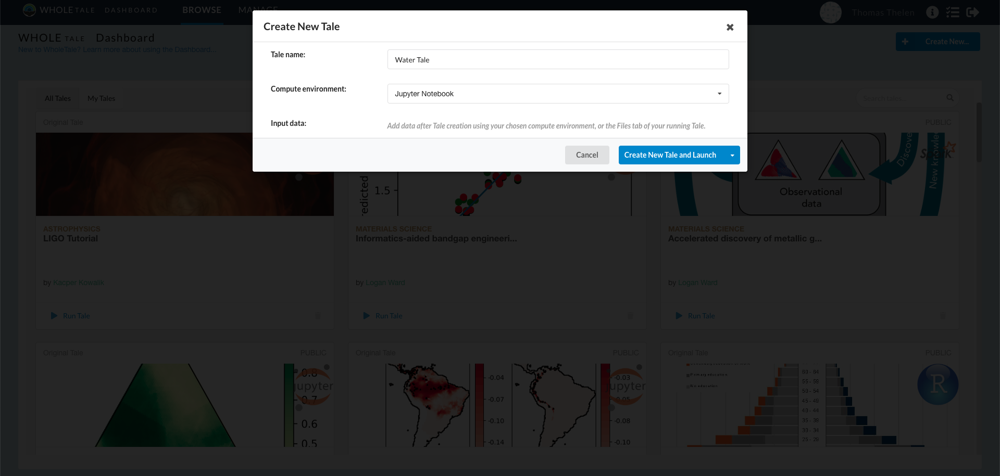

     Creating a new Tale

3. Now that the Tale has been created, it's time to register data from DataONE into Whole Tale.
To do this, navigate to the **Manage** page from the top menu bar.

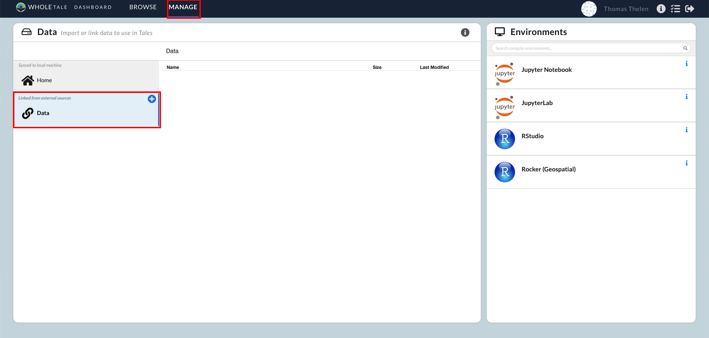

     The Manage page where you can edit datasets

4. Click the blue 'Plus' icon on the Data tab, shown on the left hand side of the page.

5. Enter the Digital Object Identifier (DOI) **10.5065/D6862DM8** for the *Humans and Hydrology at High Latitudes: Water Use Information* dataset published in DataONE. Select Search and then Register.

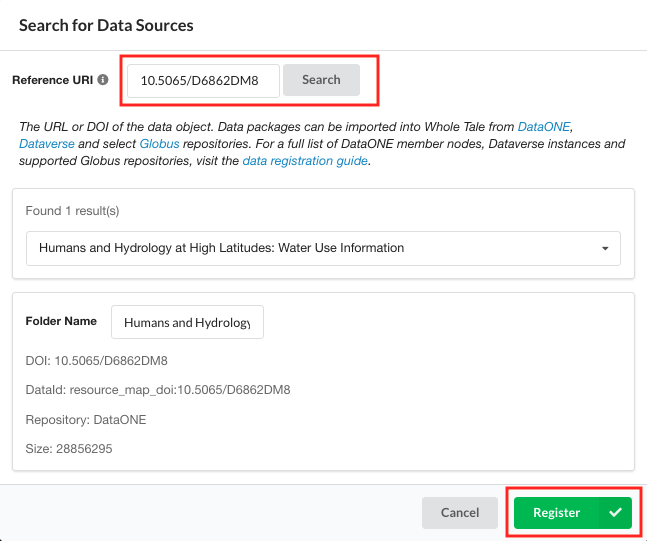

     Registering a DataONE dataset by DOI

The dataset *Humans and Hydrology at High Latitudes: Water Use Information*
should appear under your **Data** folder.

6. Navigate back to your tale and select the **Files** tab then the **External Data** folder

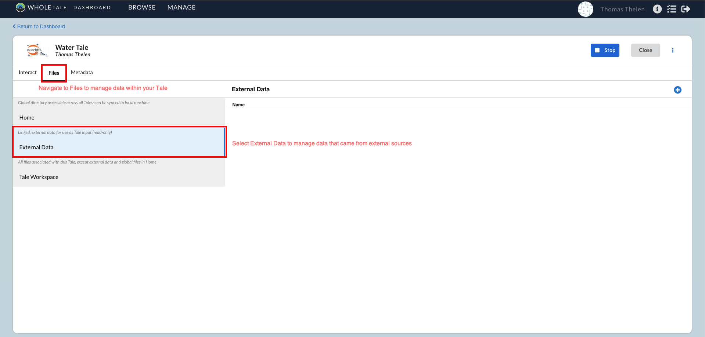

     The Tale information view about included files

7. Select the blue "+" button on the right hand side to add the registered dataset to your new
   Tale. From the "Select Data" window, highlight the dataset, click "Add Selected",
   and then finally click the "Select" button to save the changes to your Tale.

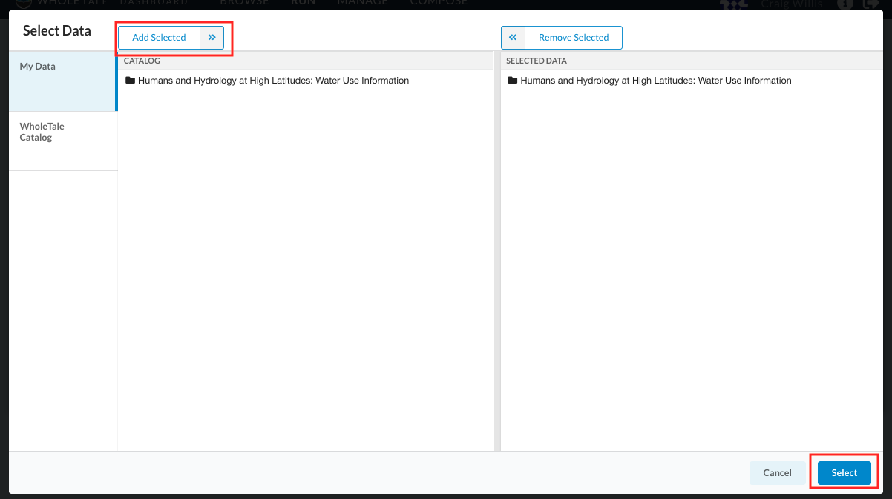

     Adding the registered dataset to your Tale

8. Once the dataset has been added, download the :download:`example notebook <wt_quickstart.ipynb>`. Close the
external data modal and select the **Tale Workspace** tab on the left hand side. Select the
"+" button and **Upload File** from the dropdown. Upload the Jupyter Notebook that you
had downloaded.

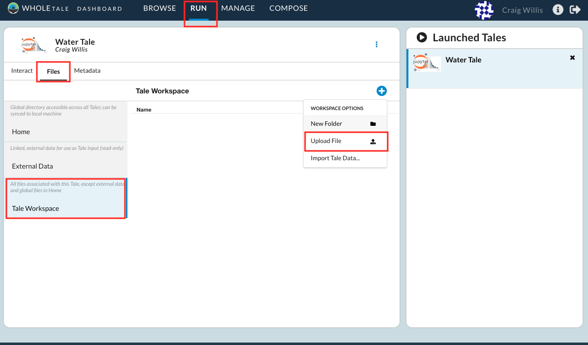

     Uploading the notebook to your Tale workspace

9. Within Jupyter, browse to the **workspace** directory to open and run the
   example notebook.

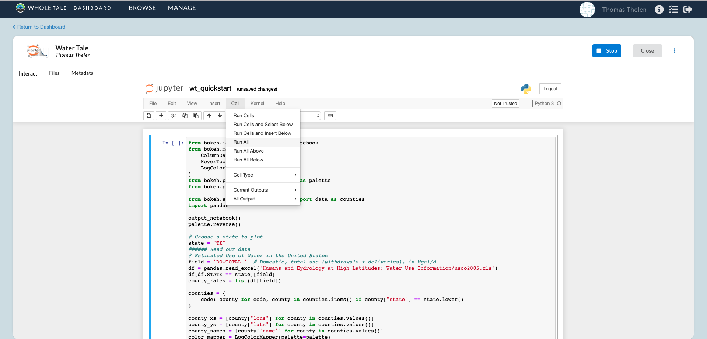

     Running the notebook

Here's what happened behind the scenes:
 
- When you created your Tale, a Docker container was started using the Jupyter
  environment.
- When you registered the dataset, a link to the data in DataONE was made in the
  Whole Tale catalog, available to all users.
- You added a reference to registered dataset to your new Tale and it
  appeared in the `data` directory of your running Jupyter environment.
- You uploaded the example notebook to the Tale workspace.  The notebook
  references the dataset in the `data` directory to produce a graphic.
