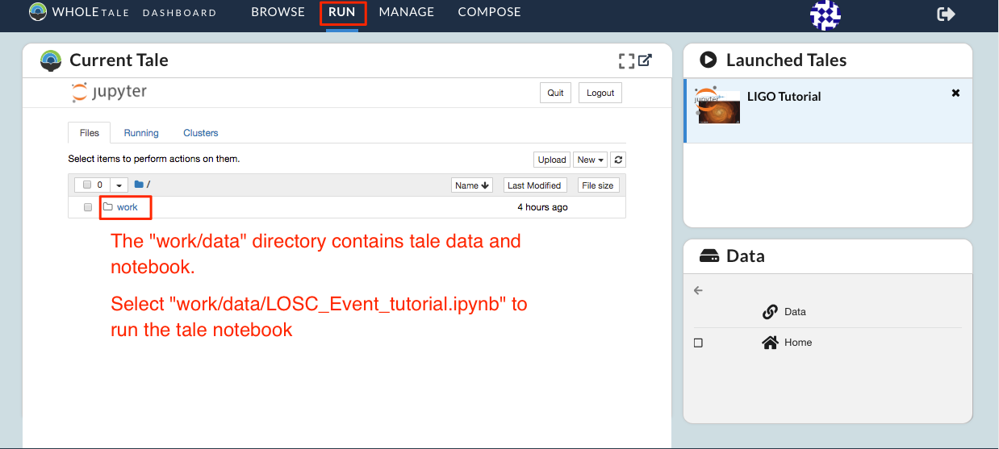
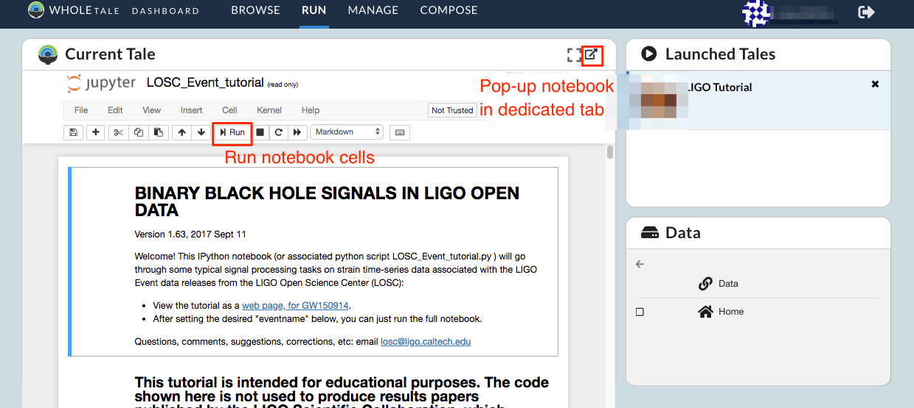
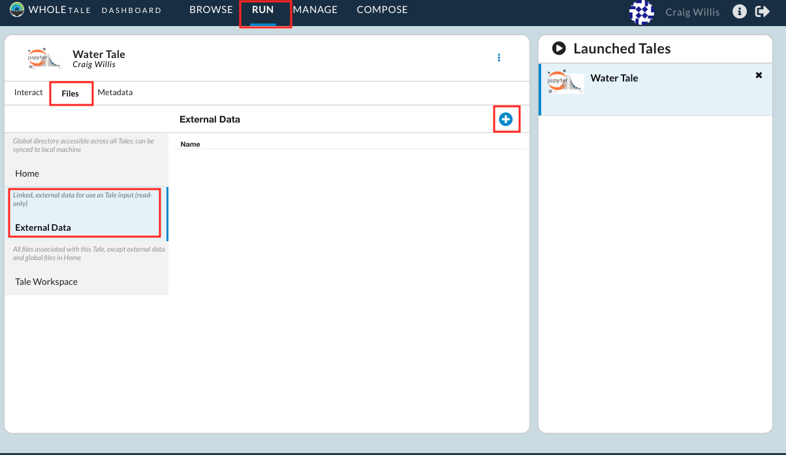
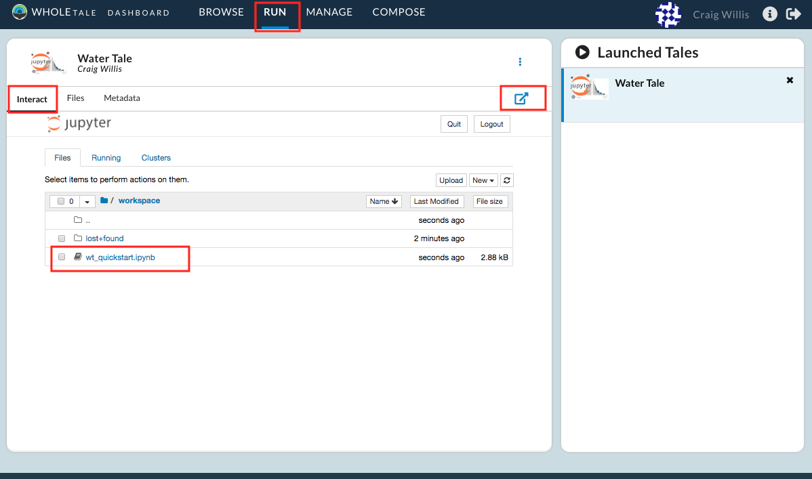

.. _quickstart:

Quickstart
==========

This page provides a brief step-by-step tutorial covering two primary Whole Tale
usage scenarios:  

-  :ref:`Finding and launching an existing tale <quickstart-launching>`
-  :ref:`Composing a new tale <quickstart-composing>`
-  :ref:`Analyze in Whole Tale <quickstart-composing>`

.. _quickstart-launching:

Launching a tale
----------------
In this example, you'll launch the LIGO Tutorial tale:

1. Go to the **Browse** page and search for "LIGO". Select the **Launch** button. 
   This will start your instance of the LIGO tale.

.. figure:: images/quickstart/browse_ligo.png
     :align: center

     Searching for and launching a tale

2. Select the "Ligo Tutorial" in the **Launched Tales** panel.  
   You should be taken to a Jupyter environment for this tale.

     Launched Ligo tale

3. Browse to ``work/data/`` and open the ``LOSC_Event_tutorial.ipynb`` notebook.
   Follow the notebook narrative.

     Ligo tale notebook

Congratulations! You've successfully run your first tale.

Here's what happened behind the scenes:

- When you hit **Launch** a Docker container was created using a Jupyter image
  containing all necessary dependencies to run the LIGO tutorial notebook.
- The Tale Workspace directory contains a notebook and python script required to
  run the LIGO tutorial
- The for the Tale, which were registered by the Tale creator, are
  mounted read-only and available under the `data` directory.
- Your Whole Tale `home` directory was mounted into `home`. This allows you
  to access personal files from within the running tale.

In the next example, we create a tale using data published in DataONE.

.. _quickstart-composing:

Composing a new tale
--------------------

The following steps demonstrate how to create a new tale based on Jupyter and
register a dataset from DataONE for analysis.

1. Select **Compose** to create a new tale with the name "Water Tale".
   Select "Jupyter Notebook" from the **Environments** panel.
   Select **Launch New Tale** to create the tale.

.. figure:: images/quickstart/watertale_compose.png
     :align: center

     Composing a tale

2. From the **Manage** page select **Data** and then the **+** icon to register 
   a new external dataset.

.. figure:: images/quickstart/watertale_manage_dataone.png
     :align: center

     Opening the register window

2.  Enter the Digital Object Identifier (DOI) ``10.5065/D6862DM8`` for the 
    *Humans and Hydrology at High Latitudes: Water Use Information* dataset 
    published in DataONE.  Select **Search** and then **Register**.

.. figure:: images/quickstart/watertale_register_dataone.png
     :align: center
     :scale: 50

     Registering a DataONE dataset by DOI

The dataset *Humans and Hydrology at High Latitudes: Water Use Information*
should appear under your **Data** folder.

4. From the **Run** page select the **Files** tab then the **External Data**
   folder and then the "+" button to add the registered dataset to your new
   Tale.

     Adding the registered dataset to your Tale

5. From the "Select Data" window, higlight the dataset and click "Add Selected"
   and the "Select" button to save the changes to your Tale.

.. figure:: images/quickstart/watertale_select_dataset.png
     :align: center
     :scale: 50

     Adding the registered dataset to your Tale

6. Download the :download:`example notebook <wt_quickstart.ipynb>`. From the
   **Run** page **Files** tab select the **Tale Workspace** folder. Select the
   "+" button and **Upload File**.

.. figure:: images/quickstart/watertale_upload_notebook.png
     :align: center

     Uploading the notebook to your Tale workspace

5. From the **Run** page select the **Interact** tab to display the running
   Jupyter environment.

     Accessing the interactive environment

5. Within Jupyter, browse to the **workspace** directory to open and run the
   example notebook.

.. figure:: images/quickstart/watertale_run_notebook.png
     :align: center

     Running the notebook

Here's what happended behind the scenes:
 
- When you created your Tale, a Docker container was started using the Jupyter
  environment.
- When you registered the dataset, a link to the data in DataONE was made in the
  Whole Tale catalog, available to all users.
- You added a reference to registered dataset to your new Tale and it
  appeared in the `data` directory of your running Jupyter environment.
- You uploaded the example notebook to the Tale workspace.  The notebook
  references the dataset in the `data` directory to produce a graphic.

