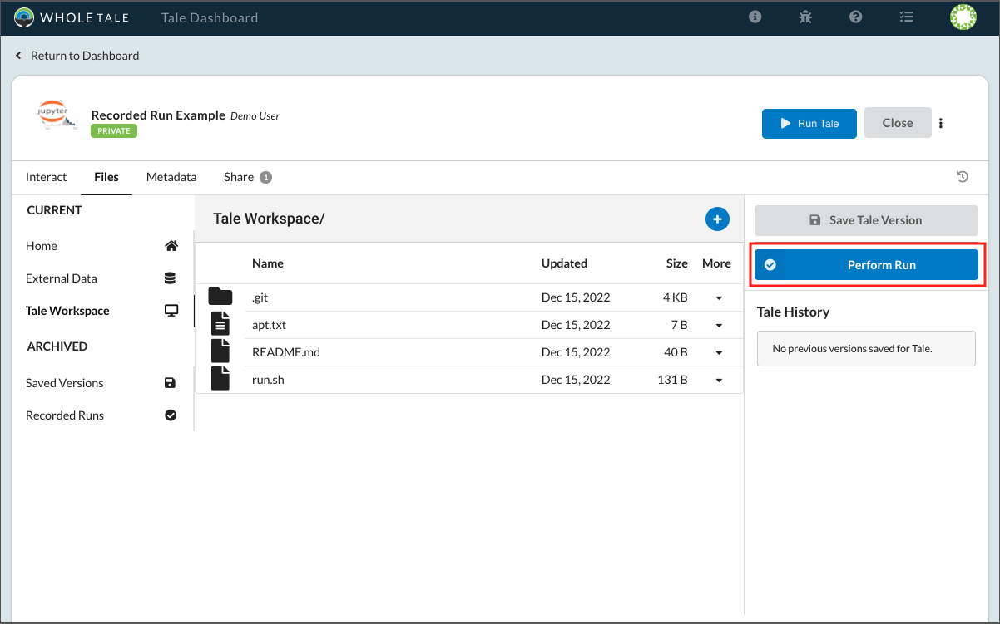
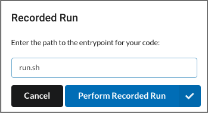
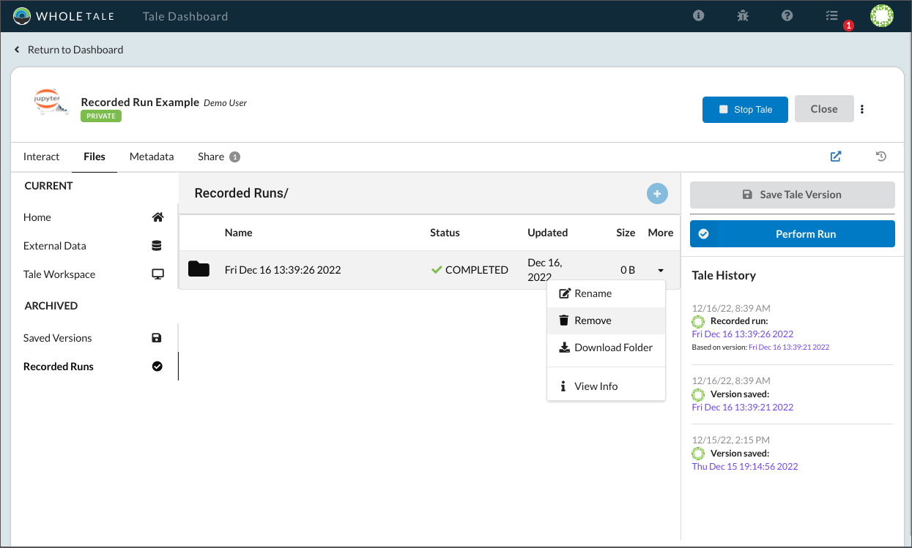
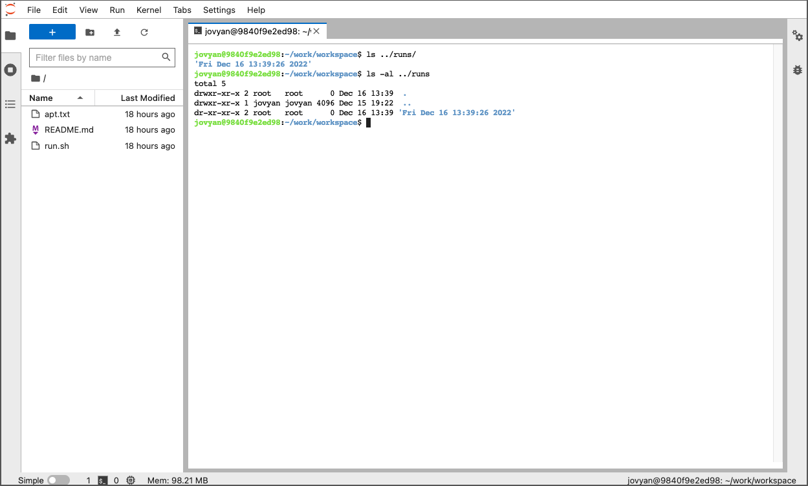

.. _recorded-runs:

Recorded Runs
==============

A **recorded run** is a way to ensure the transparency and reproducibility of
your computational workflow by capturing the exact copy of artifacts used to
genearte results. A recorded run:

* Creates a version of your tale
* Builds the container image
* Executes a specified workflow via an entrypoint or master script in an
  isolated container
* Captures an immutable copy of all outputs
* Captures system runtime information including memory and cpu usage

.. note:: 
   Recorded runs can be used to capture multiple independent workflows for a
   single version of a tale. A version can have more than one recorded run.
  
You can execute a recorded run via the **Tale Action Menu** or **Tale History**
panel.  Select the **Tale History** icon (|tale_history|) to open or close the panel:

.. |tale_history| image:: images/versioning/tale_history_icon.png

To start a crecorded run, select **Perform Run**:

     Perform run button

This will prompt you to specify an entrypoint or master script for your
workflow:

     Recorded run dialog

Created runs are accessible from the Whole Tale dashboard or from  inside your
running interactive environment in the `../runs` directory:

     Recorded run in the dashboard

     Recorded run in the interactive environment

Deleting Runs
~~~~~~~~~~~~~

Runs can only be removed if the associated version is first removed.
Deleted runs are removed permanently and cannot be recovered.

Renaming Runs
~~~~~~~~~~~~~

Runs can be renamed via the dashboard and are renamed on the filesystem.

Exporting and Publishing Runs 
~~~~~~~~~~~~~~~~~~~~~~~~~~~~~

Recorded runs are exported and published based on the associated version. This
means that an exported or published tale will have a single version, but may
have more than one recorded run.
