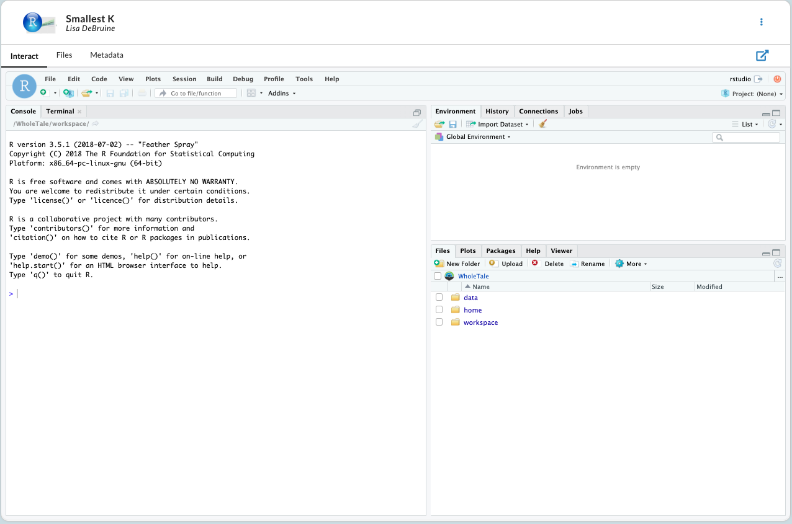
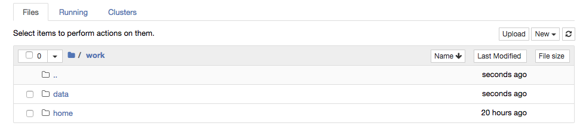
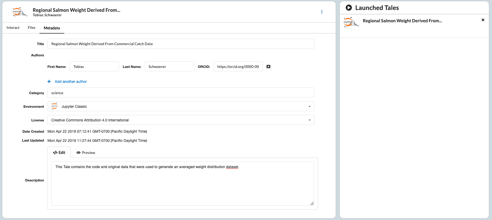
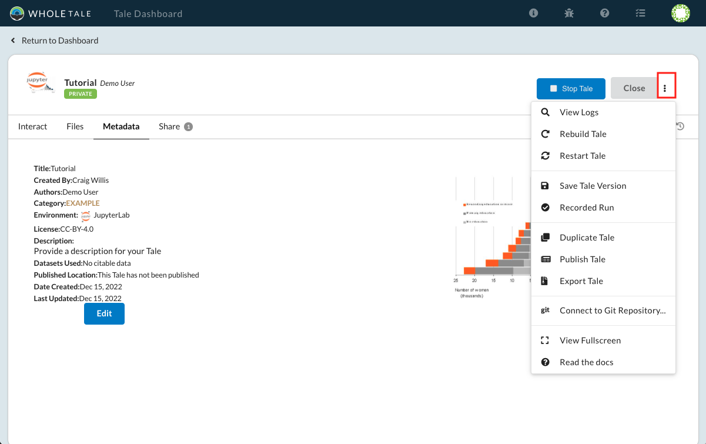

.. _run:

Run: Access and Modify Running Tales
====================================

The **Run** page allows you to interact with and modify your running Tale. From this page
you can add and remove files to your Tale, edit the metadata, stop and rebuild the environment,
and publish to external repositories for long term storage.

.. _stop-tale:

Interacting With Tales
----------------------

RStudio
~~~~~~~
When starting a tale that is using an RStudio Environment, you'll be presented
with RStudio, shown below.

Each of the folders shown are analogous to the tabs under the **Files** tab. You can access all of your home files under the **home/** folder;
data that was brought in from a third party service can be found under **data/**; files that were added to your workspace are found under **workspace/**.

Jupyter Notebook
~~~~~~~~~~~~~~~~
When starting a Tale that has a Jupyter Notebook Environment, you'll be
presented with a typical Notebook interface.

As with RStudio, data that came from external repositories can be found under **data/**, home directory files in **home/**, and workspace files in **workspace/**.

Adding Data
-----------
Although compute environments are used differently, data is added the same way. The **Files** tab provides an interface for
adding data from your home folder, local machine, or from external sources.

Home Directory
~~~~~~~~~~~~~~

The *Home* directory serves as a place for files that you can use across many Tales. Whenever a new Tale is created or launched,
this directory is added to your Tale. You may want to use this folder to store configuration files, api keys, or commonly used scripts.

Tale Workspace
~~~~~~~~~~~~~~

The *Workspace* folder is for files that only used by a particular Tale. For example, if you have a Tale that is doing a specific
analysis that isn't relevant to other Tales it may be more appropriate to add it here rather than the *Home* folder.

External Data
~~~~~~~~~~~~~

When data is brought in from external services such as Dataverse or DataONE, it is kept throughout Whole Tale. This
allows you to include it in any of your Tales so that you don't have to re-register it. When these datasets are added
to a Tale, they are added to the *External Data* folder. You can register the data in the **Manage** page, but will need
to add them to the Tale here.

Modifying Tale Metadata
-----------------------
The Run page can also be used to access the Tale metadata editor, shown below.

The editor can be used to change the environment, add authors to the Tale, change the license, make the Tale public, and provide in in-depth description of the Tale.

Tale Actions
------------

In addition to interacting with a Tale environment, you can do a number of operations on the Tale itself. Most of
these actions can be found in the Tale's action menu, highlighted in the image below.

     The Tale's action menu

Exporting a Tale
~~~~~~~~~~~~~~~~

In the case that you want to save a Tale to your local machine, select your **Export as BagIt" from the action menu. This will allow you to run the Tale on your local machine, and may be more suitable for
long term storage.

Publishing a Tale
~~~~~~~~~~~~~~~~~

When you are ready to archive your Tale and retrieve a DOI, select the **Publish** option from the action menu.
For more information on publishing, visit the  `publish`_ page.

Restarting and Rebuilding
~~~~~~~~~~~~~~~~~~~~~~~~~

If your Tale becomes stuck in an error state, you may want to restart it. Click the *Restart Tale* button in the
action menu to destroy the current instance and receive a new one.

If you change the Tale's frontend environment, you'll need to completely rebuild the Tale. This won't delete your data,
but will give you a fresh environment.

Stopping a Tale
~~~~~~~~~~~~~~~
To stop a running Tale, click the **Stop** button on the main Tale bar. Stopping the Tale
will destroy the current running instance, but will not permanently delete the Tale.

.. _compose: compose.html
.. _browse: browse.html
.. _publish: publishing.html
