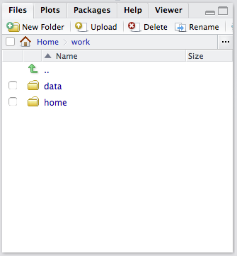
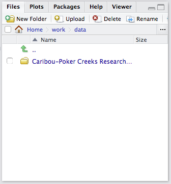
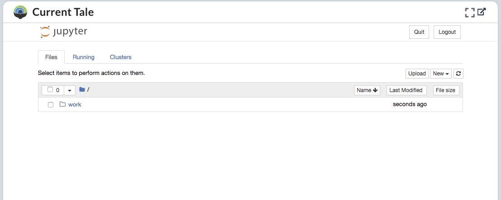

.. _run:

Run: Access and Modify Running Tales
==================================================

The **Run** page allows you to access your currently running tale instances. 

* Current Tale: displays the currently selected Tale instance (if it is iFrame compatible)
* Launched Tales: shows any running Tale instances

.. _current-tale:

Current Tale
------------

The **Current Tale** panel displays any selected running tale. Due to technical
limitations, some tales may be displayed in a separate browser tab or window. 

.. _launched-tales:

Launched Tales
--------------
The **Launched Tales** panel displays a list of your running instances, if any,
and allows you to access or stop them.

.. _access-tale:

Access a Running Tale
~~~~~~~~~~~~~~~~~~~~~
To access a running tale, click on the entry in the **Launched Tales** panel.  This will take you to the **Run** page or open a new tab for frontends that do not support iFrames.

.. _stop-tale:

Stop a Tale
~~~~~~~~~~~
To stop a running Tale, select the **X** from the entry in the **Launched Tales**
panel. You will be prompted to confirm. Select **Yes** to stop the instance. Note
that this will *not* delete the tale. To delete a Tale, refer to the browse_ 
page

Interacting With Tales
----------------------
Once a tale is running, you'll want to navigate to your data folders and run
your scripts. Execution is done differently between RStudio and Jupyter Notebook- but the
data locations remain the same.

RStudio
~~~~~~~
When starting a tale that is using an RStudio Environment, you'll be presented
with RStudio, shown below.

.. image:: images/run/rstudio.png
     :align: center
     :scale: 80%

The files that you included in your Tale during the compose process can be found
in the file browser at the lower right corner in the *work* folder. The
*kitematic* folder can be ignored.

     
Navigating into *work*, you'll see two folders: *data* and *home*. In the 
example from the compose_ page we added a dataset that we had registered
from an external resource which means it will be located in the *data* folder
rather than *home*.

Here we can see the data package that was registered from an external source. 
Inside contains the data and scripts used for analysis which
can subsequently be run. 

Jupyter Notebook
~~~~~~~~~~~~~~~~
When starting a Tale that has a Jupyter Notebook Environment, you'll be
presented with a typical Notebook interface.

Data and scripts are held inside the *work* directory. Navigating into the folder
will present two additional folders: *data* and *home*.

.. image:: images/run/jupyter_browse.png
    :align: center
    :scale: 80%

If you are using data
that was registered from an external resource, it can be found in the *data*
folder. In this case, the data was obtained from a DataONE package. The data
and scripts that belong to the package can be found inside the folder.

.. image:: images/run/jupyter_data.png
    :align: center
    :scale: 80%
    
If your data resides in your *home* directory, navigate to *home* and navigate to
the folder hosts your data.

Modifying Tale Metadata
-----------------------
The Run page can also be used to access the Tale metada editor, shown below.

.. image:: images/run/metadata_editor.png
    :align: center
    :scale: 80%

The editor can be used to change the environment, add authors to the Tale, change the license, make the Tale public, and provide in in-depth description of the Tale.

.. _compose: compose.html
.. _browse: browse.html
