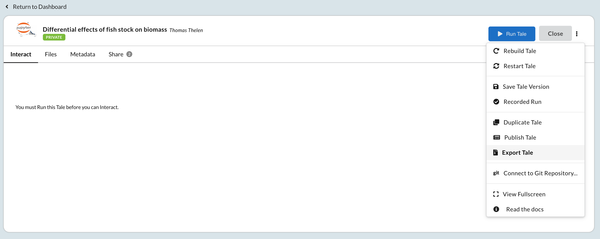

.. _run:

Accessing and Modifying Tales
==============================

The **Run** view allows you to interact with and modify your running tale. From this page
you can add and remove files; edit metadata; stop and rebuild the environment;
create versions and recorded runs; and publish to external repositories to
obtain a persistent identifier.

.. _stop-tale:

Launching the Tale
------------------
After you have finalized your tale and click **Run Tale**, you'll be brought
to the **Interact** page where it will start up, seen in the image below. From here
you can access the tale, along with an assortment of other actions that are
documented below.

.. figure:: images/compose/tale_launching.png
     :align: center

     A tale that is being created and configured.

Interacting With Tales
----------------------

RStudio
~~~~~~~
When starting a tale that is using an RStudio Environment, you'll be presented
with RStudio, shown below.

.. image:: images/run/rstudio.png
     :align: center

Each of the folders shown are analogous to the tabs under the **Files** tab. You can access all of your home files under the **home/** folder;
data that was brought in from a third party service can be found under **data/**; files that were added to your workspace are found under **workspace/**.

Jupyter Notebook
~~~~~~~~~~~~~~~~
When starting a tale that has a Jupyter Notebook Environment, you'll be
presented with a typical Notebook interface.

.. image:: images/run/jupyter_browse.png
     :align: center

As with RStudio, data that came from external repositories can be found under **data/**, home directory files in **home/**, and workspace files in **workspace/**.

Adding Data
-----------
Regardless of the selected interactive environment, data is added the same way. 
The **Files** tab provides an interface for adding data from your home folder, 
local machine, or from external sources.

Home Directory
~~~~~~~~~~~~~~

The *Home* directory can be used to store files that you need to access across
all of your tales. The home directory is mounted in every running tale
instance, but is never included in shared, exported, or published tales.

Tale Workspace
~~~~~~~~~~~~~~

The *Workspace* folder is for files that belong to a tale. 
contain all artifacts required 

External Data
~~~~~~~~~~~~~

When data is brought in from external services such as Dataverse or DataONE, it is kept throughout Whole tale. This
allows you to include it in any of your tales so that you don't have to re-register it. When these datasets are added
to a tale, they are added to the *External Data* folder. You can register the data in the **Manage** page, but will need
to add them to the tale here.

Connecting to Git
~~~~~~~~~~~~~~~~~

Git repositories can be included in a tale's Workspace. For instructions on how to connect a Git repository to your tale, refer to the *Tale Actions* section.

Modifying Tale Metadata
-----------------------
The Run page can also be used to access the tale metadata editor, shown below.

.. image:: images/run/metadata_editor.png
    :align: center

The editor can be used to change the environment, add authors to the tale, change the license, make the tale public, and provide in in-depth description of the tale.

.. _advanced-settings:

Advanced Settings
-----------------

The advanced settings section allows you to override default settings including
the default command, environment variables, and memory limits. Note that memory
limits are contrained by the underlying virtual machine. Any additional files
required for :ref:`building the container image <image-builds>` can be specified using the
``extra_build_files`` setting.

.. code-block:: json

   {
       "environment": [
            "MY_ENV=value"
        ],
        "memLimit":"12gb",
        extra_build_files: [
            "some_file.txt",
            "some_folder",
        ],
   }
   

Tale Actions
------------

Use the tale's **action menu**, highlighted below, to access tale-specific
operations.

     The tale's action menu

.. list-table:: Tale actions
   :widths: 20 80
   :header-rows: 1

   * - Action
     - Description
   * - View Logs
     - | Enabled when your tale instance is running, this option allows you 
       | to view the running container instance logs (i.e., ``docker logs``).
   * - Rebuild Tale
     - Rebuilds the container image. Requires restart (below).
   * - Restart Tale
     - Restartsthe container instance
   * - Save Tale Version
     - Creates a new version of your tale. See :ref:`versioning`.
   * - Recorded Run
     - Starts a recorded run. See :ref:`recorded-runs`.
   * - Duplicate Tale
     - Creates a copy of your tale.
   * - Publish Tale
     - Publishes your tale to a supported repository. See :ref:`publishing`.
   * - Export Tale
     - Exports your tale. See :ref:`export_run`.
   * - Connect to Git Repository...
     - | Connects an existing workspace to a remote Git repository. 
       | See :ref:`github`.

.. _compose: compose.html
.. _browse: browse.html
.. _publish: publishing.html
