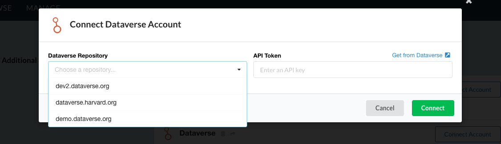
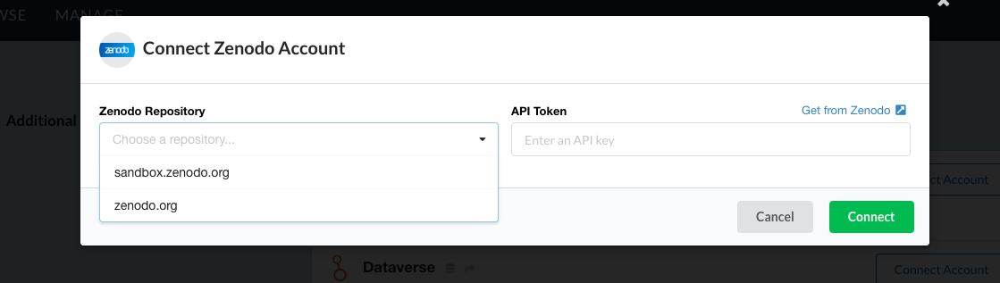

.. _settings:

Account Settings
================
The Account Settings page allows you to manage your third party integrations. From here you can check which 
services Whole Tale has access to and manage your API keys.

Connecting to DataONE
---------------------
Connecting to DataONE requires that you have an ORCID or university account. When connecting your Whole Tale account with DataONE, you'll be asked to log into either one. 
Whole Tale will automatically request your API token from DataONE once connected.

Whole Tale allows you to connect to the following DataONE instances.

1. `DataONE <https://dataone.org/>`_
2. `Dataone Development <https://dev.nceas.ucsb.edu>`_

Connecting to Dataverse
-----------------------
You can connect your Whole Tale account with Dataverse by providing your Dataverse API key. A guide on obtaining your API key 
can be found in the `Dataverse API Guide`_.

Whole Tale supports the following instances of Dataverse.

1. `Harvard Dataverse <https://dataverse.harvard.org>`_
2. `Development 2 <https://dev2.dataverse.org>`_
3. `Dataverse Demo <https://demo.dataverse.org>`_

     Connecting your account to Dataverse.

Connecting to Zenodo
--------------------
Zenodo can be integrated with your Whole Tale account by using your Zenodo API key. You can retrieve your token at the 
`Zenodo token page`_.

Whole Tale supports the following Zenodo servers.

1. `Zenodo <https://zenodo.org>`_
2. `Zenodo Sandbox <https://sandbox.zenodo.org>`_

     Connecting your account to Zenodo.

.. _Zenodo token page : https://zenodo.org/account/settings/applications/tokens/new/
.. _Dataverse API Guide : http://guides.dataverse.org/en/latest/api/auth.html