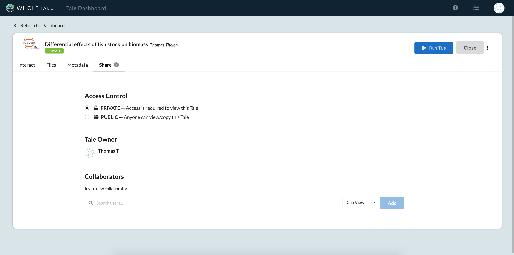
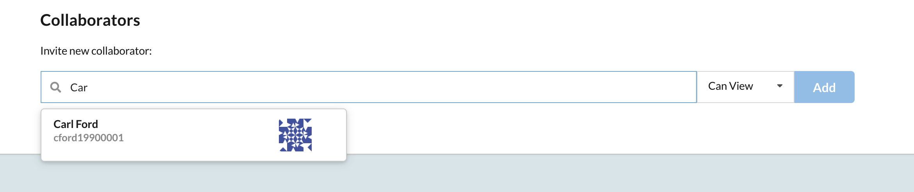
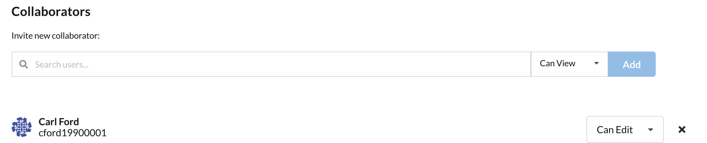

.. _sharing:

Sharing Tales
=============

Tales can be shared with other Whole Tale users, enabling active collaboration on work. The *Shared with Me* tab on the main dashboard page lists all of the Tales that other users are actively 
sharing with you. 

To share a Tale with other users, first open the Tale and navigate to the *Share* tab, shown below.

     The Tale sharing area.

To add a user as a collaborator, use the *Collaborators* section to search for their username. Once selected,
the appropriate permissions can be set.

     Sharing a Tale with a user.

Tales can also be unshared with users. To remove a user, navigate to the *Collaborators* area. Find the user that the Tale is 
being shared with and click the 'x' to remove them.

Read Permissions
----------------
The default access level for a shared Tale is *Can Read*. This means that the user you've shared the Tale with
won't be able to make modifications to the Tale's metadata or to its files. The user will instead 
be able to view the metadata fields and view the included files.

Edit Permissions
----------------
When a Tale is shared for the purpose of active collaboration, the permissions should be set to *Can Edit*. This gives
user that the Tale is being shared with the ability to make changes to the Tale's metadata and files. The changes that are made to the Tale 
will reflect on the original Tale that was shared.
