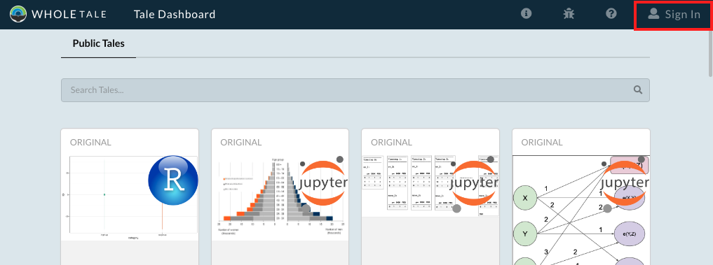
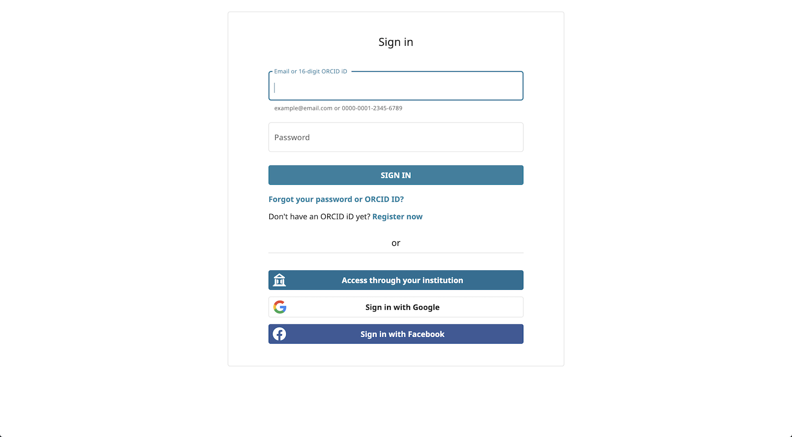
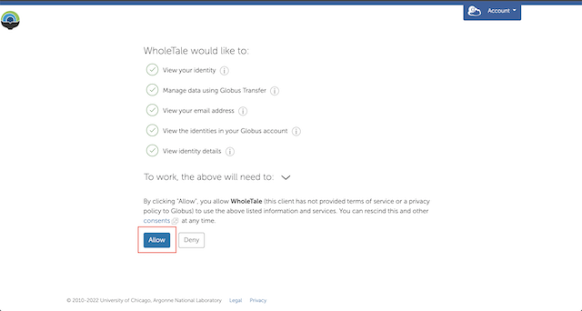
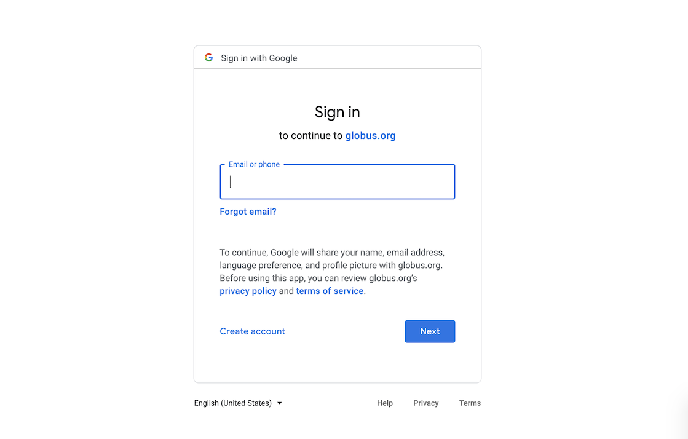

.. _sign_in:

Signing In
==========

Users can access Whole Tale to browse public tales without signing in. However,
many of the core operations require users to have an account. Whole Tale
allows users to sign in using existing credentials from from hundreds of research 
institutions and organizations as well as ORCID or Google accounts. 

.. note::

   The Whole Tale system uses `Globus Auth <https://www.globus.org/platform>`_ 
   to allow users to login using their existing credentials.  For more information 
   about Globus, see their `documentation <https://docs.globus.org/how-to/get-started/>`_.

1. Go to https://dashboard.wholetale.org and select the "Sign In" link to start the login process.

2. Search for and select your institution or organization from the search box.  If your organization does not appear in the list, you can use your Google account, ORCID account, or `register for a Globus account <https://www.globusid.org/create>`_. After selecting your organization, select the "Continue" button.

.. image:: images/sign_in/organization_selection.png
     :align: center

3. You will be redirected to your organization's login page. Enter your credentials.

.. note:: 
   Whole Tale user accounts are based on the email address obtained from the
   institutional login. Two different accounts (e.g., institution and ORCID) 
   that have the same email address will have the same Whole Tale user.

   Whole Tale uses authentication services provided by `Globus <https://www.globus.org/>`_. 
   The first time you login, you may be prompted to grant Whole Tale access to 
   information via Globus.  

After logging in you will be redirected to the Whole Tale dashboard where you can :ref:`explore existing <browse>` and :ref:`create <compose>` new tales.

.. important::
   You can revoke this consent at any time via https://app.globus.org/account/consents.

Signing in with Google
^^^^^^^^^^^^^^^^^^^^^^

You will be asked to “Sign in to continue to globus.org” - this is expected, 
as WholeTale uses Globus toolkits. If you are already signed into a Google account 
in your browser, you will be offered one or more accounts to choose from, if not, 
enter the preferred Google account to use.

Signing in with ORCID
^^^^^^^^^^^^^^^^^^^^^

You can also use your ORCID account. In this case, you will be redirected to the 
ORCID authentication screen. You should authenticate as you usually would to ORCID.

About Globus 
^^^^^^^^^^^^

Globus (https://www.globus.org/what-we-do) is a non-profit service of the University of 
Chicago for secure and reliable research data management. Globus software
is commonly used to transfer data in research computing infrastructure. The
use of Globus authentication services in Whole Tale enables us to access data on
behalf of users via the Globus network.

