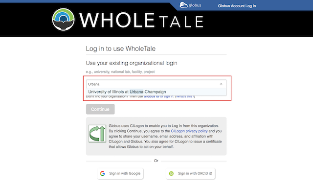
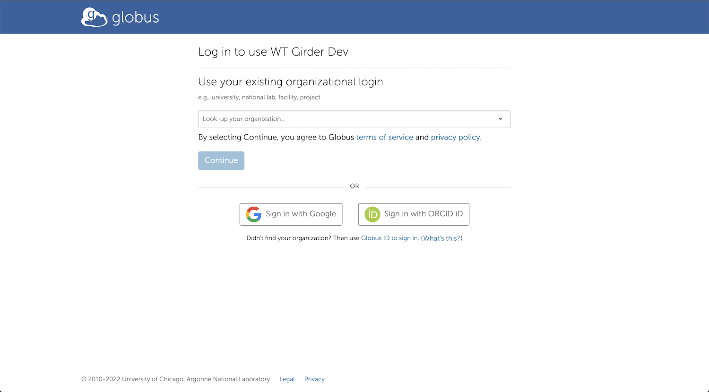
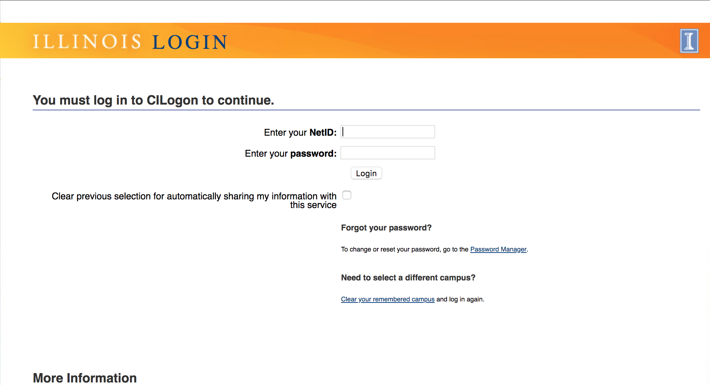

.. _sign_in:

Signing In
==========

The Whole Tale system uses `Globus Auth <https://www.globus.org/platform>`_ to allow users to login using their existing credentials from hundreds of research organizations as well as ORCID or Google accounts.

1. Go to https://dashboard.wholetale.org and select the "Access Whole Tale" link to start the login process.

.. image:: images/sign_in/landing_page.png
     :align: center
     :scale: 70%

2. Search for and select your institution or organization from the search box.  If your organization does not appear in the list, you can use your Google account, ORCID account, or `register for a Globus account <https://www.globusid.org/create>`_.

3. After selecting your organization, select the "Continue" button.

4. You will be redirected to your organization's login page. Enter your credentials.

The above example is for users from the University of Illinois at Urbana-Champaign.

After logging in you will be redirected to the Whole Tale dashboard where you can :ref:`explore <exploring_tales>` and :ref:`compose <composing_tales>` tales.
