.. _tutorial_stata:

STATA Tutorial
==============

This tutorial is intended to introduce researchers, curators, and reviewers to 
the Whole Tale system.

A note about terminology:

- A *tale* is a way to organize code, data, and information about your computational 
  environment in a way that can be shared, exported, or published. 
- The *computational environment* is the operating system, primary interactive environment 
  and any software dependencies required to reproduce reported results.  
- The *interactive environment* is the primary user interface displayed, which is generally
  related to the selected language (e.g., RStudio, JupyterLab, STATA, MATLAB)

1. Terms of Use
----------------

Please read our :ref:`Terms of Use <tos>` before continuing.

2. Signing In
--------------

Whole Tale allows users to login using credentials from hundreds of universities, 
research institutions and organizations. If your institution is not listed, you 
can login using a free ORCID account.

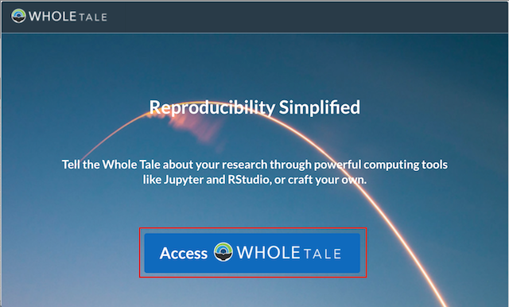

* Select "Access Whole Tale"
* Select your institution from the dropdown or select ORCID
* Login using your credentials

For more information, see :ref:`Signing In <sign_in>`.

Once you have successfully signed in, you should see the Whole Tale dashboard. 

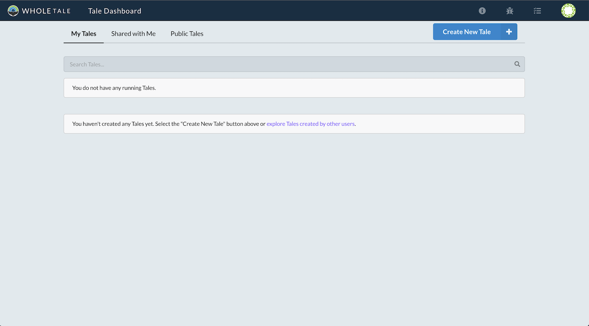

3. Creating a Tale
------------------

Each tale has a title and a default interactive environment.

Select "Create Tale > Create New Tale"

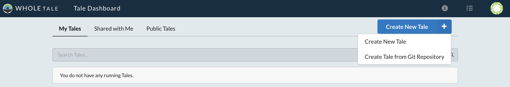

The "Create New Tale" dialog should open.  
Enter a title and select the computational environment (i.e., interactive environment) for your tale. 
For this tutorial, select the STATA 16 (Desktop) environment. 
Select "Create New Tale" to create the tale.

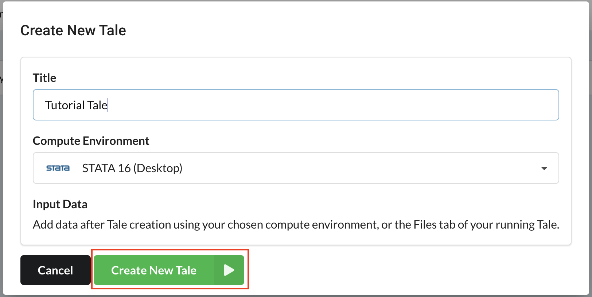

The tale page should open with the metadata tab selected.

4. Tale Metadata 
-----------------

Select the "Edit" button to edit the tale's metadata:

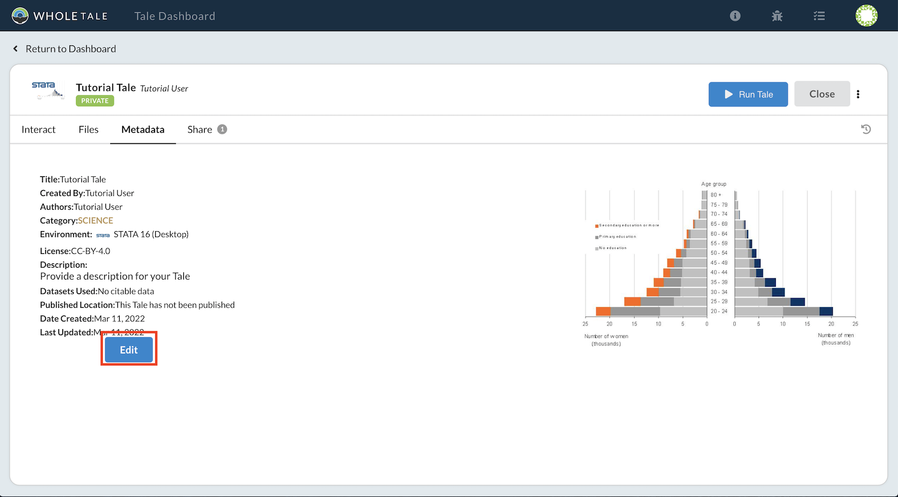

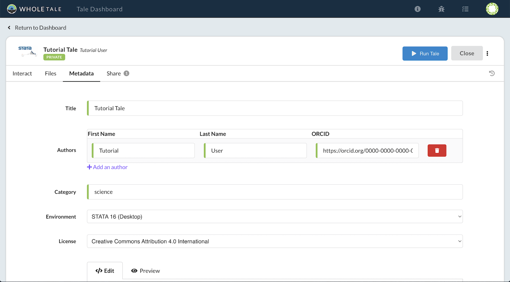

Using this page you can edit the following information:

- Title
- Author (note: a valid ORCID ID is required for each author)
- Description
- Category
- Selected computational enviroment
- License
- Display image

Select "Save" to save your changes.

5. Tale directory structure
---------------------------
Each tale includes five different folders that are accessible through the Whole Tale dashboard and mounted into running containers. 
Any file or data that is not in these folders will not be retained across tale container restarts.

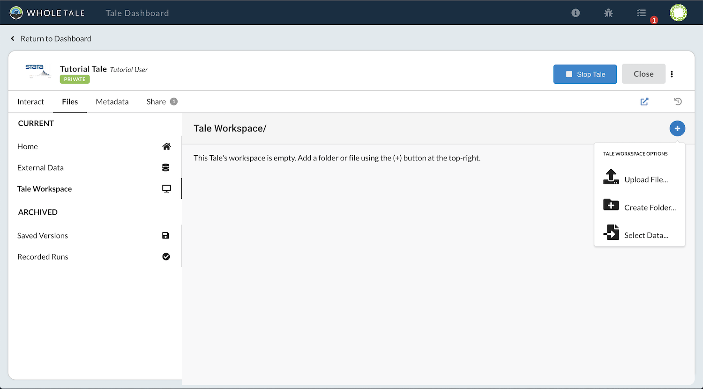

.. list-table:: Title
   :widths: 10 10 80
   :header-rows: 1

   * - Folder
     - Path in container
     - Description
   * - Tale workspace
     - workspace
     - The primary folder containing your code, data, documentation
   * - External data
     - ../data
     - | Read-only folder containing externally referenced data 
       | registered with the Whole Tale system
   * - Versions 
     - ../versions
     - Folder for accessing any tale versions
   * - Recorded Runs 
     - ../runs
     - Folder for accessing any recorded runs
   * - Home
     - ../home
     - Private read-write folder available across all tales

**Note about the "Home" directory**

The Whole Tale system includes a "Home" directory that can be used to store files that are not part of a specific tale.
You can upload files to this directory via the Files tab and they will appear the running interactive environment as a sibling to the workspace folder (i.e., ../home).
This is a mounted directory available to all tales but the contents of home are not included in the published or exported tale.
The home directory can be used to store utility files, scripts, etc.
The WT home directory is different from $HOME in the Linux container.

6. Opening the interactive environment
--------------------------------------

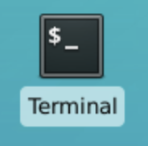
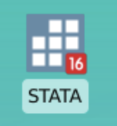

Each tale is associated with a single interactive environment. 
Currently supported environments include Jupyter/JupyterLab, RStudio, STATA, and MATLAB. 
Above, you selected the STATA 16 (Desktop) environment. 
To open this environment, select the "Run Tale" button:

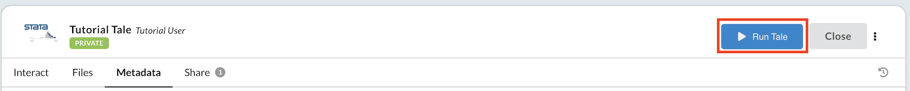

A notification panel will display with a progress indicator as the tale's image is built and container started:

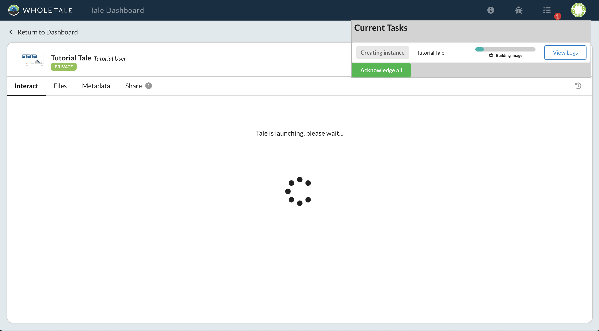

Using the notification panel you can optionally view logs for this process. 
This can be helpful when troubleshooting environment customization issues.
You can hide the notification panel using the notification icon (|notification_icon|) or dismiss them using "Acknowledge All".

Once the interactive environment has started, the selected interface should display in the Interact tab. 
The interface is displayed as part of the Whole Tale dashboard, but you can open it into a separate browser tab or window by selecting the pop-out icon |popout_icon|.  

.. image:: images/tutorial/tutorial_stata_desktop.png
     :align: center

Note: To support copy-paste to your clipboard, the Stata and MATLAB Desktop environments must be opened in their own browser tab and you must grant access to your clipboard:

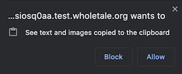

A few things to note at this point:

- Environments are based Docker images based on Linux (Ubuntu LTS). Windows environments are not currently supported. 
- By default, every tale instance is limited to 2 CPUs and 8GB RAM

8. Adding files to your tale
----------------------------

There are two ways to upload files to your tale. 
You can use 1) the **Files** tab via the Whole Tale dashboard or 2) upload using your selected interactive environment.

8.1 Using the **Files** tab
^^^^^^^^^^^^^^^^^^^^^^^^^^^

To create folders or upload files from your computer to Whole Tale without using the selected interactive environment (e.g., STATA), select the **Files** tab > **Tale Workspace** > and the blue plus button (|plus_icon|) then "Create Folder" or "Upload file".

You can upload multiple files at a time, but uploading of folders is not supported at this time. Uploading folders requires uploading a zipfile and extracting using your selected interactive environment (see Appendix).

8.2 Uploading from desktop using the selected interactive environment
^^^^^^^^^^^^^^^^^^^^^^^^^^^^^^^^^^^^^^^^^^^^^^^^^^^^^^^^^^^^^^^^^^^^^

Native web-based environments such as Jupyter/JupyterLab, RStudio, and the MATLAB Web Desktop each offer ways to upload files via the running environment. 

8.3 Downloading from internet locations using the selected interactive environment
^^^^^^^^^^^^^^^^^^^^^^^^^^^^^^^^^^^^^^^^^^^^^^^^^^^^^^^^^^^^^^^^^^^^^^^^^^^^^^^^^^

You can also directly download files to the running tale using command-line tools such as git, curl, wget; file download functions built into each programming language; or desktop browsers (Firefox).

8.5. AEA Example
^^^^^^^^^^^^^^^^
For this part of the tutorial, you will use Firefox in the running STATA environment to download data and code from OpenICPSR.

- Double-click the Firefox icon on the Desktop (|firefox_icon|)
- Paste https://doi.org/10.3886/ICPSR13568.v1 into the Firefox address bar
- Select Download > Stata (this may require using your mouse to move the Firefox scrollbar)
- Agree to OpenICPSR consent form (this may require using your mouse to move the Firefox scrollbar)
- Login using your credentials
- Save the zip file (this will end up in ~/Downloads). This could take a few minutes
- Paste https://drive.google.com/file/d/1P8fCn9lWlrdbRwMKelEQlO5KuKMy8C4Y/view?usp=sharing into the Firefox address bar
- Download and save the file 118568.zip

Once the files are downloaded, you need to extract the zipfile into the tale workspace folder.

- Double click the terminal icon (|terminal_icon|).The terminal should open in $HOME/work/workspace.
- In the terminal type

.. code-block::

       unzip ~/Downloads/118568.zip
       cd data
       unzip ~/Downloads/ICPSR_13568-V1.zip

9. Creating a version
---------------------

.. |history_icon| image:: images/tutorial/history_icon.png

Before making any changes or running your code, create a version of the tale.
Select the  history icon (|history_icon|) to open the history panel.
Select **Save Tale Version** and enter a version name.
Versions can be renamed or removed via the **Files** > **Saved Versions** panel.
You can revert to a previous version of your tale at any time.

10. Running the code
--------------------
Running code will differ across environments. 
Most environments provide both an interactive interface or a command line or terminal.  
In this tutorial you can either use the STATA UI or command line via Linux terminal. 

To run the code using the STATA UI, double-click the STATA icon (|stata_icon|). 

To run the code using the terminal, double-click the Terminal icon (|terminal_icon|).

11. Additional topics
---------------------

11.1 Configuring software dependencies
^^^^^^^^^^^^^^^^^^^^^^^^^^^^^^^^^^^^^^

The Whole Tale platform uses an extension to the Project Jupyter repo2docker software (used by Binder) to customize tale environments. 
Binder-compatible repositories can be used in Whole Tale.  
Whole Tale's extension adds the ability to build and run STATA and MATLAB-based environments. Tales are based on Ubuntu LTS.

11.2 Rebuilding and restarting
^^^^^^^^^^^^^^^^^^^^^^^^^^^^^^

When ever you change the software dependencies in your tale you must rebuild and restart the image. 
Changes made directly in the running environment are not preserved across restarts.  
For example, if you add or remove a package via the apt.txt file you must rebuild and restart the tale for those changes to take effect and be available to other users.

11.3 repo2docker

repo2docker is a tool designed to build and run Docker images from source code repositories. 
Images are built based on configuration files found in the repository.  
Each supported package manager has an associated configuration file. 
All conventions found in the repo2docker documentation are applicable in Whole Tale. 
We refer you to the repo2docker documentation for details, but below are a few common package managers. 

Any of the configuration files described below should be created in the root of your Tale workspace.

Additional Topics
------------------
- All environments are built using a custom plugin to the Project Jupyter repo2docker component which underlies Binder. See the section below on Configuring software dependencies.
- The default user differs across environments. For all Jupyter-based environments, the default user is "jovyan", a common user across Docker-based Jupyter environments (https://github.com/jupyter/docker-stacks/issues/358#issuecomment-288841673).  For RStudio the default user is "rstudio".  The user name should not matter as all code should use relative paths.

