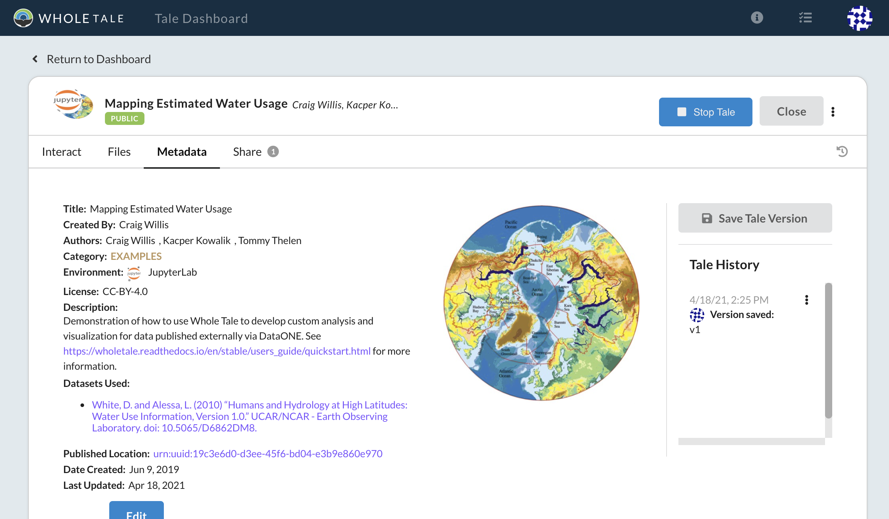
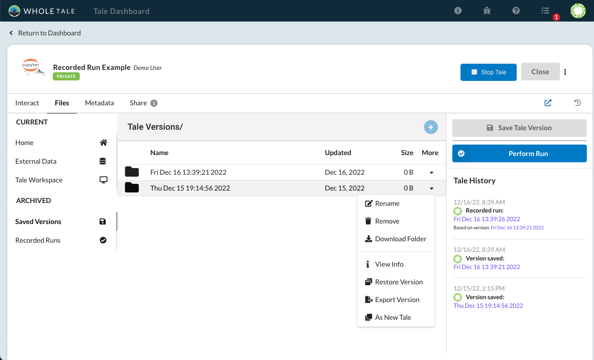
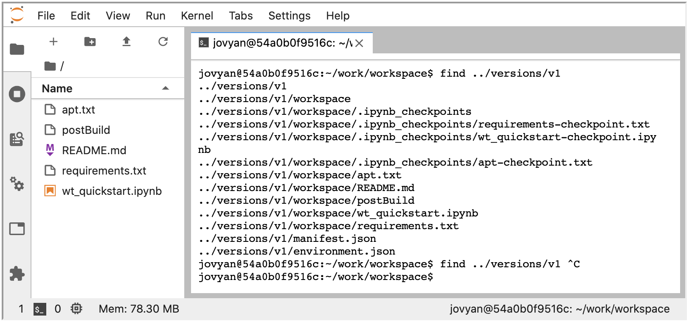
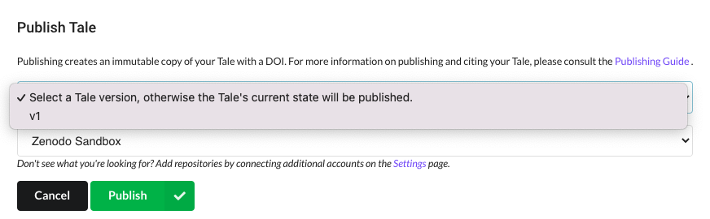

.. _versioning:

Versioning Tales
================

Whole Tale allows users to create versions of their tales. A version includes
the contents of the tale workspace, externally registered data, and metadata.
Versions can be renamed, deleted, exported and published. :ref:`Recorded runs
<recorded-runs>` are created based on versions.

Versioning Model
~~~~~~~~~~~~~~~~

Whole Tale uses a simply filesystem-based versioning model. Any versions you
create are accessible via the Whole Tale dashboard as wells as in the
``../versions`` folder in your running interactive environment.

.. _create_version:

Creating Versions
~~~~~~~~~~~~~~~~~
You can create versions of your tale using the **Save Tale Version** option on
the tale :ref:`action menu <tale-actions>` or the **Tale History** panel.  
Select the **Tale History** icon (|tale_history|) to open or close the panel:

To create a new version, select **Save Tale Version**:

     Version history

Select **Files** > **Saved Versions** to manage your versions. From this menu you
can rename, remove, download, restore, or export your tale version.

     Version menu

.. note::
   The **Download folder** option simply downloads any folder as a zip file. Use
   the **Export Version** option to download a complete version of your tale
   including metadata, external data, recorded runs, etc.
 
Created versions are accessible from inside your running interactive environment in the `../versions`
directory:

     Versions in the running container

.. _version-actions:

Version Actions
---------------

Use the version **action menu** to operate on versions
operations.

.. list-table:: Version actions
   :widths: 20 80
   :header-rows: 1

   * - Action
     - Description
   * - Rename
     - Rename the selected version
   * - Remove
     - Remove the selected version. 
   * - Download Folder
     - Download a zip file of any folder
   * - View info
     - View tale metadata for the selected version
   * - Restore Version
     - Restore the tale and workspace to the selected version
   * - Export Version
     - Export the selected version as a Bg
   * - As New Tale
     - Create a new tale based on the selected version

.. _delete_version:

Deleting Versions
~~~~~~~~~~~~~~~~~

Deleted versions are removed permanently and cannot be recovered. A version
cannot be deleted if it has an associated recorded run.

.. _rename_version:

Renaming Versions
~~~~~~~~~~~~~~~~~

When versions are renamed, they are also renamed on the filesystem.

.. _restore_version:

Restoring Versions
~~~~~~~~~~~~~~~~~~

By selecting **Restore** you will copy the contents of the selected version to your active workspace.
This includes tale metadata and registered datasets.

.. _export_version:

Exporting and Publishing Versions 
~~~~~~~~~~~~~~~~~~~~~~~~~~~~~~~~~

Each time you export or publish a tale, if no version exists one is created
for you. Selecting **Export Tale** or **Publish Tale** from the tale action menu
will export or publish the most recent version. To export a specific version,
including any associated recorded runs, select the desired version from the
**Publish Tale** dialog.

     Publishing versions

